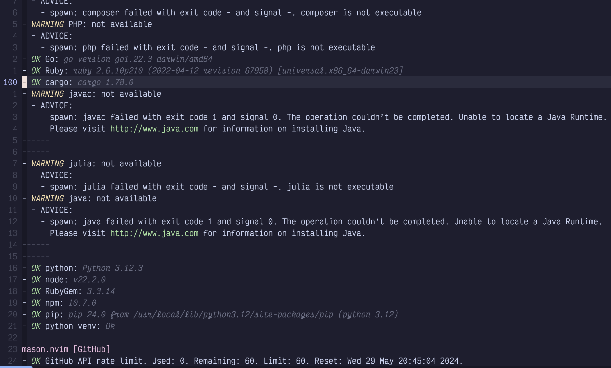
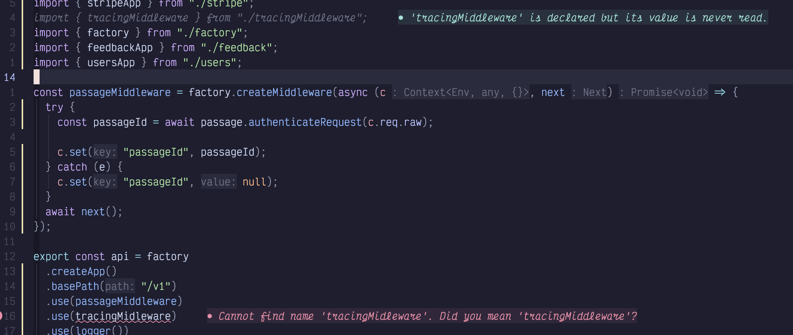
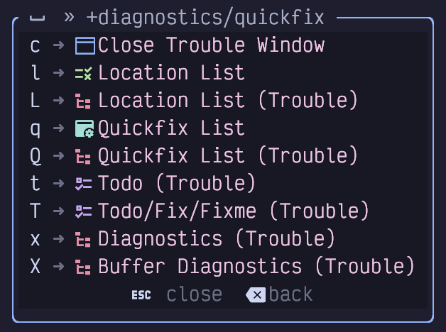
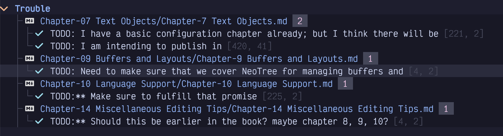

## Chapter 10. Programming Language Support

Visual Studio Code brought the world the concept of language servers, and all other text editors jumped on the idea. Early incarnations of language server protocol in Vim were frustrating and clunky and required plugins that tended to be fragile and complicated.

Then Neovim decided to build support for language servers into the editor itself. Neovim’s built-in support is still frustrating and clunky, but over time, robust and simple plugins have evolved to make the language server experience almost automatic. LazyVim represents the pinnacle of that evolution.

In addition, Neovim also has built-in support for TreeSitter, a powerful library for parsing and identifying abstract syntax trees in source code while it is being edited, and LazyVim is configured with the plugins needed to make TreeSitter Just Work™.

Language Server protocol gives us support for things like code navigation, signature help, auto-completion, certain highlighting and formatting behaviours, diagnostics, and more. TreeSitter gives us better syntax highlighting, code folding, and syntax based navigation such as provided by the `S` command you already know.

There are two main tools for working with language servers in LazyVim: various language Lazy Extras, and the Mason.nvim plugin. We’ll get to know both of these and then learn how to better use some of the tooling they provide.

### 10.1. The lang.* Lazy Extras

We’ve already used LazyVim extras for plugin configuration, and I told you to install the extras for whichever languages you use regularly. These extras include preconfigured plugins that give best-in-class support for common programming languages. Most ship with language servers and many include additional Neovim plugins that are useful with those languages.

Once you install these extras things will usually work out of the box, and you won’t have to learn any new keybindings for the commands each language provides. However, it wouldn’t hurt to read the Readmes for the plugins the extra installs (accessible by looking up the Extra’s documentation on the LazyVim website and clicking the headings) to make sure you aren’t missing out on any commands the language provides.

### 10.2. Mason.nvim

The Lazy Extras may not install everything you need. For example, instead of the default Typescript formatting and linting tools, I prefer to use the Biome formatter and linter.

To install things like this, you can use the Mason.nvim plugin, which is pre-installed with LazyVim. To open Mason, use the `<Space>cm` keybinding. The window that pops up looks similar to the Lazy.nvim and Lazy Extras floating window, although it ships with annoyingly unrelated keybindings.

Mason is a large database of programming language support tooling, including language servers, formatters, and linters, along with the instructions to install them.

Mason.nvim *does* assume a certain baseline is already installed on your system; for example if you are going to install something that is Rust-based, you better have a `cargo` binary, and if you are going to install something that requires Python support, Python and pip need to be available. In most cases, if you are coding in a given language, you already have the tools Mason needs to do its thing. The main thing that Mason takes care of is ensuring that the editor-specific tools are installed in such a way that other Neovim plugins can find them.

The hardest task with Mason is knowing what tool you want to install. I was already using Biome when I set up LazyVim, so I knew I was going to need to install editor support for it. That was no problem; just find `biome` in the Mason list (like any window, it is scrollable, searchable, and seekable, and Mason helpfully puts everything in alphabetical order).

But when I started working on this book, I decided I needed an advanced Markdown formatter, and I had no idea which one to use. I could search the window for `markdown` and then press `Enter` on any matching lines, which gives a description and some other information, but I had to do some research with a web browser, (along with a little trial and error) before I found the right tool for me.

Unfortunately, I can’t help you with figuring out what is right for you, but once you find the tool in Mason, just use `i` to install the package under the cursor. The only other command you will use frequently in Mason is `Shift-U` to update all installed tools, and you can look up the remaining keybindings with `g?`.

### 10.3. Validating Things Installed Cleanly

As good as both LazyExtras and Mason are at installing language servers, linting, and formatting tools, setting such things up is one of the places most likely to go wrong, no matter which editor you are using. So now is a good time to introduce several commands to validate that everything is working as expected.

First, LazyVim pops up notifications in the upper right corner, as you have seen with the plugin updates. These disappear after a few seconds. Every once in a while, you need to be able to refer back to them.

The secret is to use the keybinding `<Space>sn` to open the “Noice” search menu. Noice is the plugin that provides those little popups. Most often, you’ll want to follow this with either an `a` or an `l` to see all recent Noice messages, or just the last one.

<table>
<tbody>
<tr>
<td class="icon"></td>
<td class="content">You can also use <code>&lt;Space&gt;snd</code> to dismiss any currently open notifications, but honestly, by the time you’ve completed those four keystrokes, they notifications have probably disappeared themselves already!</td>
</tr>
</tbody>
</table>

The second command you’ll need for debugging LSPs is `<Space>cl`, which presents a picker of installed LSPs and useful information about whether they are working, dependencies are installed, and currently active.

If your LSP is having temporary problems—​like showing incorrect diagnostics or unable to find a file you know is there—​sometimes it just needs to be given a good kick with `:lsp restart`. The Svelte language server has a nasty habit of not picking up new files, so I’ve been using this one often enough lately to add a keybinding for it.

Another super useful command is `:checkhealth` which spits out way too much information for its own good. You can narrow it down to checking the health of individual features. For LSP purposes, you’ll most likely be interested in `:chechealth vim.lsp` and `:checkhealth mason`. The latter is quite more useful, as it tells you the status of any installed lsps and other tools Mason has installed.

Finally, the `:LazyHealth` command provides LazyVim-specific debugging information. There is a lot of overlap with the output of `:checkhealth`, but I find the `:LazyHealth` output is easier to read, while the `:checkhealth` output is more comprehensive. So I usually use `:LazyHealth` first and switch to `checkhealth` only if `:LazyHealth` didn’t yield the answer I need.

Don’t expect to see green check marks across the board; you’ll make yourself crazy. For example, my `checkhealth` output contains a bunch of warnings from Mason:

Figure 44. Lazy Health Warnings

Tools that I have used recently (and also Ruby for some reason) are installed, and I have warnings for languages that I don’t generally need to edit files in. So if you don’t code in Java, there’s no reason to waste cycles trying to make the `java` warning go away.

### 10.4. Diagnostics

Language Servers fulfill several useful functions, including identifying code problems, linting, formatting, context-aware code navigation, and documentation. We’ll discuss all of these between this and the next chapter.

We already got a peek at diagnostics in Chapter 7, when we discussed jumping between error messages with the unimpaired keybindings `[d`, `[w`, `[e`, `]d`, `]w`, and `]e`. Diagnostics show up as little squiggles under specific sections of text and when you jump to them, you usually get a small overlay window telling you what is wrong at that location. For example, I have a simple typo causing an error in this screenshot:

Figure 45. Diagnostic Overlay

I misspelled “tracingMiddleware”, and I get a helpful error message on that line in the virtual text, and a window pops up when I navigate to that error with `]d`. This window sometimes has more information than the virtual text. In addition, the line that imports the correctly spelled variable is showing a hint telling me that it isn’t used.

The colour of the diagnostic conveys the severity—​whether it is a hint, a warning, or an error—​so you can decide whether it is valuable to fix. I generally try to either fix or silence all diagnostics, as they become less useful if there is much noise.

If the window doesn’t pop up when you navigate to the diagnostic, you can use the `<Space>cd` keybinding to invoke it as long as your cursor is positioned somewhere within the underlined text. You can make the window disappear by moving your cursor with any motion key.

#### 10.4.1. Trouble and Quick Fix

You can also navigate diagnostics using the Trouble menu. Trouble is a LazyVim plugin that provides an “enhanced quick fix” experience. Which is probably meaningless to you if you are new to Vim and don’t know what “quick fix” means!

The Quick Fix window is essentially a list of files and line numbers that have been tagged as “interesting” for some reason, where that reason depends on context. It can be used to represent multi-file search results, diagnostics, compiler error messages, and more, depending on how you open it. You can easily hop between the targeted locations, making changes or corrections without losing the context of what you were originally searching for.

In its simpler form, Trouble is the same thing, just a little bit prettier to look at, with colours, icons, and nice groupings when fix locations are in multiple files.

The *contents* of the Quick Fix and Trouble windows depend entirely on how you open them. Most of them are accessible from the `<space>x` (I assume the `x` stands for “fi**X**”) menu, which looks something like this:

Figure 46. Diagnostic Menu

Let’s take to-dos as an example, as I have a lot of them in this book. It’s weird saying that because they’ll be gone by the time you see it, but this screenshot will live on:

Figure 47. To-Dos List

The cool thing about this list of locations is that they are not all in the same file. Without Trouble, I could navigate between to-dos in the *current* file using the `[t` and `]t` keys. However, using Trouble, I can navigate between to-dos in multiple files by moving my cursor to the appropriate line in the Trouble window using any normal window and line navigation techniques (Seek mode is a good choice, or use the usual `<Space> wj` to switch to the lower window if you need to scroll it) and hitting `Enter`. It will open the file and move the cursor right to the “troubling” line.

Or you can use the commands `[q` and `]q`, which will navigate between Quick Fix OR Trouble locations, no matter which file they are in, without ever focusing the Trouble window.

For diagnostics, open the Trouble menu with `<Space>xx` or `<Space>xX`. The lowercase version shows the diagnostics in the current file for a quick overview while the “but bigger” uppercase X shows all the diagnostics in the current workspace (although it depends a bit on the language servers; some language servers only show you diagnostics for all currently open buffers, not the whole project).

If you’re wondering what the “Location List” is, it’s a Quick Fix window that is associated with the current window (NOT buffer). I never use it; my brain can only handle fixing one problem at a time, even if it is in hundreds of files!

#### 10.4.2. Trouble and Quick Fix from pickers

The Quick Fix and Trouble windows are not just for references. Many actions can result in a new list of file locations being added to these windows. One common one is to activate it from picker windows. Any picker window can be converted to a list of jumpable locations in the Quick Fix window by showing the picker and hitting `Control-q`. All files will become Quick Fix entries. You can also select a subset of files with `Tab` before sending only those files to Quick Fix with `Control-q`.

Sending files to Trouble from a picker is just as easy. Focus the file or select multiple files and use `Alt-t` to send them to a Trouble window.

This feature is useful in various pickers, but I most often use it with search results and go-to-reference features that we’ll discuss in later chapters.

### 10.5. Code Actions

One of the things that made VS Code seem magical when it came out was code actions. Not that they existed, as the concept has been around for a long time, but that they WORKED. Nowadays, I kind of take them for granted.

You may be used to accessing code actions by moving your hands to the mouse and clicking a light bulb or right clicking a diagnostic. In LazyVim it is (of course) a keybinding. Navigate to a diagnostic using whatever keybindings work for you (I live by `]d`) and then invoke the `<Space>ca` menu where `c` and `a` mean “code action.” A picker menu will pop up with a list of any actions you can take. You can use the arrow keys or `<Escape>` followed by `j` and `k` to navigate between them, or you can enter a number or any text from the line to filter. Hit `<Enter>` to perform the action, or `<Escape><Escape>` to cancel the menu (just one escape allows you to enter Normal mode in the search box so you can use the many LazyVim navigation keystrokes that you are, by now, accustomed to).

### 10.6. Linting

Linting is *mostly* handled using the `nvim-lint` plugin instead of the LSP. This was a major pain point in my pre-LazyVim days because getting the LSP and linter cooperating often required some serious troubleshooting. And then throw formatting into the mix and I’d lose a day or two. To be fair, this was true when I used VS Code, too.

Using LazyVim, it is actually likely that you don’t know who is doing the linting for you. I honestly don’t. Some of my diagnostics come from the LSP and others come from the linter. I don’t bother to question the source of the errors; I just fix them.

The hard part with linting (at least, when it doesn’t work automatically) will be making sure that the appropriate linter is installed (Mason has your back here), and configured correctly. If you are lucky and the languages you love to work in have Lazy Extras, then it is probably already configured correctly. Otherwise, you may have to do a little tweaking. The tweaking involved is, sadly, language-dependent, but you’ll probably need something like this in a (for example) `extend-nvim-lint.lua` file in your plugins directory:

Listing 27. Nvim-lint Customization

    return {
      "mfussenegger/nvim-lint",
      opts = {
        linters_by_ft = {
          typescript = {
            -- lint settings for Typescript
          }
        },
      },
    }

Read `:help nvim-lint` for more information and refer to the LazyVim documentation for this configuration if you need further clarification.

The nice thing is that once you have your linting configured, the errors will show up using the same diagnostics described above and you can engage with them using the same keybindings, Trouble window, code actions, etc.

### 10.7. Formatting

Similar to linting, code formatting *can* be handled by some LSPs, but people have realized that using the language server is often more complicated than just invoking a formatter directly. So LazyVim ships with the conform.nvim plugin.

Also similar to linting, if you are lucky, it will Just Work™ after you install the appropriate Lazy Extra and/or Mason tool. However, if you don’t like the default formatter (or it’s not working), you will have to familiarize yourself with the LazyVim and conform.nvim documentation to figure out the exact incantation required.

The only formatter I’ve had to manually configure is using Prettier for Markdown. It looks eerily similar to the `nvim-lint` configuration:

Listing 28. Conform Customization

    return {
      "stevearc/conform.nvim",
      opts = {
        formatters_by_ft = {
          ["markdown"] = { "prettier" },
        },
      },
    }

*Once* it’s set up (I acknowledge this may be no mean feat), formatting in LazyVim is typically fire and forget: save your file and it formats. If you want to invoke it manually without saving, use the `<Space>cf` keybinding. I can’t stress how lucky you are that this is the case; without LazyVim, countless hours have been wasted trying to get the autocommands for “format on save” to work!

### 10.8. Configuring Non-standard LSPs

If you have installed an LSP that LazyVim isn’t aware of, you may need to tweak the `nvim-lspconfig` plugin. You will minimally need to let it know that your language server is available, and possibly to configure it to your needs. For example, one of my favourite programming languages is Rescript, which doesn’t have a huge ecosystem and therefore, has no LazyVim extra. I was able to install the language server with Mason easily enough, but I also needed to add the following to my `extend-lspconfig.lua` file for LazyVim to pick it up:

Listing 29. Third-party LSP server

    return {
      "neovim/nvim-lspconfig",
      opts = {
        servers = {
          rescriptls = {},
        },
      },
    }

As a second example, the `css_variables` language server, which I use with the excellent open-props CSS framework, works out of the box for `css` files, but I needed to use a different configuration to activate it in `svelte` files:

Listing 30. Css Variable LSP Config

    return {
      {
        "neovim/nvim-lspconfig",
        opts = {
          servers = {
            css_variables = {
              filetypes = { "css", "scss", "less", "svelte" },
            },
          },
        },
      },
    }

### 10.9. Summary

In this chapter, we learned how LazyVim integrates the language server protocol that VS Code brought to the world. It is *usually* quick and painless, which is more than can be said for manually configuring LSPs. However, there may be some headaches especially around linting and formatting. This is true in any editor, sometimes they hold your hand and sometimes they get in your way. If you get stuck, hit us up in the LazyVim discussions group on GitHub (but search it first; you’re probably not the first person to have trouble).

In the next chapter, we’ll learn more about navigating *code* using LSPs, TreeSitter, and several plugins.
