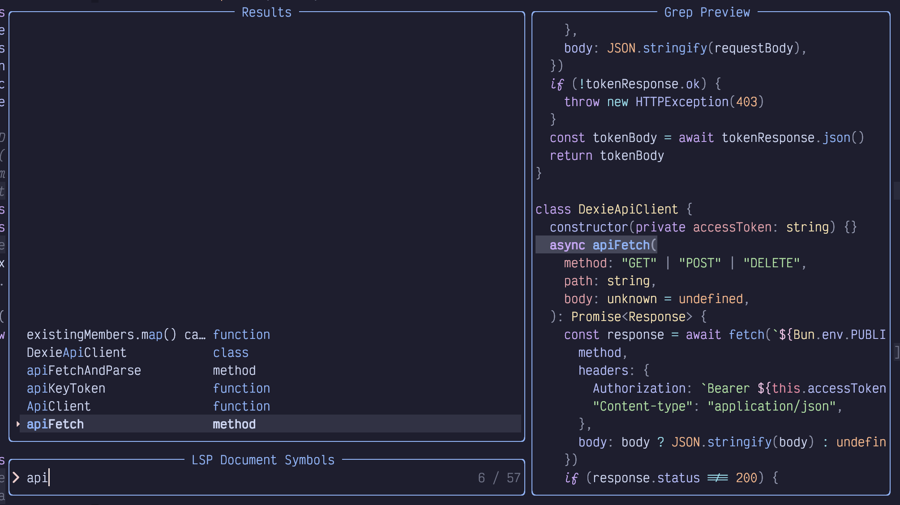
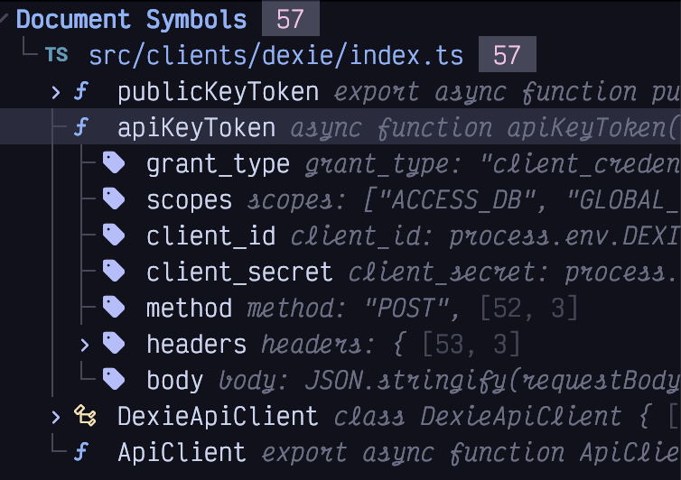
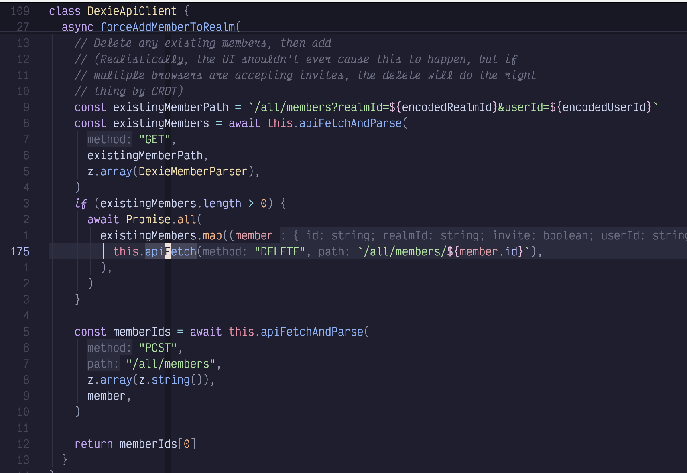
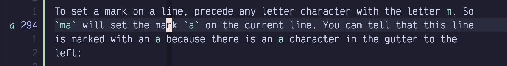
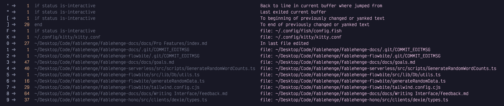

## <a href="#_navigating_source_files" class="link">Chapter 11. Navigating Source Files</a>

In previous chapters, we’ve learned many different ways to navigate within a single buffer, as well as between open tabs and windows. This chapter will go into detail of different ways to navigate between source files.

### <a href="#_go_to_definition" class="link">11.1. Go To Definition</a>

In my opinion, “Go to Definition” is the most valuable feature language servers have brought us. Major IDEs have supported it for compiled languages for eons, but dynamically typed languages—​such as Python—​have always been hell for static analysis, and such features were often pretty hit or miss.

As one of the best-named editor features of all time, “Go to Definition” jumps your cursor from whatever keyword it is currently sitting on to the place where that keyword is defined, regardless of what file it is in.

Most often, I use this when I am looking at a call site for a function and want to see the function itself. A simple press of `gd` (go to definition also has one of the more memorable LazyVim keybindings of all time) will take me there.

Depending on how good the LSP for the language I am editing is, this often even allows me to jump into library files or type declarations for third party modules so I can see what is really going on.

Go to definition is context dependent, but will usually do exactly what you expect. If you are looking at a variable, `gd` will jump to wherever the variable is initialized. If your cursor is on a class name, it will jump to wherever the class is defined.

Typically, once you’ve jumped to a definition and learned what you need to learn from that file, you’ll immediately want to jump back to where you started. You can do this easily using `Control-o`, as we discussed in Chapter 3 (and `Control-i` can move forward in your jump history).

### <a href="#_go_to_references" class="link">11.2. Go To References</a>

The inverse of the Go to Definition command is “Go to References”. If you are looking at a function, variable, type, etc, and want to see all the places that variable is accessed, use the `gr` command.

Unlike with a definition or declaration, there will typically be more than one reference to a given symbol (a variable in isolation is a useless variable, indeed). So when you type `gr` it usually won’t immediately jump to a location. Instead it will pop up a picker view of all the references to the word that was under your cursor, with all the preview and filtering luxury that the picker always brings.

It is common to want to perform some action—​such as a rename or adding an argument or what have you—​at every reference. You *could* keep showing the picker by hitting `gr` again or by using the `<Space>sR` keybinding which resumes your previous picker search. However, it is often much more useful to use the Trouble list that we learned about in Chapter 10.

To do that, use `gr` to show the references in a picker as usual. Then use `Alt-t` to open all results in Trouble. You can also select which results to send to Trouble before opening them using the selection behaviour described in Chapter 4.

### <a href="#_context_specific_help" class="link">11.3. Context-specific Help</a>

Most non-modal editors show you some help or “hover” text when you hold your mouse over a word or symbol. The quantity and value of this text varies widely depending on the LSP, but usually includes a function signature and documentation for the keyword under the cursor.

It’s probably possible to set up Neovim to show help texts on hover, but why would you move your hand to the mouse when LazyVim has such amazing navigation on the keyboard? Instead, use the (shifted) `K` keybinding. Yeah, `K` is a pretty stupid mnemonic to remember, but `H` and `?` were already taken.

<table>
<tbody>
<tr>
<td class="icon"></td>
<td class="content">In fact, the <code>K</code> stands for “keywordprog”, which is a legacy Vim concept that has been superseded by language servers in the modern world. So LazyVim reappropriated the keybinding.</td>
</tr>
</tbody>
</table>

### <a href="#_listing_symbols" class="link">11.4. Listing Symbols</a>

Another handy LSP feature is searching all the symbols in the current file or project. If you are editing a particularly long file and need to jump to a function that is not terribly close to your cursor, you might use the `<Space>ss` command (mnemonic is “search symbols”). As hinted by the double `s`, this is expected to be a fairly common action.

The dialog that pops up should be fairly familiar by now, as it’s the usual picker:

Figure 48. Picker Symbols

So you already know how to use it. However, I want to remind you of a couple Picker tips that make it more useful:

Most of the time when I’m using this symbol picker, I only care about functions, or sometimes classes. So the fields and properties scattered in the screenshot above are just a distraction. It **is** possible to configure the picker to only show certain kinds of symbols, but I prefer a quick trick that allows me to narrow it down to just functions: type (part of) the word `function`.

Since the picker includes the word “function” in the second column of the results, it merrily filters out all the lines that don’t have that word in them. Handy.

Better yet, I can input a space *after* the word “function” to inform the picker to perform subsequent searching back in the first column. So “func api” filters all functions that have the word “api” in them.

My second tip is to not forget about the `Control-q` and `Alt-t` shortcuts to dump picker results into the Quick Fix or Trouble list. It generates a quick and dirty table of contents of whatever symbols you filtered for.

If you want to search all the symbols in your whole project, use the “but bigger” mnemonic. `<Space>sS` will perform such a search. However, be warned that not all LSPs support workspace symbol search. Some only search in currently open files, and even many of those that fully support workspace symbol search are unusably slow.

### <a href="#_trouble_also_has_a_symbols_outline" class="link">11.5. Trouble Also has a Symbols Outline</a>

You can also open a symbols outline using the Trouble plugin. The keybinding is `<Space>cs`, which you may have trouble finding because it is in the `Code` menu rather than the `Search` menu. Unlike most Trouble windows, it opens in a right sidebar by default. It creates a lovely tree view and you can even collapse and expand the tree nodes using the folding keybindings we discussed in Chapter 9.

Figure 49. Trouble Symbols

You can resize the Trouble window using the same keybindings you usually use for resizing windows (`<Space>w<` and `<Space>w>`). As you move the cursor over the Trouble window, the symbol it is over will automatically scroll into view.

The fastest way to use the Trouble window is to use Seek mode. Recall that Seek mode can jump to *any* currently visible window, which includes Trouble. So if I am currently editing the above file and my cursor is somewhere near the end of the file, I can use `spub` to enter Seek mode and search for the characters “pub”. This will place a label on the `publicKeyToken` in the Trouble window. If I hit that label, my cursor jumps to the trouble window and my editor window immediately scrolls to the function in question. Now I just have to hit `Enter` to move the cursor back to the file I’m editing.

### <a href="#_context" class="link">11.6. Context</a>

The `nvim-treesitter-context` extra is a helpful way to know where you are in the current file. It uses treesitter to figure out which functions and types you are in, and then pins the lines that define those types to the top of the editor. Enable it as usual by visiting `:LazyExtras` and hitting `x` over the line that contains `nvim-treesitter-context`.

This plugin keeps track of which class or function your cursor is currently in. If the function or type definition is so long that the signature scrolls off the screen, it will helpfully copy that signature into the first line or lines of the code window, highlighted with a slightly different background colour.

This is easier to describe with a reference image, so consider this screenshot:

Figure 50. Treesitter Context

In this image, the first two lines, which are *slightly* shaded, are providing context, rather than being part of the buffer. The first line tells me that I am in the `DexieApiClient` class and the second line tells me that I’m currently looking at the `forceAddMemberToRealm` method in that class.

Especially notice the relative line number column. The `class DexieApiClient` line is 109 lines above my current cursor position, and the `async forceAddMemberToRealm` line is 27 lines above it. In contrast, the first *visible* line of the function is only 13 lines above my current cursor position.

The effect is quite subtle, but the definitions that make their way into this context section tend to be exactly what you need while coding. If they fit on one line I can see function signatures and return types. You really don’t notice how often you have to scroll up to see what a variable is named in a function signature until you don’t have to do it anymore! And if you DO need to scroll up to the signature, simply type the relative line number followed by `k` and you’re there with no searching required.

If you need to disable the context temporarily, use the keybinding `<Space>ut`. We haven’t seen much of the `<Space>u` menu yet, where you can toggle various User Interface effects. This is largely because the default user interface is configured well enough that you don’t want to change it often!

### <a href="#_navigating_with_bookmarks" class="link">11.7. Navigating with (Book)marks</a>

You already know how to navigate through your history with `Control-o` and `Control-i`, and to jump around documents effectively using a wide variety of motions.

Vim also includes a “bookmarks” feature, although it’s referred to as “marks” I assume because the `m` character was still free on the Vim keymaps.

Marks are built-into Vim and LazyVim has (as usual) added a few minor improvements.

Much like the registers that we covered in Chapter 8, marks can be assigned to each letter of the alphabet. Additionally, certain punctuation characters represent special system-set marks that you can jump to, but not set.

To set a mark on a line, precede any letter character with the letter `m`. So `ma` will set the mark `a` on the current line. You can tell that this line is marked with an `a` because there is an `a` character in the gutter to the left:

Figure 51. Mark in Sign Column

Now I can jump to the line marked with `a` from anywhere *in the current file* by using an apostrophe followed by `a`.

I don’t use this very often because other tools tend to be more useful for navigating within a file than manually setting a mark. However, if I had marked the line with a capital letter (e.g. `mA`), I would be able to jump to the mark no matter which file is currently open using `'A`.

So essentially, you can have up to 26 local marks within each file you ever open, as well as 26 global marks that you can access from any file.

Conveniently, if I just type a single apostrophe (in Normal mode), LazyVim will pop up a menu of all the marks currently available to jump to:

Figure 52. Marks Menu

This list shows the lowercase `a` mark that I’ve set in this file, several system marks that I can jump to using punctuation (notice the descriptions for each of those marks to the right so you don’t have to memorize them), two global marks I use to jump to my kitty and fish configuration files, and the ten numbered marks.

I find the numbered marks to be kind of useless. They essentially refer to the file and cursor location of the last time you closed Neovim. I don’t close Neovim that often unless I’m editing a commit message or pull request description in a temporary instance, so my numbered marks are mostly just those kinds of temporary files. If I need to get back to where I was previously, the `<Space>qs` keybinding to restore session is typically more useful than the numbered marks.

The menu that pops up when you press the apostrophe key is usually sufficient to find marks, but you can also use the `<Space>sm` keybinding to search marks in a picker. I don’t usually have enough marks active for this to be useful, but if you’ve got a lot of global and local marks set and you can’t remember which letter is associated with a given one, it might help to use the picker to search for the contents of the line you have marked.

Once you’ve set a mark, you’ll eventually be dogged by the question “how do I get rid of it?” Deleting marks is probably up there with “how do I quit Vim” for most common queries! There isn’t a keybinding for deleting marks. Instead, you need to use the command `:delmarks <mark>` to delete the given mark. This can be shortened to `:delm <mark>`. So to get rid of the `a` mark in this file, I used the command `:delmarks a`. You don’t have to be on the marked line to delete the mark.

In Command mode, marks can be used in place of line numbers in ranges. For example, if you want to write the text between mark `a` and mark `b` to a file, you could do `:'a,'bwrite somefile.txt`. If you’ve seen the `'<,'>` in front of colon lines when you have text selected, that is because `'<` and `'>` represent the start and end of the most recent visual selection. So rather than manually setting `ma` and `mb` you can visually select the thing you want to write and have those marks pre-filled for you.

You can also use `'<` and `'>` to jump to the beginning or end of the most recent selection even if it has since been deselected.

The other symbol mark that I use frequently is `'.` which jumps to the last place I inserted or changed text. This can sometimes be quicker than a series of `Control-o` keypresses.

### <a href="#_summary_11" class="link">11.8. Summary</a>

In this chapter, we learned how to navigate code files using go to definition and references, and various “document symbol” plugins.

We saw how LazyVim gives us context on our current location in the document and how to look up documentation for the symbol under the cursor.

Finally, we covered Vim marks, a more manual process of tracking locations that you may want to jump to.

In the next chapter, we’ll learn all about searching text both in the current file and globally across a project.
