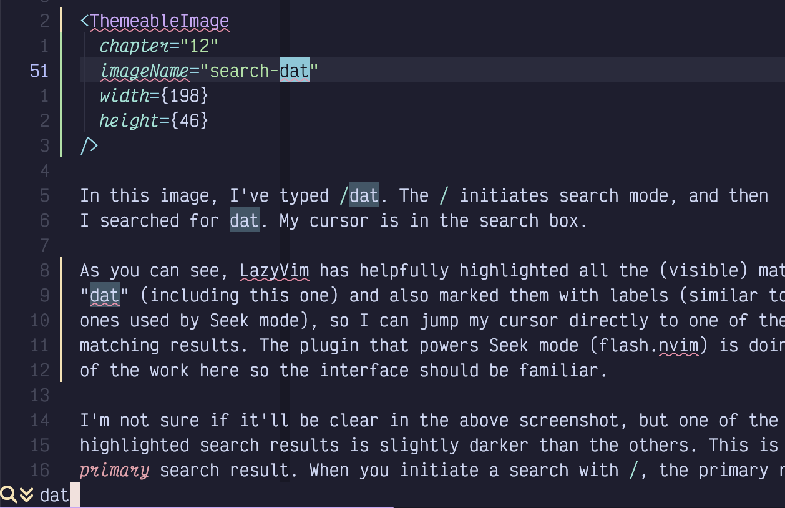
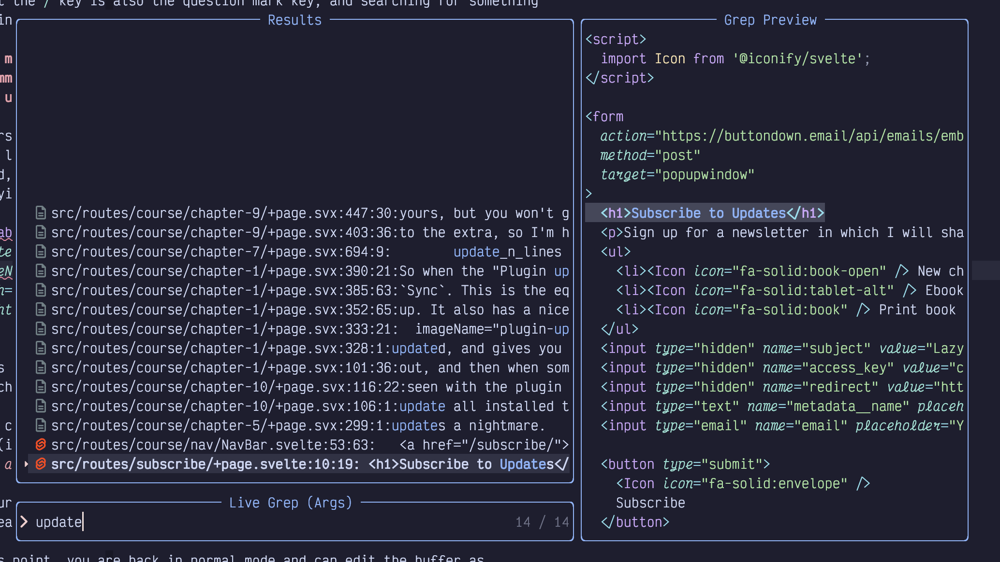

## <a href="#_searching" class="link">Chapter 12. Searching…​</a>

It’s kind of amazing that we’ve gotten this far without covering searching. Find and replace in Vim has always been far more powerful and nuanced than in most editors, which just give you a little dialog with three fields and, if you’re lucky, a check box to specify regular expressions.

LazyVim extends Neovim’s powerful search feature to make it both easier to use and prettier. You know about the Seek (`s`) and Treesitter (`S`) modes for navigating to and selecting objects you can see, as well as their remote operator-pending objects counterparts: `r` and `R`. These work great when the text you are looking for is currently visible. However, when you need to search a file and have it automatically scroll to search results, they are insufficient.

### <a href="#_search_in_current_file" class="link">12.1. Search in Current File</a>

To search for a pattern in Vim use the `/` command in Normal mode. The mnemonic is that the `/` key is also the question mark key, and searching for something is a kind of question.

<table>
<tbody>
<tr>
<td class="icon"></td>
<td class="content">Many tools that are not considered “modal” have adopted Vi’s <code>/</code> as a command to invoke search. For example, the exceptional Linear task tracking tool uses <code>/</code> to begin a search, as does the ubiquitous GitHub.</td>
</tr>
</tbody>
</table>

The first time you type a `/` in Normal mode, you might lose your cursor! It doesn’t pop up a new window. Instead, `/` takes over the current file’s status bar with a magnifying glass icon:

Figure 53. Search “dat”

In this image, I’ve typed `/dat`. The `/` initiates Search mode, and then I searched for `dat`. My cursor is in the search box.

As you can see, LazyVim has helpfully highlighted all the (visible) matches for “dat”. The "primary" result will always be the first matching result *after* the point where your cursor was when you hit `/`.

Your cursor will jump to the primary result if you press `Enter` to confirm your search. Press `Escape` to cancel it, as usual.

At this point, you are back in Normal mode and can edit the buffer normally. Before doing so, however, notice that all the highlighted results are still highlighted. You can easily jump to the next result using the `n` (for **n**ext) key. This command accepts a count, so you can use `3n` to jump to the third result after the current cursor position.

The search will wrap to the top of the document if there are no more matching results at the bottom. If you know how far you need to jump, you can use a count with the `/` command as well, as in `3/something` to jump forward to the third `something`. Figuring out how far you need to jump requires some mental agility, though, so it’s usually faster to use Seek mode.

If you `n` too far, you can use `Shift-N` to move the cursor to the previous result instead. And if you *know* you need to search backwards to a previous result, you can initiate the search with `?` (i.e. `Shift-/`) instead of just `/`.

<table>
<tbody>
<tr>
<td class="icon"></td>
<td class="content">If you have used Vim before, I should warn you that this behaviour of <code>n</code> and <code>N</code> is different from the default Neovim behaviour. They used to “repeat the last <code>/</code> or <code>?</code> command,” so <code>n</code> would continue <em>up</em> the document if you started with <code>?</code>. The LazyVim model is easier to remember; <code>n</code> always means “next down” and <code>N</code> always means “previous up”.</td>
</tr>
</tbody>
</table>

### <a href="#_ignore_case" class="link">12.2. Ignore Case</a>

If you enter your search term as all lowercase letters, LazyVim will ignore case by default, but if you include a capital letter in your search term, it will enable case sensitivity. So searching for `in` will match `in` and `In`, but searching for `In` will only match `In`.

If you expressly want to search for **only** lowercase matches, you can modify the search term by inserting the two characters `\C` (that `C` is capitalized) somewhere in it.

Conveniently, it doesn’t have to be at the beginning of the search term; if there is a `\C` anywhere in the search string, it will make the whole search case sensitive. So, imagine you were looking for the lowercase word “initiate”. If you start typing `in` and realize it’s matching a bunch of unnecessary `In` because ignore case is enabled, you can append `\C` (so you end up with `in\C`) to switch to ignore case mode before typing `iti` (so the total search string is `in\Citi`).

If you want to completely disable ignore case temporarily, type the colon command `:set noignorecase`. This will only last until you exit Neovim, or explicitly enable it again with `:set ignorecase`.

If you want to make the change permanent, open your `options.lua` file and add `vim.opt.ignorecase = false` somewhere in it. Note that now if you want to make any specific search case **in**sensitive, you need to use lowercase `\c` instead of `\C` in the search phrase.

The `\C` trick seems kind of weird at first, but when you think about the alternative used in most code editors, where you have to move your hand to your mouse, target a tiny checkbox with a label like `wW`, and click it, then refocus the search box and continue typing, you’ll probably decide that `\C` is faster.

### <a href="#_regular_expressions" class="link">12.3. Regular Expressions</a>

Vim searches use regular expressions by default. But they are kind of strange regular expressions.

Ok, I admit that *all* regular expressions are kind of strange. Vim’s are only strange in comparison to the PCRE-style regular expressions that are common in most modern programming languages. Luckily, if you are searching text, you probably don’t need the full complexity the Perl-compatible expressions offer.

I don’t have space in this book to instruct in regular expression syntax, so I’ll just mention some of the main go-tos and leave you to look up the rest:

- `.` matches *any* single character. If you need to search for a literal period, escape it with `\.`.

- `\S` matches any *non-whitespace* character.

- The `*` character matches the preceding expression zero or more times. Notably, `.*` will match any string of characters of arbitrary length.

- The `\+` string will match the preceding expression one or more times. (This is notably different from most regular expression parsers I’ve seen, where you don’t need the `\` before the `+` to match one or more). It can be combined with e.g. `\S` to match any word without spaces: `\S\+`.

- `\=` can be used to match the preceding pattern zero or one times. Useful for things like `https\=:` where the “s” is optional. This pattern is usually `?` in most regular expression engines, and in fact `\?` also works for this. However, it would confuse Vim when the command to invoke search backwards is `?`, so `\=` wins.

- `\\` matches a literal backslash and `\/` matches a literal forward slash.

In general, if you know PCRE-style regular expressions, you’ll find you need a lot more backslashes in Vim. That said, the vast majority of code editor searches are covered by the above.

If you want to “disable” regular expression matching for a specific search, place `\V` at the beginning of the line (or in the middle of the line if you only need to disable it for the remaining part of the search). The “V” stands for “very nomagic”, and if you want to become extremely confused, type `:help magic`. It is so confusing, in fact, that you will prefer to learn to just use regular expressions (yes, I am aware how very confusing that is. Vim’s interpretation of magic is worse).

If you desperately need a regular expression to do something you can ask Claude skim through `:help regular expressions` to find the syntax you need. You will come away either enlightened or frustrated.

### <a href="#_search_in_project" class="link">12.4. Search In Project</a>

If you need to search for a word across your entire codebase, instead of just in one file, use the command `<Space>/` instead of just `/`. It will pop up the ever-so-familiar picker, this time in something called `live_grep` mode.

Fun fact: On the command line, `grep` is a tool that is used for regular expression searching, and the name comes from the `ed` (remember `ed`, the predecessor of `vi`, `ex`, and `sed`?) command `g/re/p`, which maps to "global / regular expression / print". The `live` in LazyVim’s "live grep" means that the searching happens as you type instead of waiting to run a command line like the `grep` utility does.

LazyVim uses a tool called `ripgrep` that is a lot faster and more featureful than the original `grep` tool, so make sure you have `ripgrep` installed and available on your path as `rg`.

Type the string you are looking for. The results will show up in the left side and the file will display in a preview on the right so you can be sure you found the right one:

Figure 54. Live Grep Picker

Remember that you can add labels to picker results by pressing `Alt-s`. I find this more useful in the `live_grep` window because unlike most pickers, a space in `live_grep` is sent as a literal space to `ripgrep`, instead of allowing us to narrow the search results by searching for something earlier in the line as we discussed in chapter 4.

<table>
<tbody>
<tr>
<td class="icon"></td>
<td class="content">Since this is a picker, you can press <code>Alt-t</code> while it is open to put all the search results into the Trouble window so you can navigate them while editing (using <code>]q</code> and <code>[q</code>).</td>
</tr>
</tbody>
</table>

Annoyingly, this search mode is completely different from Vim’s built-in search. It just passes your pattern to `ripgrep` and behaves the way `ripgrep` does. And `ripgrep` doesn’t know about things like Vim’s strange regular expression engine. It *does* support regular expressions, but they use maddeningly different syntax from Vim. Which is to say, the same syntax as pretty much everything that isn’t Vim. It’s Vim that’s maddening here, not `ripgrep`. Just so we’re all clear.

### <a href="#_summary_12" class="link">12.5. Summary</a>

This chapter was all about search: the `/` shortcut to enter Search in file mode, and the `<Space>/` shortcut to enter find in project mode.

Searching is, of course, only half the story. In the next chapter, we’ll cover replacing text, both as part of a search operation and at a more project-wide level.
