## <a href="#_and_replacing" class="link">Chapter 13. …​And Replacing</a>

Vim has a very powerful find and replace mechanism. It…​ takes some getting used to. On the one hand, it’s pretty hard to go back after you’ve gotten used to the power of Vim substitution. On the other hand, getting used to it can take a lifetime.

You definitely need to know how to do old-school substitution in Vim, but I first want to discuss a slightly easier version of find and replace that I have been reaching for more and more often.

### <a href="#_nvim_rip_substitute" class="link">13.1. Nvim-rip-substitute</a>

The `nvim-rip-substitute` plugin by Chris Grieser provides a familiar find and replace dialog that is similar to most other tools and editors. It isn’t as powerful as native Vim substitution, but it is easier to use.

There is no Lazy Extra for `nvim-rip-substitute`, so you’ll need to add a new file to your `plugins` directory. I call mine `rip-substitute.lua`, and it looks as follows:

Listing 31. Nvim-rip-substitute configuration

    return {
      "chrisgrieser/nvim-rip-substitute",
      keys = {
        {
          "g/",
          function()
            require("rip-substitute").sub()
          end,
          mode = { "n", "x" },
          desc = "Rip Substitute",
        },
      },
    }

Restart Neovim after adding this plugin. It adds a new `g/` keybinding. The `g` is a prefix for "stuff that doesn’t fit elsewhere" and the `/` is a parallel to the "Search" `/` from the previous chapter.

Now when you hit `g/` you get a search and replace widget in the lower right corner of your window:

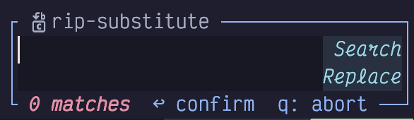

Figure 55. Rip Substitute Widget

There are two fields, and the `Search` field is focused when the widget pops up. Type whatever you want to search for in there (it may be pre-populated if you had previously selected small text).

This field uses regex syntax, but thankfully, it **isn’t** vim regex syntax. It uses the modern regex syntax that comes with-rip-grep and should be familiar if you have worked with regular expressions in any modern programming language. If you aren’t, switch to Normal mode with `Escape` hit the `R` key to open the current regular expression in the helpful [regex101](https://regex101.com/) website!

To switch between the `Search` and `Replace` fields, use the `j` and `k` keys from normal mode, just as though you were switching lines in any vim window. You can even use things like `o` to enter insert mode on the next line.

Once you have got your search and replace strings arranged to your liking, and verified the live preview that pops up, use the `Enter` key in Normal mode or the `Control-Enter` key combination in Insert mode to perform the subtitution.

By default, rip-substitute performs its find and replace on the whole file. If you start with a line-wise visual selection before you invoke the `g/` keybinding, it will instead search and replace inside the selected lines.

This can be confusing because if you start with a **character-wise** range selected, which can span multiple lines, it will instead use the selected text to prepopulate the `Search` field. If you start with no selection, the `Search` field is instead populated with the word that was under the cursor when you opened the widget.

You can **capture** variables in the search string and then reuse them by number in the replace section, with $1, $2, etc, where the capture groups are numbered from left to right by their opening brace.

This allows you to perform subtititions like this:

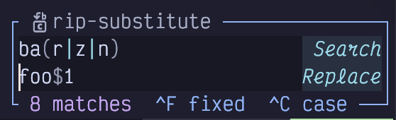

Figure 56. Rip Substitute Capture

In this example, we are matching on any of the words `bar`, `baz`, or `ban`, and, depending which was matched, replacing each with `foor`, `fooz`, or `foon`.

Rip-substitute also keeps track of your history. Use the up and down arrows in normal mode to select a previous substitution and edit it as needed.

I have made rip-substitute my daily driver for find and replace. It is powerful enough to cover the majority of my needs, and its default behaviour is quite a bit saner than the substitute command we’ll cover next. That said, rip-substitute can’t do everything, so you’ll still need to reach for the deep dive below from time to time.

### <a href="#_substitute_command" class="link">13.2. Substitute Command</a>

Substitution predates Vim and even Vi; it goes back to the legendary `ed` by the even more legendary Ken Thompson. He wrote the original paper on regular expressions, (among **many** other foundational tools) so I suspect `ed` is the first place regexes were used in the wild.

Substitution in `ed` was so powerful that it has somehow stuck around for over half a century. Not only is it the primary search and replace mechanism in modern Vim and Neovim, it is also popular when automating tasks via shell scripting, using `sed` (the stream editor, a sequel to `ed`).

LazyVim, as usual, enhances the substitution command, mostly by showing you live previews of your changes as you type.

Because it is an `ex` command (ex stands for “extended ed”, much like its sibling `vi` was later rewritten as “vi improved”), you access substitution by entering Command mode (with a `:`). You could type `:substitute`, but everybody shortens it to `:s` because a) it works, and b) why type more than you need to?

Then, without pressing enter, type a `/`. This is just a separator to separate the command you are issuing (`s` or `substitute`) from the term you are searching for.

Now type the search pattern. This can be any Vim regular expression, just like those we covered for a normal search in Chapter 12.

Here you can see that I have typed `:s/pattern` into my editor, and the `pattern` is highlighted on the line that my cursor was on:

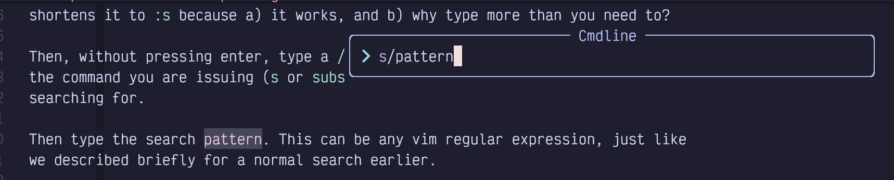

Figure 57. Substitute Pattern

Next, type another `/` to separate the *pattern* from the *replacement*, and then type whatever string you want to replace it with. LazyVim will live update all instances of the search term with the replacement term so you can preview what it will look like. Here, I’m going to replace `pattern` with `FOOBAR`:

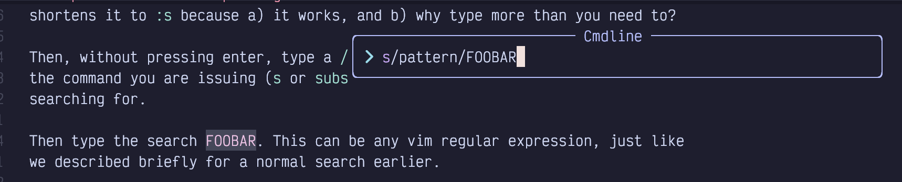

Figure 58. Substitute Replace String

Now press `Enter` to complete the command and confirm the replacement. So find and replace is as simple as `:s/pattern/replacement<Enter>`. That’s not so bad, is it?

Maybe it’s not, but we’re not done. Not remotely. For one thing, that command will only replace the first instance of `pattern`, and only if the pattern happens to be on the same line as the cursor.

<table>
<tbody>
<tr>
<td class="icon"></td>
<td class="content">It is conventional to use a <code>/</code> after the substitute command, but if you are performing a substitution on something that has a lot of <code>/</code> characters in it (e.g a Unix path), you can use another character such as <code>+</code> for the separator to avoid having to escape a bunch of <code>/</code> characters with <code>\/</code>. For example <code>:s+/home/dustyphillips/+/home/yourname/+</code> can be used instead of <code>%s/\/home\/dustyphillips\//\/home\/yourname\/</code>.</td>
</tr>
</tbody>
</table>

#### <a href="#_substitute_ranges" class="link">13.2.1. Substitute Ranges</a>

Many Neovim ex commands can be preceded by a range of lines that the command will operate on. The syntax for ranges can be a little confusing, and to this day I still have to look it up with `:help range` if I’m doing anything non-standard.

The simplest possible range is the `.`, which stands for “current line”. It would look like `:.s/pattern/replacement`. The `.` between the `:` and the `s` is the range, in this case. You normally wouldn’t bother, though because `.` or “current line” is the default range.

Probably the second most common range you will use is `%`. It stands for “Entire File”. If you are used to the find and replace dialog in most editors or word processors, you probably expected it to search the “entire file” by default. But it doesn’t, and if you want to do a find and replace across the entire file, you would need to use `:%s/pattern/replacement` (probably with a `/g` on the end as described in the next section).

You could also set a specific line number, such as `:5s/pattern/replacement` to replace the word `pattern` on line 5. But I would normally use `5G` to move my cursor to line five and then do a default range substitution instead.

The name “range” implies that you can cover a sequence of multiple lines, and you can indeed separate a start and end position using a comma. So, for example, `:3,8s/…​` will perform the substitution on lines 3, 4, 5, 6, 7, and 8 (the selection is inclusive at both ends): Here I’ve started a pattern that is highlighting the word `hello` on lines 3 through 8, but no other lines:

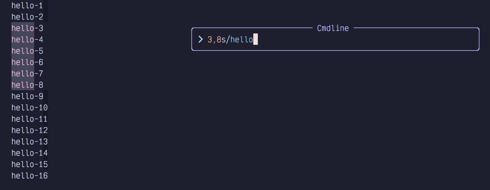

Figure 59. Range 3-8 Inclusive

You can also use marks such as `'a` as described in the previous chapter to define the start or end of a range.

The most common way you’ll use this is using `'<,'>`, which specifies the range for “the most recent visual selection”. Luckily, you won’t need to type those characters all that often, because if you select some text using e.g. `Shift-V` followed by a cursor movement, and then type `:`, Neovim will automatically take care of copying that range into the command line.

This means that if you want to “perform a substitution in the current visually selected text,” you just have to select the text and type `:s/…​`. The range will be inserted between the colon and `s`, so you’ll get `:'<,'>s/…​`.

If your brain is up for some recursive confusion, you can even use a search pattern to specify one end of the range! In the following example, my cursor was on line 5 when I started the substitution:

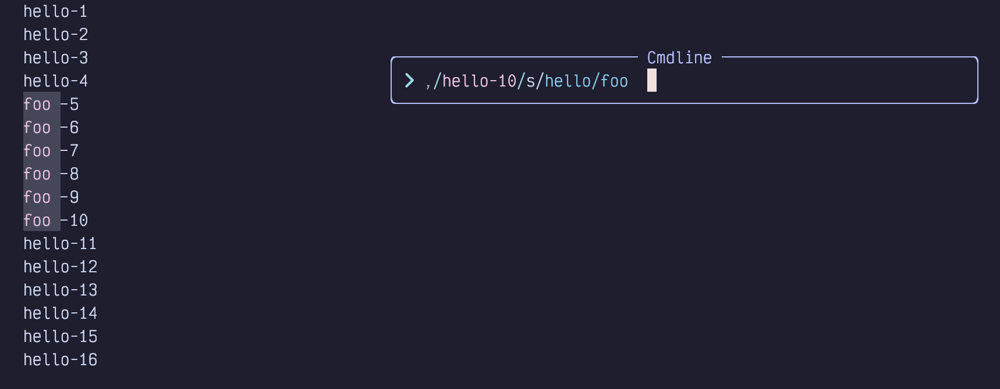

Figure 60. Pattern Range

The substitution is `:,/hello-10/s/hello/foo`. All those forward slashes in there make it pretty hard to read (looks like a Unix file path!), but it’s actually easy to write. Let’s break it down from left to right:

- `:` is the Normal mode “start an ex command” trigger.

- There is nothing between the `:` and the `,` so the start of the range is the current line (line 5 in this example).

- The first `/` is a more succinct way of saying “the end of the range is the first line after the current cursor position that matches some pattern”.

- `hello-10` is the pattern we are searching for to define the end of the range.

- The second `/` marks the end of the pattern. So our full range is `,/hello-10/` and means “from the current line to the line containing `hello-10`.”

- The `s` indicates we want to perform a substitution on the lines in that range.

- `/hello/foo` is the pattern “hello” and replacement “foo”, like any substitution.

There is a ton of other stuff you can do with Vim ranges, but the truth is, most of them only exist to support outdated editing modes. You will likely find that `%`, `'<,'>`, and `,/pattern/` cover 95% of your use cases. Read through `:help range` once to make sure you know what other sorts of syntaxes are available, and don’t be afraid to look them up in the rare cases where one of the above is not sufficient.

#### <a href="#_flags_global_and_ignore_case_substitutions" class="link">13.2.2. Flags (Global and Ignore Case Substitutions)</a>

You can add “flags” at the end of any substitution (after the last `/`) to modify how the search and replace behaves. The most common flag you’ll use is `g` which stands for “global”. You’ll append it more often than not.

By default, `substitute` only replaces the first instance of a pattern on the line. So if I have a file full of the overly cheerful words `hello hello`, then the substitution `:%s/hello/foo` will only replace the first instance on each line:

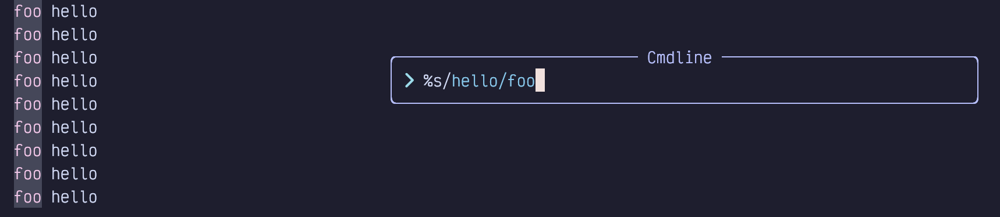

Figure 61. Substitute Highlights (Non-Global)

But if I append `/g` it will replace all the `hello`'s on each line:

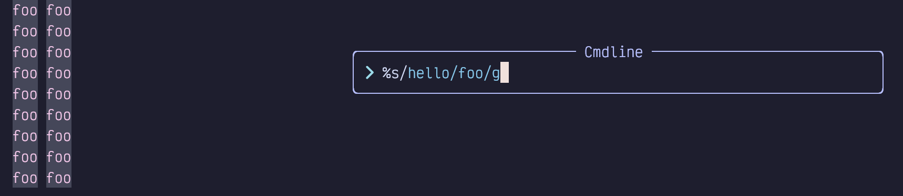

Figure 62. Substitute Highlights (Global)

I mentioned earlier that the supremely common use case of “replace everything in the file” is `:%s/pattern/replacement/g`. The `%` is "every line", and the `g` means “every instance in each line”.

There are almost a dozen flags, but the only other useful ones are `i`, `I`, and (rarely) `c`. The first two explicitly ignore case or disable ignoring case in the term being searched for, and you’ll only ever need one or the other depending on whether you have `ignorecase` set in your `options.lua` (it defaults to true in LazyVim). The `c` flag means confirm and is useful if you want to make substitutions in a large file but you know you want to skip some of them. You will be shown each proposed change and can accept or reject them one at a time.

Flags can be combined, so `:%s/hello/foo/gc` will do a global replace, confirming each one.

#### <a href="#_handy_substitute_shortcuts" class="link">13.2.3. Handy Substitute Shortcuts</a>

You don’t need to memorize this section, but once you get used to substituting, you’ll probably notice that some actions are rather repetitive and monotonous and you’d like to type them faster. Read through these tips so you remember to look them up when you are more comfortable with `:substitute`.

If you leave the pattern part of a substitution blank, (as in `:s//replacement/`), it will default to whatever pattern you last searched for *or* substituted. For example, if you perform these commands in order:

- `/foo` will search for the word `foo`

- `:s//bar` will replace `foo` with `bar`

- `:s/baz/bar` will replace `baz` with `bar`

- `:s//fizz` will now replace `baz` with `fizz`

This can save a little typing when you search for a term and then decide you want to replace it, or when you have substituted something in one file and want to substitute it again in another.

If you just use `:s` without any pattern or replacement, it will repeat the last pattern **and** replacement you did. But be aware that it will not act on the same range, so if you want to repeat it exactly you’ll need to type the range again.

It also won’t repeat flags, but you can (usually) append the flags directly to `:s`. For beginners, the most common of these is `:%sg`, which maps to “repeat the last substitution on the entire file, globally.” This is helpful when you typed `:s/long-pattern/long-replacement` and expected it to do a global replace, but actually it just replaces the first instance on the current line. `:%sg` will repeat the substitution the way you intended it. You might also reach for `'<,'>sg` to replace in the last visual selection.

<table>
<tbody>
<tr>
<td class="icon"></td>
<td class="content">Don’t forget that you can repeat the last visual selection with <code>gv</code> to confirm that it is actually selecting what you expected.</td>
</tr>
</tbody>
</table>

If you want to reuse “whatever was matched in the pattern” in the replacement, you can use `\0` in the replacement string. This is particularly useful when you are using a regular expression that could potentially match different things.

For example, imagine I have the following file:

Listing 32. An Imaginary File

    hello world
    Hello thrift shop
    Hellish world

For some reason, I want to add an adjective between the first and second words. This can be accomplished with the command `:%s/[hH]ell\S* /\0green /`:

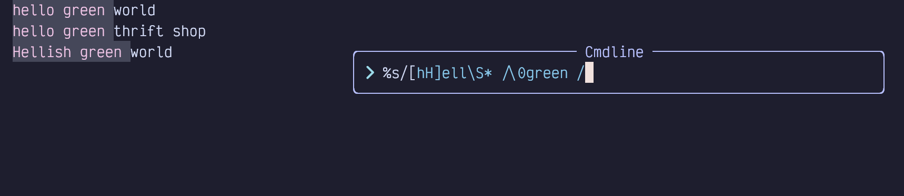

Figure 63. Substitute With Pattern in Replacement

That command might be a little intimidating if you aren’t comfortable with regular expressions, so I’ll break it down again:

- `:%` means “perform a command on the entire file”

- `s/` means “the command to perform is substitute”

- `[hH]` means “match h case insensitively (see note)”

- `ell` means “match the three characters `ell` exactly”

- `\S` means “match any non-whitespace character”

- `*` means “repeat the `\S` match zero or more times”, which takes us to the end of the word.

- ` /` includes a space and then the end of the search pattern

- `\0` says “insert whatever was matched by the above pattern into the replacement”

- `green` says “insert that text directly into the replacement”

<table>
<tbody>
<tr>
<td class="icon"></td>
<td class="content">The <code>[hH]</code> isn’t necessary if you don’t have <code>vim.opt.ignorecase=false</code> in your <code>options.lua</code>. An alternative would be to use <code>/i</code> at the end of the pattern to force ignoring case for this one search. Then <code>[hH]</code> could just be <code>h</code>.</td>
</tr>
</tbody>
</table>

You can even reuse **part** of the pattern in the replacement. To do this, place the part you want to reuse between `\(` and `\)`. Then use `\1` to represent whatever was matched between brackets in the replacement portion.

This is easier to understand with an example. If we start with the same three line example as above, we can use the substitution `:%s/hell\(\S*\)/green\1 and blue\1/i` to cause the following nonsense substitution:

Figure 64. Substitute with Partial Pattern

The `\(\S*\)` matches the same thing as `\S*` but it stores the result in a *capture*. Then when we want to reuse the capture in the replacement, we use `\1` to refer *back* to whatever was captured on that match.

<table>
<tbody>
<tr>
<td class="icon"></td>
<td class="content">You might guess from the fact that we’re using numbers here that you can have and refer back to multiple captures, and your guess would be correct!</td>
</tr>
</tbody>
</table>

### <a href="#_project_wide_search_and_replace" class="link">13.3. Project-wide Search and Replace</a>

LazyVim ships with a plugin called Grug-far.nvim to do a global find and replace in all files in the project. Without grug-far, you would probably (unenthusiastically) do this from the command line using `sed`, the stream-oriented evolution of `ed` that I mentioned.

<table>
<tbody>
<tr>
<td class="icon"></td>
<td class="content">It is a good idea to commit your files to version control before running Grug-far. The changes it makes can be tricky to reverse. You can undo it file-by-file, but not all in one go. So make sure <code>git reset --hard</code> won’t cause you to lose any work that wasn’t done by Grug-far.</td>
</tr>
</tbody>
</table>

Grug-far is a lightweight UI wrapping `ripgrep`, the command line search tool some other plugins rely on. But that UI is pretty handy, as `ripgrep` has some arcane arguments.

To show the Grug-far UI, use the keyboard shortcut `<Space>sr`, where the mnemonic is r for **r**eplace. A window will open up on the right:

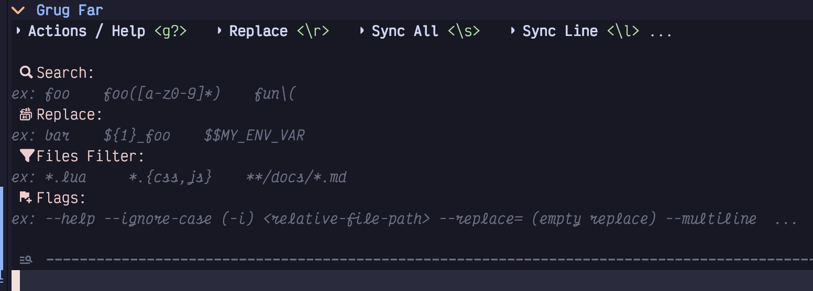

Figure 65. Empty Grug-far Window

You can navigate around this window using all the normal Vim motions, but you’ll mostly just need `j` and `k` to jump between fields.

The search field can accept any regular expression. Because this is using ripgrep under the hood, it is a slightly less arcane regex syntax. The Files Filter field isolates your search to a specific path or file extension, and accepts standard shell glob syntax.

As you fill in the form entries, Grug-far instantly previews the proposed changes in a live-updating widget:

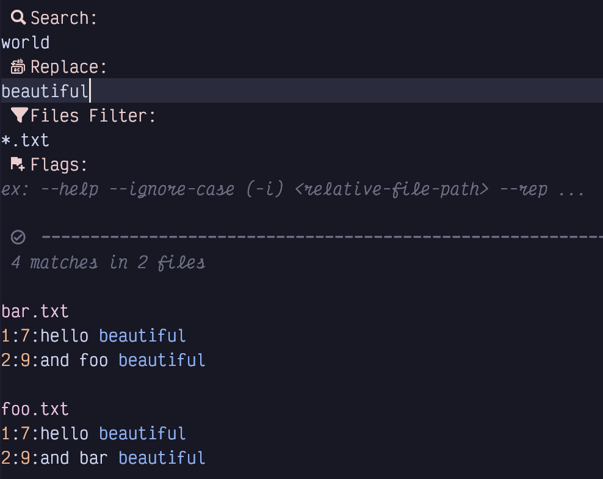

Figure 66. Grug-far With Preview

After you have inserted the search and replace text, you will need to press `Escape` to return to Normal mode. If all the results in the preview area look acceptable, simply hit `\r` to perform the **r**eplacement.

You also have the option to *tweak* the search results if some of them don’t match your needs. Use any standard motions to navigate the preview window. If there are matches that you don’t want to change, just use `dd` to delete them outright. Alternatively, feel free to edit any line, right in the preview window, to make it look the way you want.

Once you are satisfied with the preview, use `\s` instead of `\r` to **s**ync the changes you’ve made with their original source files.

You can also jump to the source file of a preview result by placing your cursor over it and hitting `Enter`.

Grug-far keeps track of your recent search and replace operations and allows you to revisit them with the `\t` keybinding. Navigate between them with standard motions and use `Enter` to reuse one of them.

There are a few other useful keybindings in a menu you can pop up with `g?`, which I’ll leave you to peruse at your leisure.

### <a href="#_the_text_case_plugin" class="link">13.4. The Text-case Plugin</a>

The [text-case.nvim](https://github.com/johmsalas/text-case.nvim) plugin by Johnny Salas provides a set of commands to quickly change the case of text. It has two related, but distinct, use cases:

- You want to change the "shape" of a specific word or selection to a different shape without changing the word. This plugin can quickly convert snake-case to CamelCase, or CONSTANT\_CASE for example.

- You want to change the "content" of a specific word to different content without changing the shape. For example, you can replace `foo_bar`, `FooBar`, and `FOO_BAR` to `fizz_buzz`, `FizzBuzz`, and `FIZZ_BUZZ` with one substitution command.

This is one of those plugins that you don’t reach for all that often, but saves tons of time when you do need it.

There is no lazy extra for `text-case.nvim`, but you can install it into your plugins directory as follows:

Listing 33. Text-case.nvim Configuration

    return {
      "johmsalas/text-case.nvim",
      lazy = false,
      config = true,
      cmd = {
        "Subs",
        "TextCaseStartReplacingCommand",
      },
    }

The `lazy = false` is needed to get certain interactive features from the plugin.

Once installed, you can start changing case. Write a snake case word somewhere such as `fizz_buzz`. Move your cursor to that word (you don’t even have to select it) and type `ga`. Notice how the which-key menu pops up to show you all the cases you can change it to:

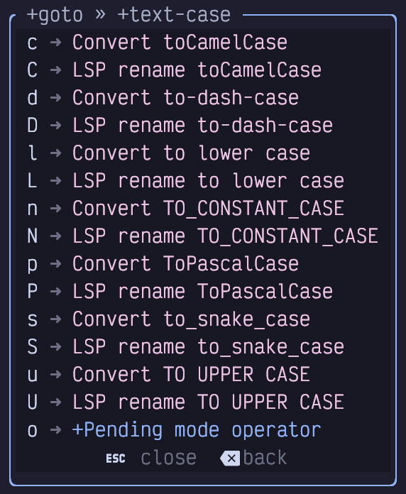

Figure 67. Text-case.nvim Which-key Menu

Select the case style you want to switch the word to and you’re done! This short form only works if the word you are on doesn’t have spaces. If you want to change e.g. `fizz buzz` to `FizzBuzz`, the easiest thing to do is select the two words in visual mode (e.g. move cursor to the `f` and hit `v2e`) and then hit `gap`, where `p` means "pascal" case. The which-key menu in visual mode will, of course, show other options after you hit `ga`.

Alternatively, you can put the cursor on the starting `f` and hit `gao` to instruct text-case to enter `operator-pending` mode **after** you select your target case. Then you can use any motion (e.g. `2w`) to tell text-case what block it should operate on.

#### <a href="#_case_aware_substitution" class="link">13.4.1. Case-aware substitution</a>

The text-case plugin also supports a `:Subs` command that behaves similar to the `:substitute` command, but changes words in such a way that it always keeps its existing case shape.

For example, consider this simple python class:

Listing 34. Case-aware Substitution

    class FooBar:
        fooBar: str

        def foo_bar(self):
            self.fooBar = "FOO_BAR"

Select the entire class (The `S` keybinding to seek surrounding objects is perfect for this) and enter the command mode command `:Subs/foo_bar/fizz_buzz`. In a single substitution, the entire class changes to the following:

Listing 35. Case-aware Substitution

    class FizzBuzz:
        fizzBuzz: str

        def fizz_buzz(self):
            self.fizzBuzz = "FIZZ_BUZZ"

This feature is ridiculously useful…​ when it’s useful. The occasions where it is needed are relatively uncommon, but when you need it, no other tool is nearly so suitable.

### <a href="#_perform_vim_commands_on_multiple_lines" class="link">13.5. Perform Vim Commands on Multiple Lines</a>

The `:substitute` command isn’t the only one that can operate on multiple lines at once, with a range. In fact, if you just want to write a few lines out to a separate file, you can pass a range to `:write`. The easiest way to do this is to select the range in Visual mode and type `:write <filename>`. Neovim will automatically convert it to `:'<,'>write` and only save those lines.

<table>
<colgroup>
<col style="width: 50%" />
<col style="width: 50%" />
</colgroup>
<tbody>
<tr>
<td class="icon"></td>
<td class="content">

Neovim doesn’t have first class multi-cursor support (yet). Historically, Vim coders have considered multi-cursor mode to be a crutch required by less powerful editors that don’t have Vim’s modes. More recently, experimental editors such as Kakoune and Helix have demonstrated that multiple cursors can integrate very well with modal editing. Modern developers like multiple selections, and Neovim is expected to ship with native multiple cursor support in the future (it’s currently listed as "Future (unknown release)" on the roadmap).

In the meantime, there <em>are</em> multiple cursor plugins, but I find them to be clumsy and fragile, and recommend avoiding them at this time. Instead, you can use the commands discussed below or rely on other Vim tools such as repeating recordings (with <code>q</code> <code>Q</code>, and <code>@@</code>), or Visual Block mode (<code>Control-v</code>) with an insert or append that modifies multiple lines.

</td>
</tr>
</tbody>
</table>

#### <a href="#_the_norm_command" class="link">13.5.1. The Norm Command</a>

When you first use it, `:norm` feels pretty weird. It allows you to perform a sequence of arbitrary Vim normal-mode commands (including navigation commands such as `hjkl` and `web` as well as modification commands like `d`, `c`, and `y`) across multiple lines.

You can even enter Insert mode from `:norm`! But you need to know a small secret to get out of Insert mode because pressing `<Escape>` while the command menu is visible will just close the command menu. Instead, use `Control-v<Escape>`. When you are in Insert mode or Command mode, the `Control-v` keybinding means “Insert the next keypress literally instead of interpreting it as a command.” The terminal usually renders `Control-v<Escape>` as `^[`.

For example imagine we are editing the following file:

Listing 36. An Imaginary File

    foo
    Bar
    fizz buzz
    one two three

For inexplicable (but pedagogical) reasons, we want to perform the following on each and every line:

- insert the word “HELLO” at the beginning of the line with a space after it

- capitalize the first letter of the first word on the line

- insert the word “BEAUTIFUL” after the first word on each line with spaces surrounding it

- append the word “WORLD” to the end of each line with a space before it

Start by typing `:%norm` to open a command line with a range that operates on every line in the file (`%`) and the `norm` command followed by a space.

Then add `IHELLO` to insert the text `HELLO` at the beginning of each line in the range. Now hit `Control-v` and then `Escape` to insert the escape character into the command line.

Now type `lgUl` to move the cursor right (which puts it on the beginning of the first word), then uppercase one character to the right (i.e. the first character of the next word).

Next is `e` to jump to the end of the word, followed by `a BEAUTIFUL` to append some text after that word. `Control-v` and `Escape` will insert another escape character.

Finally, add `A WORLD` to enter Insert mode at the end of the line and add the text `WORLD`.

The entire command would therefore be:

Listing 37. Norm Command

    :%norm IHELLO <Control-v Escape>lgUlea BEAUTIFUL<ctrl-v Escape>A WORLD

Visually, it looks like this, since the `Control-v Escape` keypresses get changed to `^[`:

Figure 68. Why Would You Ever Want To Do This?

And the end result:

Listing 38. Result of Applying Norm Command

    HELLO Foo BEAUTIFUL WORLD
    HELLO Bar BEAUTIFUL WORLD
    HELLO Fizz BEAUTIFUL buzz WORLD
    HELLO One BEAUTIFUL two three WORLD

Of course, it’s unclear why you’d want to perform this exact set of actions, but it hopefully shows that anything is possible!

It’s pretty common to get the command wrong the first time you try to apply it. Simply use `u` to undo the entire sequence in one go, then type `:<Up>` to edit the command line again.

If the command is kind of complicated, you’ll probably get annoyed while editing it because you don’t have access to all the Vim navigation commands you are used to. So now is a great time to introduce Vim’s command line editor.

### <a href="#_command_line_editor" class="link">13.6. Command Line Editor</a>

To display the command line editor, type `Control-f` while the little `Cmdline` window is focused. Or, if you are currently in Normal mode, type `q:`. This latter is not related to the “record to register” command typically associated with `q`. It is instead “Open the editable command line window”.

This window is basically what happens when the normal command line editor marries a normal Vim window and spawns a magical superpower command line window.

The new power window shows up at the bottom of the current buffer, just above the status bar, and it contains your entire command line history (including searches and substitutions):

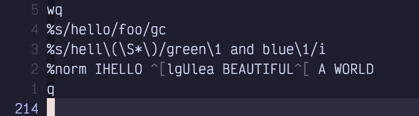

Figure 69. Command Line History Window

Use `Control-u` to scroll up this baby and you’ll see every command you ever typed. You can even search it with `?` (search backward is probably more useful than search forward since your commands are ordered by recency).

To run any of those old commands, just navigate your cursor to that line and press `Enter`. Boom! History repeats itself.

Or you can enter a brand new command on the blank line at the bottom of this window (remember `Shift-G` will get you to the bottom in a hurry).

You will find this window is devilishly hard to escape, though. The escape key doesn’t work, because it’s reserved for escaping to Normal mode while editing *in* the window. The secret is to use `Control-C` to close it, although other window close commands such as `<Space>wq` will also work. You can even run `:q` from inside the command line window.

Most importantly, you can use normal Vim commands to *edit* any line in this window. Just navigate to the line, use whatever mad editing skills you have (including other command-mode commands such as `:s`) to make the line look the way you want it to, return to Normal mode, and press `Enter`. The edited command will execute.

### <a href="#_mixing_the_norm_command_with_recording" class="link">13.7. Mixing the Norm Command With Recording</a>

Recall that the `q` command can record a sequence of commands to a register for later playback. And the `:norm` command can be used to apply a sequence of commands to a range of lines. The fact that you can `p` a register that has a recording in it means there are several ways you can later apply a recording to a range of lines using `:norm`:

- `:<range>norm @q` will simply execute the `q` register on each line in the range, since `@q` is the command to execute register `q`.

- `:<range>norm <Control-r>q` will copy the *contents* of register `q` into the cmdline window so the actions will be applied to each line.

- `q:<range>inorm <Esc>"qp` will open the command line editor window, insert the word `norm` and copy the contents of register `q` into the line using the Normal mode register paste command.

### <a href="#_the_global_command" class="link">13.8. The Global Command</a>

The `:norm` command operates on a range of lines, and Neovim ranges must be contiguous lines. It’s not possible to execute a command on e.g. lines 1 to 4 and 8 to 10, but not 5 to 7 (other than running `:norm` twice on different ranges).

Sometimes, you want to run a command on every line that matches a pattern. This is where the `:global` command comes in.

The syntax for `:global` is essentially `:<range>global/pattern/command`, although you can shorten it to `:<range>g/pattern/command`. The pattern is just like any Vim search or substitute pattern.

The `command`, however, is kind of weird. Technically, it’s an “ex” command, which means “many but not all of the commands that come after a colon, but mostly ones you don’t use in daily editing so they are hard to remember”.

The most common example is “delete all lines that match a pattern”, which you can do with `:%g/pattern/d`.

Another popular one is `substitute`, which you already know. If you precede your substitute with `:%g/pattern`, you can make it only perform the substitution on lines that match a certain pattern. This pattern can be *different* from the one that is used in the substitution itself. Consider the following arcane sequence of text:

Listing 39. Combine Substitute with Global

    :%g/^f/s/ba[rt]/glib

What a mess! This is obviously meant to be easy to write, not easy to read. If we wanted it to be slightly easier to read, we’d probably write `:%global/^f/substitute/ba[rt]/glib`.

This command means “perform a global operation on every line that starts with `f`. The operation in this case should be to replace every instance of `bar` or `bat` with the word `glib`.”

<table>
<tbody>
<tr>
<td class="icon"></td>
<td class="content">This is different from using a pattern in a range, such as <code>:,/foo/s/needle/haystack/</code>. This command performs the substitution on all lines between the cursor and the first line to contain <code>foo</code>, whereas <code>:%global/foo/s/needle/haystack/</code> performs the substitution on every line in the file that contains the word foo.</td>
</tr>
</tbody>
</table>

In my opinion, the most interesting use of `:global` is to run a Normal mode command on the lines that match a pattern. This effectively means mixing `:global` with `:normal`, as in `:%g/pattern/norm <some keystrokes>`.

As just one example, this will insert the word “world” at the end of every line that starts with “hello”:

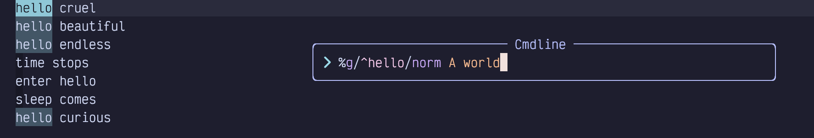

Figure 70. Mixing Global and Normal

You can also use global to perform a command on every line that **does not** match a pattern. Just use `g!/` instead of `g/`.

<table>
<colgroup>
<col style="width: 50%" />
<col style="width: 50%" />
</colgroup>
<tbody>
<tr>
<td class="icon"></td>
<td class="content">

The <code>g!</code> is useful in log files that have exceptions wrapping onto random lines. For example, a rudimentary log file might look like this:

Listing 40. Imaginary Log File

<pre class="pygments highlight"><code>2024-03-26T12:00:00 Something happened
2024-03-26T12:01:01 Something happened
2024-03-26T12:01:02 Something super bad happened
  Traceback:
    A bunch of lines I don&#39;t care about
2024-03-26T12:02:00 Something else happened
2024-03-26T12:03:58 Cool thing happened</code></pre>

and prior to further processing, I might want to remove every line that doesn’t start with a date:

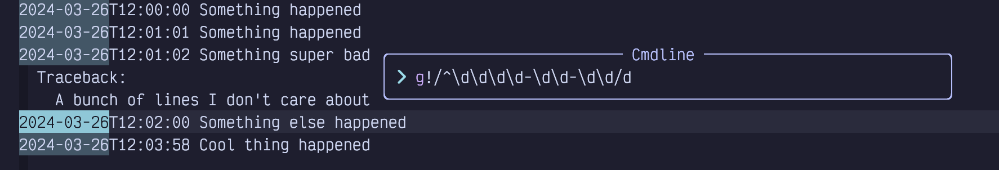

Figure 71. Global Invert Match

As has become a running theme, that might be a bit eye-watering. Each <code>\d</code> means “match a digit”, while the final <code>/d</code> means “perform a delete operation on the selected lines”. The <code>g!</code> is the important part; that’s the one that means “the selected lines are ones that <em>don’t</em> match the pattern”.

</td>
</tr>
</tbody>
</table>

I don’t use `:global` nearly as often as I use `:norm`. But when I do, it is a hyper-efficient way to cause massive changes in a file. It takes some getting used to, and you’ll probably be looking up the syntax the first few times you need it, but it’s a really terrific tool to have in your toolbox.

### <a href="#_summary_13" class="link">13.9. Summary</a>

This chapter was all about bulk editing text. We started with substitutions using the `:s[ubstitute]` ex command, and then took a tour of the UI for performing find and replace across multiple files using the Grug-far plugin.

Then we learned how to perform commands on multiple lines at once using `:norm` and `:global`, and earned a quick but comprehensive introduction to the command line editing window.

In the next chapter, we’ll learn several random editing tips that I couldn’t fit anywhere else.
