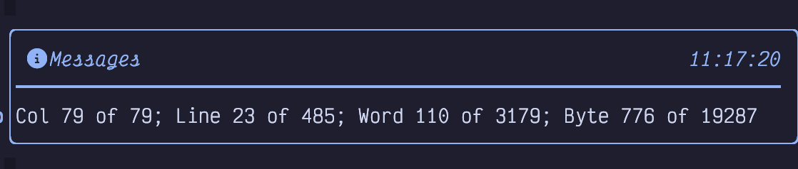
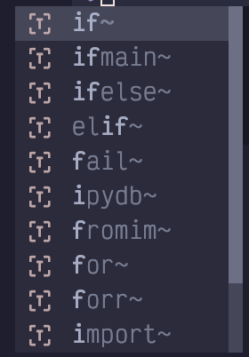
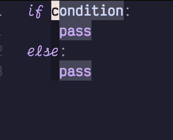

## <a href="#_miscellaneous_editing_tips" class="link">Chapter 14. Miscellaneous Editing Tips</a>

Before we dive into some of the more “IDE-like” behaviours that LazyVim enables, I wanted to collect some tips that can make your editing life a little more fun. This chapter is a bit of a grab bag, and includes some commands and plugins that I couldn’t fit anywhere else.

### <a href="#_word_counts" class="link">14.1. Word Counts</a>

Use `g<Control-g>` to spit out a message containing some helpful info about the current cursor position:

Figure 72. Word Count

Most notably, the “Word 110 of 3179” tells me that this chapter has over 3000 words in it (obviously I updated this section after I wrote more words!)

### <a href="#_transposed_characters" class="link">14.2. Transposed Characters</a>

How often do you type so fast that you accidentally transpose two chracters? I’m looking at you, `hte`!

Simply use `xp` to swap a character with the one to the right of it. For example, if you have typed `ra` when you meant to type `ar`, put your cursor on the `r` and hit `xp`.

This is not a special custom command. It just uses the default “delete character” and “put last deleted after the cursor” commands to move the character from its current position to the next one. You can use a similar idea to move other text around. For example, move a word with `dwwP` or use `daWwp` to delete an argument and move it later in a function signature.

### <a href="#_commenting_and_uncommenting_code" class="link">14.3. Commenting and Uncommenting Code</a>

LazyVim ships with a plugin for commenting and uncommenting code in older versions of Neovim, but as of Neovim 0.10, this is actually a native Neovim feature.

The verb for toggling comments is `gc` and can be followed by a motion or text object. So `gc5j` will comment this line and the five lines below it, while `gcap` will comment out an entire block separated by newlines.

This command pairs beautifully with the `S` command to comment out a surrounding text object. For example `gcSh` will comment out the function surrounded by the `h` labels after the `S` is invoked.

To comment out a single line, use the easy-to-type shortcut `gcc`. This command can take a count, so `5gcc` will comment out five lines (a little easier to type than `gc4j`).

As with most verbs, `gc` can also be applied to a visual selection with e.g. `V5jgc`.

The `gc` verb is actually a toggle, so if a line is currently commented, it will uncomment it instead of commenting it a second time. Thus, `gccgcc` is a no-op. However, note that if you have a selection that contains commented and uncommented lines, you will end up with a double comment. This is usually what you want: If you temporarily comment out a block that contains other comments, when you uncomment that block, you probably want the original comments to stay commented.

As a shortcut, if you want to add a new comment line above or below the current line, instead of commenting the current line, you can use `gcO` and `gco`. Technically this is a new verb, but for memory’s sake, think of it as combining `gc` with the verbs to open a new line (`o` and `O`).

### <a href="#_incrementing_and_decrementing_numbers" class="link">14.4. Incrementing and Decrementing Numbers</a>

If your cursor is currently on a number in Normal mode, you can use `Control-a` to increment that number. This command is somewhat smart and does the “right thing” if your number needs new digits. So `9` becomes `10` and `99` becomes `100` when you press `Control-a` anywhere in the number.

To decrement a number, use `Control-x`.

I hated these two keybindings for the longest time because they are only occasionally useful, but when they are useful, I couldn’t remember the keybindings. So I spent a long time manually incrementing numbers and thinking to myself “I need to look up those number increment commands,” but the only keywords associated with this help section were the keybindings themselves!

Eventually I learned about the `:helpgrep` command, which allows you to search the help. Long before I memorized the keybindings, I remembered that `:helpgrep Adding and subtracting` would help me look them up.

But there is actually a mnemonic for these keybindings: `Control-a` is “Add”, which is easy enough to remember. `Control-x` is a little harder, but now that you have `Control-a` you’ll be able to look it up with `:help CTRL-a`. I’m not sure if it will help anyone else, but I think of the `x` as “'cross' out one digit to subtract”.

Use `g<Control-a>` and `g<Control-x>` to decrement numbers on consecutive lines with an additional increment for each line in the count. This is useful if you are manipulating numbered lists. Say you want to make a list of 10 items. First type `o1.<esc>` to make a line that says `1.`. Then type `9.` to repeat that command 9 times. Now you have:

Listing 41. A Dumb List

    1.
    1.
    1.
    1.
    1.
    1.
    1.
    1.
    1.
    1.

You can use `V'[` to select the 9 rows that just got inserted, as the `'[` mark is the first character of the previously changed text. Now type `g<Control-a>` to increment them and you end up with:

Listing 42. A Smarter List

    1.
    2.
    3.
    4.
    5.
    6.
    7.
    8.
    9.
    10.

Not bad for just a handful of odd-looking keystrokes: `oi1.<Esc>9.V'[g<Control-a>`!

If you need to insert a new entry in the middle of a list, add the entry, select the lines with the remaining entries, and hit `Control-a` to sync them up.

Neovim will smartly increment just the first number it encounters on a line. This means it is easy to e.g. manipulate a book’s outline even if it contains multiple numbers. Consider this hypothetical outline of a book largely unlike this one:

Listing 43. Some Book Chapters

    Chapter 1: Intro and Install
    Chapter 2: 1 Weird modal editing trick
    Chapter 3: The numbered marks 1-9
    Chapter 4: Navigating things
    ...

Let’s say I want to split Chapter 1 into two different chapters: “Intro” and “Install”. I can simply add the new chapter using normal text insertion like this:

Listing 44. Adding a New Chapter

    Chapter 1: Intro
    Chapter 2: Install
    Chapter 2: 1 Weird modal editing trick
    Chapter 3: The numbered marks 1-9
    Chapter 4: Navigating things
    ...

Then I can use `<Shift-V>}` to select the chapters originally numbered 2 and higher. When I hit `Control-a`, the chapter numbers are incremented, but the `1` in `1 Weird trick` will not be impacted, nor will the numbered marks indicators.

Listing 45. Sync Up the Numbers

    Chapter 1: Intro
    Chapter 2: Install
    Chapter 3: 1 Weird modal editing trick
    Chapter 4: The numbered marks 1-9
    Chapter 5: Navigating things
    ...

#### <a href="#_the_dial_nvim_extra" class="link">14.4.1. The Dial.nvim Extra</a>

If the increment and decrement keybindings sound kind of like that weird kitchen unitasker that is helpful once a year, you might want to consider installing the `editor.dial` extra from `:LazyExtras`.

This extra installs the dial.nvim plugin which allows you to increment and decrement a bunch of other cool stuff in addition to numbers. I mostly use it to swap boolean expressions (both `Control-a` and `Control-x` will alternate `true` to `false` and vice versa.), but it can also increment words (“first” increments to “second”), months (“December” increments to “January”), version numbers, Markdown headers, and more. You can even extend it with your own patterns if you need to.

### <a href="#_changing_indentation" class="link">14.5. Changing Indentation</a>

The `>` and `<` keybindings can be used in Normal mode to indent or dedent text. Most often, you’ll use them doubled up (as in `<<` and `>>`) to change the indentation of the current line. However, you can also change the indentation of any motion. Another common one is `>Sx` to indent a treesitter entity by some label `x`, and `>ap` will indent an entire blanks-delimited paragraph.

These verbs can get a little confusing when it comes to using counts. You might expect `2>>` to indent the current line by two indentation levels, but instead, it will indent two lines by one indentation level.

When you want to change by multiple indents in one command, you will need to resort to Visual mode. To indent the current line by five indentation widths, the quickest way is with `v5>`, compared to typing ten greater-than symbols. This works with any visual selection, so you can use, for example, `va{5>` to indent an entire block five levels.

Often, all you want to do is “make the indentation correct for this programming language”. If conform.nvim is configured correctly, the easiest way to do this is to just save the file. LazyVim has format on save enabled by default, and if it can find a formatter, it will use it. You can also use `gq` with a motion or selection (most commonly `gqag` to format the entire file) to apply formatting.

However, if you don’t want to save, or aren’t using conform.nvim, you can also use the `=` verb. The behaviour of `=` depends a little on the programming language, but it generally applies the indentation engine to the visually selected (or motion selected) lines as though you had pressed `enter` to start a new line. The end result is that all lines will be indented “correctly” for some definition of “correctly”.

You can also adjust indentation without leaving Insert mode. The `Control-t` and `Control-d` keybindings will indent and dedent the current line while inserting text. The mnemonics are “add **t**ab” and “**d**edent”.

### <a href="#_reflowing_text" class="link">14.6. Reflowing Text</a>

I’ve used the `gw` command a lot while writing this book. It effectively rewraps (`w` for wrap) all the text at the eighty character limit (or any ruler number, configurable with `:set textwidth=<number>`), without breaking words.

Most often, I use `gww` to rewrap the current line so that it has linebreaks at the appropriate position or `gwip` to rewrap an entire paragraph. But `gw` works with any motion or visually selection. To rewrap an entire file, use `gwig`.

This command relies heavily on the existence of newlines. Effectively, any two consecutive lines will be joined into a single line (if they fit in 80 characters). For me, this has meant that if I forget to put a newline after a heading, my first paragraph gets tied up into the heading, which is obviously not what I want.

### <a href="#_filtering_through_external_programs" class="link">14.7. Filtering Through External Programs</a>

You can also pipe text out to any external program that is a good Unix citizen: one that processes input on STDIN and outputs it to STDOUT. To do so, visually select the text you want to pipe in Visual mode. Then type a `!`. This will open the command window with the visual selection as a range, and is a shortcut for `:'<,'>!`. Then type a command on the path and the selected text will be replaced with the output of that command.

Here are some examples, assuming some common Unix tools are installed:

- `!grep -v a` will replace the selection with the same text, but any lines that contain the letter “a” will be removed.

- `!tr -s ' '` will call the translate command, replacing all instances of multiple spaces with a single space.

- `!jq` will format the `json` text with `jq`

- `!pandoc -f markdown -t html` is a handy way to quickly write HTML by starting with simpler Markdown syntax.

- `!./my-custom-script` will pipe the command through an arbitrary script you wrote.

- `!python ./something.py` will pipe the command through a Python script you wrote.

<table>
<tbody>
<tr>
<td class="icon"></td>
<td class="content">If you want to run a command without modifying the text, don’t supply a range. For example, <code>:!mkdir foo</code> will run the <code>mkdir</code> command without overwriting your file content.</td>
</tr>
</tbody>
</table>

I think it is unfortunate that this feature is not used more. Many features that are built into Neovim or supplied as plugins could just as easily be CLI programs that operate on piped input and output. As just one example, the `:sort` command that ships with Neovim is, in my opinion, just bloating the editor when `!sort` can run the external sort utility just as well.

### <a href="#_spell_check" class="link">14.8. Spell Check</a>

You can enable or disable spell check with `<Space>us`. When enabled, words that are not recognized by the spell checker are underlined with a curly underline similar to a diagnostic. But you have to jump between spelling errors with `[s` and `]s` instead of the diagnostic keybindings `[d` and `]d`.

To ask Vim to give you suggestions for how to spell the word, use `z=`. This is about as unmemorable as you can get, so write it down. If you can remember it is in the `z` menu rather than `Space`, you can at least find it in the menu again. The spelling suggestions will pop up in a numbered menu; enter a number to replace the word with that spelling.

### <a href="#_insert_mode_keybindings" class="link">14.9. Insert Mode Keybindings</a>

If you are in Insert mode, and want to perform a single Normal mode action before going back to Insert mode, you can use `ctrl-o`. Perform the one Normal mode command, and you’ll be back in Insert mode immediately. I don’t really see the point of this, since `Control-o<command>` adds two keypresses, and so does `<Escape><command>i`.

While in Insert mode, if you press `Control-a`, it will Insert whatever text you inserted in the previous Insert mode session. This is similar to accessing the `".` register.

To access other registers in Insert mode, use `Control-r`. This will pop up the registers menu and you can Insert any of those registers by hitting the appropriate key. So `Control-a` in Insert mode is similar to `Control-r.`. To insert from the clipboard, use `Control-r` and then `+`.

The `CTRL-U` keybinding will remove all characters *on the current line* that were added since you entered Insert mode. So in a single line edit, it’s similar to an Undo operation, but if your Insert has included an `<Enter>`, the undo would only be on one line.

Some people like to bind to an unusual sequence of characters in Insert mode. The most common suggestions are to bind `jk` to `Escape` or to bind `;;` to `Control-O` but you can do any combination you like. The former allows you to switch to Normal mode without pressing `Escape` or `Control`, and the latter allows you to temporarily perform a single Normal mode operation and return to Insert mode. They don’t save you any keypresses in terms of count, but they are easy keys to hit.

If you want to explore this, open your `keymaps.lua` file and add the following lines:

Listing 46. Insert Mode Keymaps

    vim.keymap.set("i", "jk", "<Esc>", { desc = "Normal mode" })
    vim.keymap.set("i", ";;", "<C-o>", { desc = "Normal mode single operation" })

NOTE  
If you like the `jk` action to leave Insert mode, the `max397574/better-escape.nvim` plugin will eliminate the delay that happens every time you press `j` in Insert mode.

The important bit here is the `"i"` as the first argument. This tells Neovim that the keymapping should happen in Insert mode instead of Normal mode (`"n"`). You can also use `"o"` for operator pending mode and `v` for visual and select modes, among others.

<table>
<tbody>
<tr>
<td class="icon"></td>
<td class="content">In normal text and coding, the <code>;</code> key is rarely followed by any character other than <code>&lt;Space&gt;</code> or <code>&lt;Enter&gt;</code>, so it is a good candidate to use as a prefix for a variety of Insert mode operations.</td>
</tr>
</tbody>
</table>

Do not use this technique for expanding a sequence of text to a different sequence of text, though. For that, you are better off using either abbreviations or snippets, the topic of the next two sections.

### <a href="#_abbreviations_and_filetype_configuration" class="link">14.10. Abbreviations (and Filetype Configuration)</a>

Vim abbreviations have been around since the earliest days of the editor. They are an easy way to have “shortcut” words that expand to something else entirely without leaving Insert mode.

To create a temporary abbreviation, just use the command `:iabbr <shortcut> <expansion>`. You can use Vim’s keybinding syntax to represent special characters like `<Enter>`, and `<Tab>` in the expansion. You can even use e.g. `<Left>` to reposition the cursor within the abbreviated text.

For example, consider this command:

Listing 47. Abbreviation Command

    :iabbr ifmain if __name__ == "__main__":<Enter>main()<Left>`

It will expand the text (when entered in insert mode) `ifmain<Space>` to the following, and place the cursor inside the parentheses after `main`:

Listing 48. Suggested If Main Expansion

    if __name__ == "__main__":
        main( )

The `i` in `iabbr` means it will work in Insert mode, and `abbr` is short for “abbreviate.”

Note that I didn’t have to explicitly add any indentation after the `Enter` because the Python indentation engine takes care of that for me. Note also that the `<Space>` I typed after `ifmain` was inserted between the brackets. If you need to expand an abbreviation without adding spaces, use the `Control-]` keybinding to trigger expansion instead.

And if you need to insert the words `ifmain` without expanding them, type `ifmain<Escape>` to return to Normal mode without expanding.

This abbreviation will only exist until I close the editor. To make it permanent, I need to add it to my LazyVim configuration. Typically, abbreviations only make sense within the context of a single filetype, so I collect mine in the `autocmds.lua` using syntax like this:

Listing 49. If Main Abbreviation

    vim.api.nvim_create_autocmd("FileType", {
      pattern = { "python" },
      callback = function()
        vim.cmd('iabbr ifmain if __name__ == "__main__":<Enter>main()<Left>')
        vim.cmd("iabbr frang for i in range():<Enter><Esc>F(i")
        -- Other Python abbreviations
      end,
    })

The `frang` abbreviation shows another neat trick: You can use the string `<Esc>` to enter Normal mode and move the cursor. I used `F(` to “find the previous open paren” followed by `i` to enter Insert mode inside the `range()` parens.

Vim abbreviations have been around forever and do the job well. I still use them (probably because I am old), but the world has largely moved on to snippets instead.

### <a href="#_snippets" class="link">14.11. Snippets</a>

LazyVim ships with the `blink.cmp` plugin, which provides the high-speed completions interface we’ve seen before. Among other completions, it connects to Neovim 0.10’s built-in snippets functionality. It can load [VS Code-style snippets](https://code.visualstudio.com/docs/editor/userdefinedsnippets#_create-your-own-snippets).

By default, `blink.nvim` pops up a simple menu with a bunch of completions as you type. For example, here’s what I see if I type `if` in a Python file:

Figure 73. Cmp Menu `if`

The list shows possible completions. I can move my cursor up and down the list with the *arrow* keys or `Control-n` and `Control-p` (`j` and `k` won’t work here because I’m still in Insert mode). Most completions have a preview box pop up with documentation or an example of the completion.

<table>
<tbody>
<tr>
<td class="icon"></td>
<td class="content">I temporarily disabled the LSP to hide non-snippet results in this screenshot.</td>
</tr>
</tbody>
</table>

This snippet was created by the `FriendlySnippets` plugin, which is a massive collection of useful snippets that ships with LazyVim. (Also, notice that there is an `ifmain` snippet much like the abbreviation I apparently didn’t actually need to define above!)

If I then press the `Control-y` key, which confirms a completion (or `Enter` if you use the LazyVim defaults or `Right Arrow` if you have configured `blink.cmp` the way I have), the snippet is inserted into my editor:

Figure 74. Inserted Snippet

The editor is currently in “Select” mode, an uncommon mode that is superficially similar to Visual mode. In LazyVim’s default config, I’m not aware of any way to get into Select mode other than accepting a snippet! So we won’t go into detail about this mode outside the context of snippets.

The key point is that “condition” is currently highlighted, and I can start typing immediately to overwrite it, almost as though I was in Insert mode. Once the condition has been replaced, I can press the `<Tab>` key, which, in Select mode, means “jump to the next field in the snippet.” Now the `pass` inside the `if` is highlighted instead.

The `<Tab>` key only works like this if `nvim-snippets` is aware it is in a snippet that has fields.

#### <a href="#_defining_new_snippets" class="link">14.11.1. Defining New Snippets</a>

If the `FriendlySnippets` snippets aren’t enough for you, you can define your own snippets using the now-ubiquitous VS Code Snippet syntax and load them in nvim-snippets. As a quick example, here’s how to create a snippet for a boilerplate Svelte component:

1.  If it doesn’t exist, create the `~/.config/nvim/snippets/` directory to hold your snippets. This is the default location `blink.cmp` looks for snippets.

2.  Create the `~/.config/nvim/snippets/package.json` file if it doesn’t exist. It needs to contain a list of all snippet files. In this case, we’ll be adding `svelte`:

    Listing 50. Snippet package.json

        {
          "name": "personal-snippets",
          "contributes": {
            "snippets": [
              { "language": "svelte", "path": "./svelte.json" }
            ]
          }
        }

    The language for a given filetype can be found by opening a file of that type and entering the `:set ft` command.

3.  Create a `json` file that matches the path i.e. `svelte.json`. Give it the following contents:

Listing 51. Snippet Definition

    {
      "Boilerplate Component": {
        "prefix": "<scri",
        "description": "Basic svelte boilerplate",
        "body": [
          "",
          "",
          "${2:

}",
          "",
          ""
        ]
      }
    }

If you are unfamiliar with VS Code snippet definitions:

- `prefix` is the string you type in Insert mode to trigger the snippet. In this case, it is `<scr`.

- `description` is a string that describes it in the preview pain.

- `body` is a list of lines in the snippet.

- `$1`, `$2`, `$3` represent “tab stops” in the snippet.

- `${2:

}` represents a tab stop with placeholder content (after the `:`) that can be typed over.

If I restart Neovim and load a svelte file, I can type `<scri` to insert this snippet. The default output looks like this:

Listing 52. Snippet Output

    

    

    

### <a href="#_summary_14" class="link">14.12. Summary</a>

This chapter introduced various editing tips, starting with word counts and transposing characters, and then moving on to managing comments, indentation and formatting.

Finally, we covered the old-but-not-busted abbreviation syntax and the new-hotness Snippets engine that LazyVim ships with.

In the next chapter, we’ll start discussing something completely different: version control in LazyVim.
