## <a href="#_source_control" class="link">Chapter 15. Source Control</a>

LazyVim ships with several features to manage your source control history, and there are some excellent third-party plugins you can use as well. Some of these plugins work with multiple version control systems, while others are git-centric. This book will assume you use git because, well, you probably do, even if you use other systems as well.

### <a href="#_the_integrated_terminal_a_rant" class="link">15.1. The Integrated Terminal (A Rant)</a>

For reasons I cannot explain, Neovim ships with a terminal emulator. It is bizarre to me that an editor that *runs in a terminal* ships a terminal. It is literally possible to open a terminal, open Neovim, open a terminal in Neovim, and open Neovim in a terminal in Neovim.

Add some nested ssh sessions if you really want to make a mess.

I don’t need a terminal in my editor. I have a terminal already, an excellent one. I just use Kitty splits, tabs, and windows when I need a new terminal window. The smart-splits plugin allows me to switch between editor and terminal seamlessly and Kitty even manages installing itself over ssh for me.

Or I press `Control-z`, which is the traditional way Vim users used to access a terminal. It is a shortcut that I really wish hadn’t gone out of style. Pressing `Control-z` “suspends” Neovim. If you’re not in the know, you’ll think it closed your editor without saving, because the window disappears and returns you to your terminal.

But fear not! It is merely suspended, as indicated by the `'nvim' has stopped` message in the output:

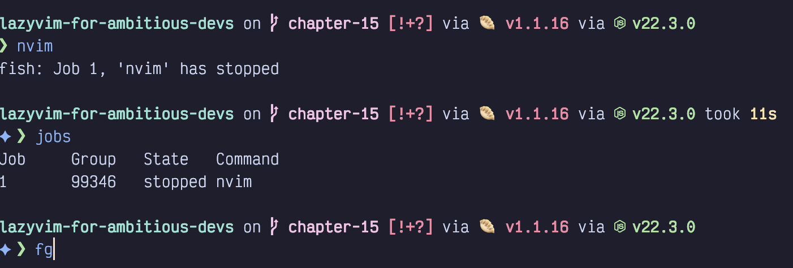

Figure 75. Suspended Neovim

As this screenshot also shows, you can see the list of stopped (or running) background jobs using the `jobs` command in any shell. The `fg` (short for foreground) command starts the suspended Neovim process back up. If you have multiple suspended jobs, the `fg %#` command can be used to choose a specific job id (e.g. `fg %1` will run the job with id `1` in the first column of the `jobs` output).

This is not a Neovim-specific feature. The `Control-z` trick works with (almost) any long-running shell command. You can even set a suspended task to keep running in the background by using the `bg` command instead of `fg` (though if the background job prints to stdout you’ll quickly become confused).

Between terminal splits and `Control-z`, there’s just no need for the editor to have its own terminal embedded with it. Still, Neovim ships with an integrated terminal, so I should probably explain how to use it.

### <a href="#_the_integrated_terminal_for_real_this_time" class="link">15.2. The Integrated Terminal (For Real This Time)</a>

You can pop up a terminal at any time in Lazyvim using the keybinding `Control-/`. It will appear in front of all your other editor windows (unless you have the Edgy extra enabled, in which case it will show up in the bottom half of the editor) and can be dismissed with `Control-/` again.

Neovim’s terminal window is a super weird hybrid terminal and Vim window. Once the terminal is open, you can use Normal mode commands to navigate around it.

However, unlike Insert mode, the `Escape` key WILL NOT put you in Normal mode, even though your fingers are, by now, conditioned to hit `Escape` reflexively. This actually makes sense because `Escape` is a common key to need to type in various terminal programs, so it would be rude for Neovim to steal it. LazyVim has set up the keybinding `<Escape><Escape>` (press `Escape` twice quickly) to switch to normal mode from terminal mode, or you can use the hard-to-type default incantation `<Control-\><Control-n>`.

Once in Normal mode, you can navigate anywhere in the Terminal window using any of the navigation keys including Seek and Search modes. This can occasionally be helpful if you need to yank some outputted text to the clipboard.

Pressing a key such as `a` or `i` will send you back to “Terminal mode” which effectively just sends every keystroke to the program currently running in the terminal (probably your shell).

Annoyingly, this means you can’t use Normal mode to reposition your cursor on the command line; it will go back to wherever it was when you last entered normal mode.

<table>
<tbody>
<tr>
<td class="icon"></td>
<td class="content">If you want to use Vim Normal modes to edit your command line (in any terminal; not just inside Neovim) configure your shell to use “Vi mode.” All modern shells support some version of this, and it usually allows you to use <code>Escape</code> to put the shell in a pseudo-normal mode. It gives you commands like <code>w</code> and <code>b</code> for navigation and basic line-editing commands like <code>d</code> and <code>c</code> to edit the command line.</td>
</tr>
</tbody>
</table>

There are third-party plugins that try to make the terminal experience more consistent and enjoyable, but in my opinion, they are not worth the trouble. I can just press `cmd-enter` to get a new Kitty terminal pane and have a perfectly normal terminal experience.

### <a href="#_checking_your_git_status" class="link">15.3. Checking Your Git Status</a>

Lazyvim is preconfigured with a handful of carefully configured plugins that make your version control life much better.

The simplest of these uses the file picker to list files that have changed since the last commit. This will behave similarly to other file picker operations, except it only lists files that have modifications in git.

You can open it with `<Space>gs`. I use it a lot for switching between files related to whatever feature I am currently working on, and actually prefer it to the buffer picker (which only shows opened files) we discussed in Chapter 9.

This picker screenshot shows that I have modified two files since my last commit:

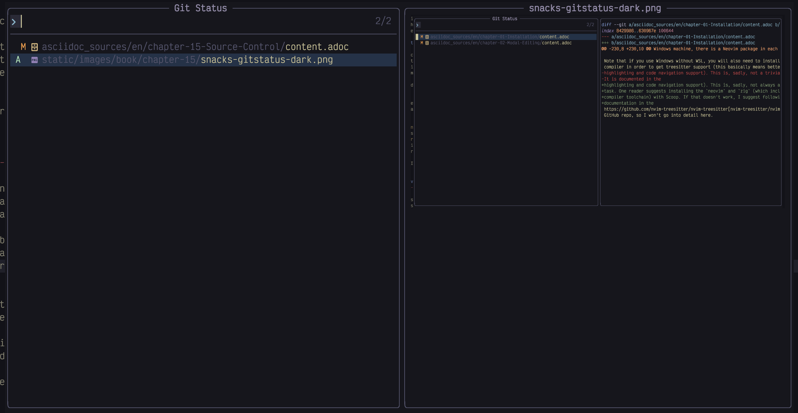

Figure 76. Git Status in Picker

The preview pane shows the diff of lines I have added and removed. On the left, you can see that I have the chapter-1 `content.adoc` focused, and a preview of some of the changes in the file on the right.

The confusing bit to pay attention to is the first two columns in the results pane. They are completely unlabelled in the Snacks picker, and depending on whether you’ve staged any changes, it’s not always clear that there **are** two columns.

The left-hand column holds symbols for files that have been staged. In this case, the second file (the image above, in fact) has been added to the repo and staged, so there is an `A` in the left-hand column. The first file, on the other hand, has been modified, but has not been staged yet, so the `M` appears in the second column.

These columns indicate your git status for each file, and their meaning can be devilishly hard to remember. The symbols themselves are straightforward:

- `M` means the file on that line contains modifications since the last commit

- `D` means it has been deleted

- `?` means it is an untracked file (has been added to the working directory but not staged or committed)

- `A` means it is a new file that has been staged in git

If the sign shows up in the *first* column, it means the file has been staged and will be included in the next commit. If it is in the *second* column, then it means the file is not yet staged. If symbols show up in both columns, some parts of it have been staged and some parts have not.

In addition to allowing you to effectively view your git status, this picker also allows you to *stage* entire files. To do so, focus a file and hit the `<Tab>` key to stage the file if it was previously unstaged, or to unstage it if it was previously staged.

#### <a href="#_other_git_pickers" class="link">15.3.1. Other Git Pickers</a>

Snacks.nvim comes with pickers to view and search commit history, and to check out a branch, among other git operations. The log can be accessed with `<Space>gl`. The branch picker doesn’t have a keybinding but you can use the lua command `:lua Snacks.picker.git_branches()` to show it. If you particularly like this command, bind a keybinding to it.

There are a variety of less commonly-used git-related pickers you can find by typing `:lua Snacks.picker.git` and then `Tab`.

### <a href="#_interacting_with_github" class="link">15.4. Interacting with GitHub</a>

If you have the `gh` command installed for manipulating GitHub, LazyVim can file issues and comment on PRs on your behalf. The interface takes some getting used to, and it may not be worth the effort. The GitHub API is slow enough to make waiting for lists of PRs and issues to load a painful experience that outweighs most benefit from being able to comment with vim keybindings. However, your thresholds may be different, so I’ll cover the basics here.

You can browse open issues with with `<Space>gi` and all (including closed) issues with the capitalized version `<Space>gI`. Both commands take a while to load but will eventually pop up a picker interface you can navigate with the usual picker keys. As you focus each issue you will see a variety of details about the issue show up in the preview area of the picker.

You can even interact with the issue. Focus any issue and press `<Enter>` to pop up an action menu:

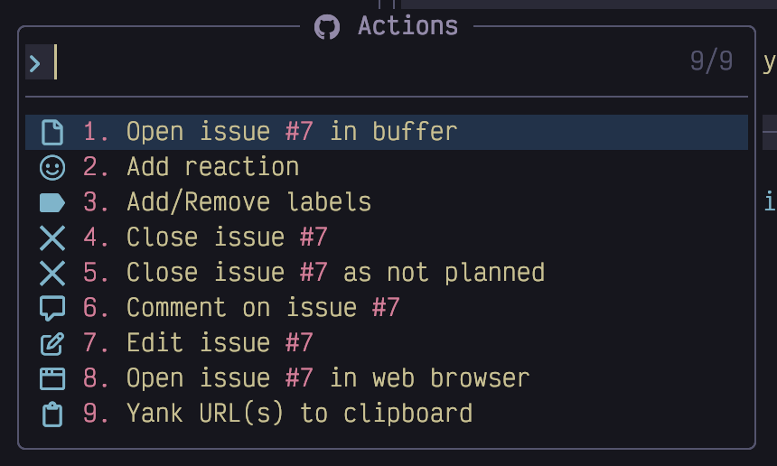

Figure 77. Issues Actions

The actions should be self-explanatory. Commenting and editing are the coolest ones as they both open a buffer that you can edit using all your favourite vim motions and commands.

The *Open in Buffer* action gives you a more permanent read-only view of the issue. I say read-only because you can’t directly edit the buffer like a regular text file. However, you can use these keybindings to manipulate the issue:

<table class="tableblock frame-all grid-all stretch">
<colgroup>
<col style="width: 16%" />
<col style="width: 83%" />
</colgroup>
<thead>
<tr>
<th class="tableblock halign-left valign-top">Key</th>
<th class="tableblock halign-left valign-top">Description</th>
</tr>
</thead>
<tbody>
<tr>
<td class="tableblock halign-left valign-top">
<code>&lt;Enter&gt;</code>
</td>
<td class="tableblock halign-left valign-top">
Show the actions menu
</td>
</tr>
<tr>
<td class="tableblock halign-left valign-top">
<code>i</code>
</td>
<td class="tableblock halign-left valign-top">
Edit issue/PR title and body
</td>
</tr>
<tr>
<td class="tableblock halign-left valign-top">
<code>a</code>
</td>
<td class="tableblock halign-left valign-top">
Add a new comment
</td>
</tr>
<tr>
<td class="tableblock halign-left valign-top">
<code>c</code>
</td>
<td class="tableblock halign-left valign-top">
Close the issue
</td>
</tr>
<tr>
<td class="tableblock halign-left valign-top">
<code>o</code>
</td>
<td class="tableblock halign-left valign-top">
Reopen a closed issue
</td>
</tr>
</tbody>
</table>

You can interact with pull requests in a similar way, using `<Space>gp` and `<Space>gP` to list open or all pull requests, respectively. The actions menu for pull requests is a little bit longer:

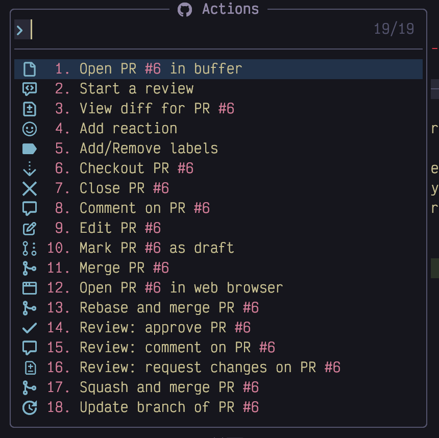

Figure 78. Pull Request Actions

Yes, you can even merge a PR right from LazyVim. However, the most convenient part is the ability to do code review. Code review is poorly documented and not at all obvious, but once you understand it it’s quite a bit more pleasant than the GitHub web interface.

First, you may want to start a review to collect your comments and submit all at once. Use the "Start a review" action to put the PR in a pending state.

Next, show the actions menu for the PR again and use the "View diff for PR" action to show a picker with all the files that changed in this PR. Scroll through, search, or use `s` to seek to a specific file to read, review, and start commenting on. Remember, `ctrl-f` and `ctrl-b` can be used to scroll the preview window without focusing it.

Once you see a line that you think deserves a comment, use `alt-w` to focus the preview area. Now you can use any of your favourite vim motions to navigate to the line in question. Press `<Enter>` to show the action menu again and you’ll see an option to "Comment on diff in PR". Invoke that and you’ll be given a box to type your comment into. Use `Control-s` to submit the comment.

When you are done commenting on all the files, don’t forget to invoke the actions menu on the PR again and select one of "Review: approve PR", "Review: comment on PR", or "Review: Request changes on PR" to make the comments visible to the original author.

That may seem a bit confusing, but in practice, it’s quite elegant. The UI is context sensitive, but is always tied to an action menu accessible with `<Enter>`. If it wasn’t so slow to load the list of open PRs in the first place, I would use it all the time!

### <a href="#_status_of_the_currently_focused_file" class="link">15.5. Status of the Currently Focused File</a>

Every buffer has a couple subtle indications of the changes in that file. Consider this screenshot:

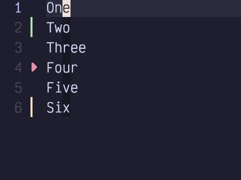

Figure 79. Git Status in Signs Column

Notice the left sidebar, to the right of the line numbers. It contains a green bar, a small red triangle, and a short orange bar. These indicators show that lines have been added, removed, and modified, respectively.

Additionally, in the status bar, just to the left of the file progress indicator we see these icons, which summarize the same information:

Figure 80. Git Status in Status Bar

### <a href="#_staging_from_the_editor" class="link">15.6. Staging From the Editor</a>

You can add files to git’s index (so they are ready to commit) right from the editor. The `<Space>gh` menu (mnemonic is “**g**it **h**unks”) has a bunch of interesting subcommands:

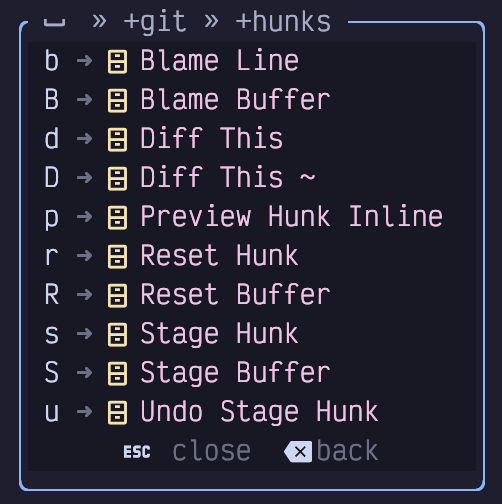

Figure 81. Git Hunks Menu

You can use `<Space>ghS` to stage an entire file, which would move it to the left column in the git status pickers we discussed above. If you want to stage a patch containing a subset of your changes, navigate to the hunk you want to stage (`[h` and `]h` are super handy for this) and hit `<Space>ghs`.

<table>
<tbody>
<tr>
<td class="icon"></td>
<td class="content">Most people have an unfortunate habit of just committing everything instead of properly curating their history, but if you are one of the rare folks who uses git properly (please be that person), you’ll use the <code>&lt;Space&gt;ghs</code> command a lot.</td>
</tr>
</tbody>
</table>

You can also reset a hunk (effectively making it the same as it was at the time the last commit was made) using `<Space>ghr`. If you want to reset the entire file, use the “but bigger” `<Space>ghR`. Resetting is a destructive operation, so be careful (though `u` for **u**ndo can usually get you back to where you were).

If you accidentally stage a hunk, use `<Space>ghu` to unstage it. Unlike reset, this won’t change the file; the changes will still be there; they just won’t be staged anymore.

### <a href="#_git_information_keybindings" class="link">15.7. Git Information Keybindings</a>

The blame line (`<Space>ghb`) command shows the commit that last changed the line the cursor is currently on, useful for answering the all-important question “Why on Earth did I do that?”

Preview hunk (`<Space>ghp`) temporarily renders the original and changed version of a hunk (one above the other) so you can see exactly what changed.

The `Diff this` (`<Space>ghd` and `<Space>ghD`)commands do the same except in a side-by-side view that we will discuss later in this chapter.

Personally, I use many of these commands too often for the number of keystrokes required to pop them up. So I’ve created an `extend-gitsigns.lua` file in my plugins directory that copies them from `<Space>gh` to `<Space>h`:

Listing 53. Git Hunks Menu Keymaps

    return {
      "lewis6991/gitsigns.nvim",
      keys = {
        {
          "<leader>hb",
          "<cmd>Gitsigns blame_line<cr>",
          desc = "Blame Line"
        },
        {
          "<leader>hs",
          "<cmd>Gitsigns stage_hunk<cr>",
          desc = "Stage Hunk"
        },
        {
          "<leader>hS",
          "<cmd>Gitsigns stage_buffer<cr>",
          desc = "Stage Buffer"
        },
        {
          "<leader>hr",
          "<cmd>Gitsigns reset_hunk<cr>",
          desc = "Reset Hunk"
        },
        {
          "<leader>hR",
          "<cmd>Gitsigns reset_buffer<cr>",
          desc = "Reset Buffer"
        },
        {
          "<leader>hu",
          "<cmd>Gitsigns undo_stage_hunk<cr>",
          desc = "Undo Stage Hunk"
        },
      },
    }

I got these by copying them from the git-signs config on the LazyVim website and converting from `map` calls to the `keys =` format.

### <a href="#_lazygit" class="link">15.8. Lazygit</a>

Lazygit (which, despite sharing the `Lazy` namespace with LazyVim and Lazy.nvim, is by an entirely different developer) is a terminal UI tool for interacting with git. It is a separate program that you will need to install with your operating system’s package manager (e.g. `brew install lazygit`) if you want to use it.

LazyVim is preconfigured to show lazygit in a terminal window using the keybinding `<Space>gg`. I won’t go into all the details of how to use this third-party program. It can do almost anything git can do in a much more user-friendly interface.

Lazygit takes a bit of study to get used to, but it has helpful menus and mnemonics for its keybindings so the learning curve is relatively gentle.

Ironically, I used lazygit (in its standalone format from the command line) a lot more before I started using LazyVim. I used to stage changes using lazygit, but now I use the `<Space>h` (or `<Space>gh` if you didn’t remap it) menu we just covered instead.

I also now do most of my git work with the exceptional [git-spice](https://abhinav.github.io/git-spice/) tool, which simplifies many of the flows I used to use lazygit for (especially rebasing). I still use lazygit every day; I just don’t have it open 100% of the time like I used to.

### <a href="#_diff_mode" class="link">15.9. Diff Mode</a>

Neovim comes with a powerful, but slightly hard-to-learn diff viewing mode. It shows “before” and “after” files side by side and can even be configured to show the “parent” and changed state if you want a fancy merge tool.

There are several different ways to get yourself into Diff mode. The basic way is to specify it when you open two files on the command line:

Listing 54. Open In Diff Mode

    nvim -d file1 file2

This opens the indicated files side by side in a linked diff view. Most often, you won’t have two separate files, though. Instead, you’ll want to see the difference between the current file and the staging index, which you can do with the shortcut `<Space>ghd`. Or use `<Space>ghD` to show the differences between the current file and the last commit, regardless of what has been staged.

<table>
<tbody>
<tr>
<td class="icon"></td>
<td class="content">Once you are done operating in Diff mode, it can be tricky to get back to the normal file. The issue is that when a file is in <code>diff</code> mode, it stays that way, even if other windows are opened or closed. The secret is to use the <code>:diffoff</code> command, which will disable “diff view” for the current buffer. This doesn’t close the two side-by-side windows, though; you’ll need to use normal window and buffer management tooling such as <code>&lt;Space&gt;bd</code> and <code>&lt;Control-w&gt;q</code> to do that.</td>
</tr>
</tbody>
</table>

Note that by default, the diff view will collapse any code that is identical between the two files into a single fold. Use the code unfolding command `zo` to expand a section.

#### <a href="#_editing_diffs" class="link">15.9.1. Editing Diffs</a>

If you use the `<Space>ghd` command to show your file in diff view against the index mode, you can keep editing the file to make additional changes. If you do this, only edit the file on the *right*. This is the “working” file. The file on the left is the “index” file; it shows the staged changes. If you want to “edit” the file on the left, use the `<Space>ghs`, `<Space>ghr`, and `<Space>ghu` to stage, reset, and unstage hunks from the right side. It is not *forbidden* to edit the index file directly, but it will confuse the Diff mode machinery, so stick to editing, staging, and unstaging from the right side.

When working with diff view like this, I find that the stage, reset, and unstage keybindings best match the mental model I am used to. However, there are two kind of weird commands built into Neovim that you may sometimes prefer to reach for: `:diffget` and `:diffput`. These are more commonly typed as `:diffg` and `:diffp` to save a couple keystrokes, or you can use the keybindings `dp` and `do` (mnemonic `diff obtain`).

These commands are most often used in Visual mode (or with a range), and they essentially mean that (within that range) we should either “make this file the same as the other file” or “make the other file the same as this file”, respectively.

Consider these two files that are slightly different:

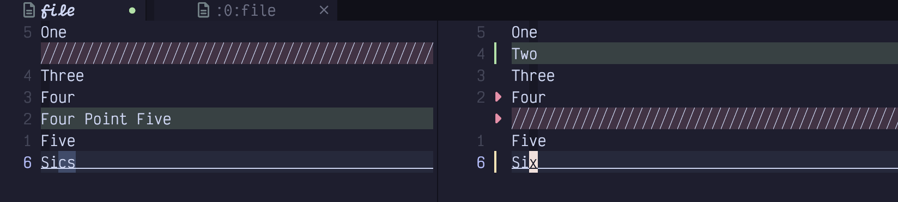

Figure 82. Diff Mode

The file on the left represents the state of my index, while the file on the right is my working copy. The indexed version was missing the word “Two”, so I have added that on the right. It also had an extra “Four Point Five” line that I have removed on the right. And I modified the spelling of the word “Six”.

Let’s explore a couple ways to make these files identical with `:diffg` and `:diffp`. You can use these commands on either file, but it usually makes sense to operate on only one of them. For this example, assume I’m working on the right-hand file.

I can use any navigation commands to jump to the second line of the file. If you are editing a real git indexed file, the `[h` and `]h` keybinding are probably useful for jumping between hunks. However, when you are in “diff” mode you can also use the `[c` and `]c`, which mean “jump between changes,” but **only** when you are in “diff” mode. (In a non-diff window, LazyVim has bound those keys to jump between classes or types.) I usually just use `[h` and `]h`, but in those instances where a diff view is not attached to git history, `[c` and `]c` should not be forgotten.

So with my cursor on the first line of the file, `[c` or `[h` will jump to the second line, which contains the word `Two` in my file, but not the index.

I want to stage this change, so I type `:diffp`, which means “make the other file the same as this one.”

The next line is `Four Point Five` in the left file, but was deleted in the right file. For the sake of argument, let’s say I want to “unstage” this change, which is to say “make the right file the same as the left file”. To do this from the right window, I can use `Shift-V` to enter Visual Line Mode, and select the lines containing `Four` and `Five` as well as the blank red space between those two lines representing the deleted line. Now I can type `:diffg` or `:diffget` which means “get the contents of the other window and make my window match it.” Since `:diffget` and `:diffput` accept ranges, it passes the visual selection with the usual `'<` and `'>` marks.

<table>
<tbody>
<tr>
<td class="icon"></td>
<td class="content">If you find you like the above diff interface, but figuring out which files have differences is frustrating, you may want to configure the <a href="https://github.com/sindrets/diffview.nvim">diffview.nvim</a> plugin. I personally just use the git status telescope picker, but the <code>diffview.nvim</code> plugin has a nice interface and some handy commands.</td>
</tr>
</tbody>
</table>

### <a href="#_configuring_vim_diff_as_merge_tool" class="link">15.10. Configuring Vim Diff as Merge Tool</a>

Everyone seems to hate resolving merge conflicts. Armed with Diff mode and rebasing, I actually find the process kind of enjoyable. The trick is to have a slightly complicated `~/.gitconfig` (and a very large monitor).

I can’t help you with the monitor, but the `.gitconfig` needs to look like this:

Listing 55. Git Mergetool Configuration

    [diff]
        tool = vimdiff
    [merge]
        tool = vimdiff
        conflictstyle = zdiff3
    [mergetool "vimdiff"]
        cmd = nvim -d $LOCAL $BASE $REMOTE $MERGED \
              -c '$wincmd w' -c 'wincmd J'

The `zdiff3` conflict style makes diffs a bit easier to read by automatically resolving identical lines. The two `tool =` lines say to use the `vimdiff` merge tool that is configured on the last line.

That last line is a command to open Neovim with a whopping FOUR windows open and focuses the appropriate one.

To demonstrate this, I made a new git repo with two branches with conflicting changes. When I went to rebase (I always use rebase rather than merge commits because it allows me to deal with conflicts in the isolation of one change. This is why it’s important to me that every commit have only one change!), one branch onto the other, of course, I end up with this error:

Listing 56. A Dreaded Git Conflict

    ✦ ❯ git rebase main
    Auto-merging file
    CONFLICT (content): Merge conflict in file
    error: could not apply f611b6f... Uppercase
    Could not apply f611b6f... Uppercase

To resolve this conflict, I run `git mergetool`. Because of the git configuration above, it will open Neovim with these four different diff windows:

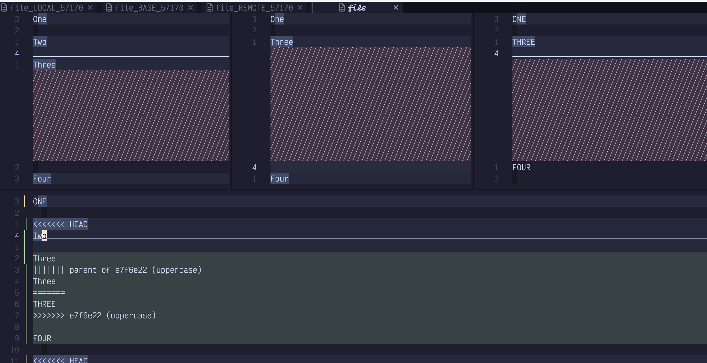

Figure 83. Merge Tool on Steroids

There are three windows across the top and one in a big pane (also pain) in the bottom.

Upper-left window  
Shows the “local” changes. The meaning of “local” depends on exactly what commands you used to get into the conflict situation. In typical rebase flows, it refers to “the current state of the main branch”. So when there is a conflict, it would contain “the other person’s changes”, so “local” doesn’t seem applicable.

Middle window  
Contains the “common ancestor” or “base” of the changes. Which is to say, this is the state of the file before either you or “the other person” made any changes. This window is not commonly included in merge-tool tutorials, but I find it can be quite helpful when trying to figure out what changed between the base and each of the two side windows.

Upper-right window  
Contains the “Remote” changes, which, like local, can be a misnomer. In rebase flows, it usually means, “the changes I made on the branch I am rebasing onto main.”

Bottom window  
Contains “the current state of the file”, which at the time the rebase failed includes messy conflict markers. This is the only file you should make edits to.

All four files will feature code folding if there are long sections of common code. Also, if you scroll or move the cursor in the lower file, the upper files will also scroll so everything stays in sync, and an underline in the top three windows will indicate which line the diff tool thinks is the “current” one with respect to the cursor position in the lower window.

Most rebase flows start with using `vag` and `:diffg` from the lower window to make it identical to one of the upper windows. Then you would use `diffget` to get hunks from the left or right window, depending on context. You’ll also usually have to do some manual editing.

The problem is, `:diffg` doesn’t know which window to get things from because there are multiple windows open:

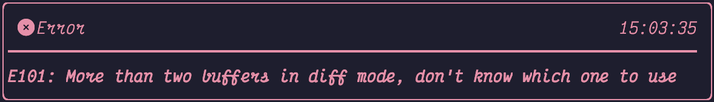

Figure 84. Diffget Error

Instead, we need to use the command `:%diffg 2`. The `2` is a buffer number. When you run merge-tool directly from the command line, the buffers are numbered in the order they are open. So `1` is the left-hand buffer, `2` is the middle one, `3` is the right-hand one, and `4` is the lower window. If you aren’t sure, you can use the `<Space><comma>` keybinding to show the buffer list:

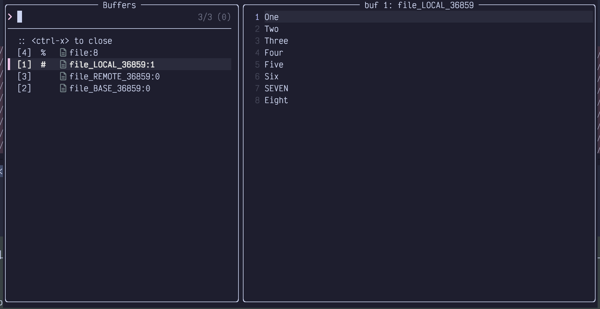

Figure 85. Buffer Numbers In Picker

In this list, the first column holds the buffer number. This number generally increases monotonically from the most recent time Neovim opened, so it can get pretty high if you’ve been editing for a while. But when you use `git mergetool`, it typically opens a brand new Neovim instance and `1-4` are expected.

After running `vag` and the `:%diffg 2` command, the bottom window looks the same as the middle window, which is the state everything was before either branch was created. If I used `vag` and then `:%diffg 1` it would look the same as `main`, and `vag` followed by `:%diffg 3` would make it look the same as my branch. Then I could selectively look at differences between buffers and use `:diffg #` to get changes from the left or right one respectively.

Merge conflicts can always be somewhat stressful, but I find the four window view often makes it easier to understand what changed and why. That said, I only reach for it when I’m in a particularly knotty merge situation. Normally, I use the git-conflict.nvim plugin.

### <a href="#_git_conflict_nvim" class="link">15.11. Git-conflict.nvim</a>

While merge-tool is very helpful when working with particularly complicated merges, for simple conflicts, I usually find it quicker to just edit the file with the conflict markers in it directly. A plugin called git-conflict.nvim provides syntax highlighting and some keybindings to help navigate conflicts.

Set it up with a config something like this:

Listing 57. Git Conflict Configuration

    return {
      "akinsho/git-conflict.nvim",
      lazy = false,
      opts = {
        default_mappings = {
          ours = "<leader>ho",
          theirs = "<leader>ht",
          none = "<leader>h0",
          both = "<leader>hb",
          next = "]x",
          prev = "[x",
        },
      },
      keys = {
        {
          "<leader>gx",
          "<cmd>GitConflictListQf<cr>",
          desc = "List Conflicts"
        },
        {
          "<leader>gr",
          "<cmd>GitConflictRefresh<cr>",
          desc = "Refresh Conflicts"
        },
      },
    }

I use the `<Space>h` prefix that I set up previously for staging hunks and add a few new commands to it. After enabling this extension, if you open a file with conflicts, it highlights the conflict markers in a different colour. On my plaintext sample file it looks like this:

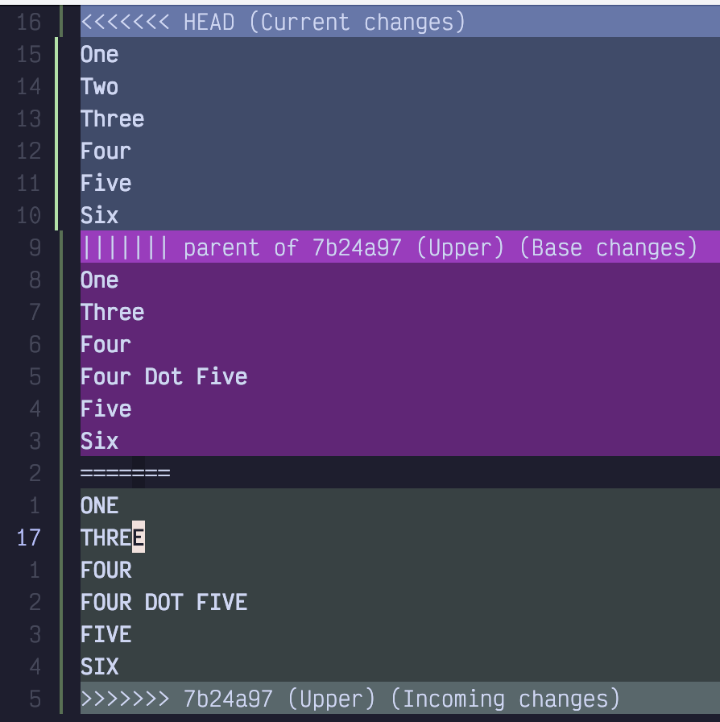

Figure 86. Conflict Markers

The conflict markers include the “current” (whatever is on main) code above, and the “new” (whatever is being rebased) code below, with the original or base code (before either change) in the middle.

I can use the `]x` keybinding to quickly jump to the next conflict (in this case there is only one). Then I can use one of the following keybindings to resolve the conflict:

- `<Space>ho` Choose the top version

- `<Space>ht` Choose the bottom version

- `<Space>hb` Choose both

- `<Space>h0` Go back to whatever is in the middle

The `o` and `t` keybindings are hard to remember. Technically they mean “ours” and “theirs”, but depending on which order you did a merge or rebase, it doesn’t always semantically map to your own or somebody else’s commit. I just remember that `o` is before `t` in the alphabet, so it means the upper change. You could also map them to more mnemonic keybindings if you want.

In all cases, but especially in the latter two, you will likely need to do some manual editing to make the code look correct. This is normal. None of the conflict management extensions uses AI to semantically understand what the changes *intended* to do, so you still need to do that part yourself!

About ninety percent of the time, this plugin is all I need to resolve a conflict. I only use the mergetool when things are particularly hairy or complicated.

### <a href="#_summary_15" class="link">15.12. Summary</a>

This chapter introduced a lot of different ways of interacting with git and version control from inside LazyVim. You probably won’t use all of it, but I wanted to present multiple options so you can decide which ones work best for you.

Perhaps you want to use Lazygit, or maybe you want to stay in the editor and use the functionality that git-signs and native Vim diff mode provide. Maybe you want to install some extra plugins such as git-conflict.nvim or diffview.nvim to streamline your experience (others you might want to look at include Neogit and mini.git).

Or maybe you don’t want to manage this stuff from your editor at all and just want to drop to Terminal mode and use `git` or a wrapper like `git-spice`. Whatever works for you, LazyVim provides the integrations you need.

In the next chapter we’ll admit that it’s not 2020 anymore and talk about artificial intelligence.
