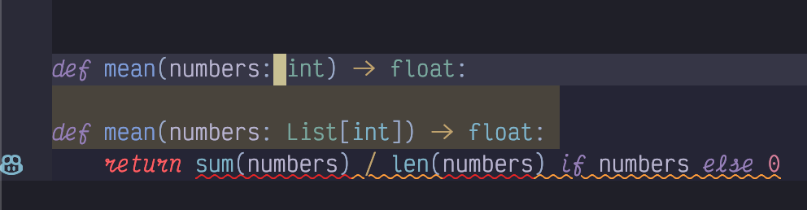
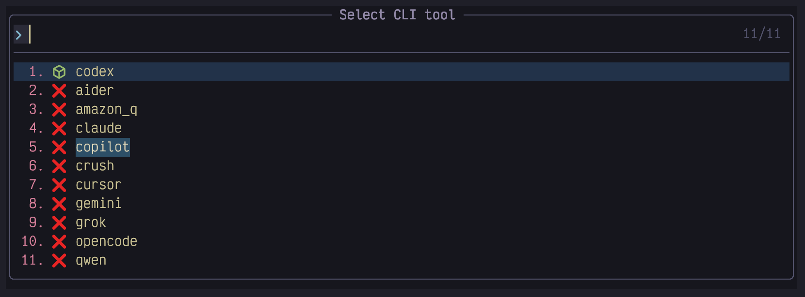
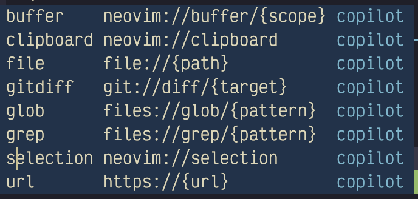

## Chapter 16. Configuring Artificial Intelligence

I predicted when writing the first edition of this chapter in 2024 that it would quickly become out of date and be a nightmare to maintain. That was so true that I don’t think many people still use any of the extras and plugins it discussed. I’ve updated it as of January 2026, and it’s probably going to become immediately out of date again.

You have a few options for integrating AI into your daily coding, from avoiding it altogether to completions-only to fully interactive "cursor-style" interactions. I can’t cover all of them here, but I’ll try to hit the best-supported versions in LazyVim.

### 16.1. My current AI workflow doesn’t use LazyVim

I use AI extensively for work, but not at all for my hobby coding. For work, I exclusively use the most powerful command line tool of the day. That’s usually Claude Code, but I’ve also used Gemini CLI and Codex.

Regardless, I don’t use LazyVim to manage the AI window. I just run whichever one I’m using in a separate terminal window outside my editor.

I don’t even bother with AI code completions inside LazyVim. I type fast enough that the completions are largely useless and waiting for the right one to show up just slows me down.

Further, when I’m coding with AI, completions are not much help, since I’m just chatting with the CLI tool. There’s no code for me to complete! And when I’m not coding with AI, there’s a good reason I’m not doing so, and that reason applies to completions, too.

However, you aren’t me, and you should evaluate the pile of LazyVim extras that provide support for AI coding to see which ones work for you. Let’s start with completions.

### 16.2. Sidekick.nvim

The `Sidekick.nvim` plugin is maintained by the author of LazyVim, so it fits in well with all the tooling and UI we are used to. It features two unrelated AI features:

- Show and hide CLI chat tools such as Claude Code or Codex inside a terminal window in LazyVim.

- Integrate "Next edit suggestions" from the Copilot service, with fancy diff viewer and ability to accept and reject changes.

The former may be a nice to have if you want to use LazyVim for window management instead of navigating to separate terminal panes like I do. The next edit suggestions are like inline completions on steroids and are worth enabling if you or your company are already invested in Copilot. Let’s look at Next Edit Suggestions (NES for short, and I’d be dating myself if I told you that to me that means a game console).

#### 16.2.1. Sidekick next edit suggestions

To use it, first enable the `ai.copilot` extension as described above to get needed dependencies. Then enable the `ai.sidekick` Lazy Extra and restart your editor. You’ll then need to authenticate with the `:LspCopilotSignIn` command.

Next edit suggestions are surprisingly easy to use, but it can be difficult to know if they are working at al. As the plugin docs say, you just have to "Type some code and pause - watch for Next Edit Suggestions appearing." However, if the code you typed didn’t happen trigger a suggestion, is it because the engine couldn’t come up with a good suggestion or because it isn’t working?

I found this subtly broken Python code to be fairly reliable at triggering NES:

Listing 58. Slightly broken Python

    def mean(numbers: int) -> float:
        return sum(numbers) / len(numbers) if numbers else 0

The type of the `numbers` parameter is incorrect; it should be a `list[int]`. NES may trigger as soon as you pause typing, or you may need to `cw` the `int` so it knows you are editing the parameter, then pause for under a second, or you may need to `dw` and press `Escape` to return to normal mode. If the AI gods are smiling on you, you should see something like this:

Figure 87. Next Edit Suggestion

The top line is the line currently focused. Underneath it are two lines highlighted in a kind of orange colour. These are the suggested replacement. There’s a grinning robot icon beside it ()although in my font it looks more like a frog). This is the symbol LazyVim has chosen for artificial intelligence. It indicates that a next edit suggestion is visible here.

The suggestion itself is a little disappointing because it is using an obsolete capital `List` instead of the lowercase `list` which has been standard in Python for quite some time. But at least the plugin is active! I’m guessing it would behave better if I had a paid Copilot plan to activate a better model.

To move your cursor to the nearest NES, press the `<Tab>` key. If you are already on a proposed suggestion and want to accept it, use the same `<Tab>` key. So you can accept any suggestion with a double tap of `<Tab>` and be on your way.

Next edit suggestions are not meant to replace completion menu Copilot suggestions; you will probably want to turn both features on. NES can do quite a bit more invasive refactors, while completions can only insert at one point (the cursor), but they are both useful if you are still typing code.

However, if you’re into AI these days, why are you typing code at all? That’s where Sidekick’s other feature comes in.

#### 16.2.2. Sidekick chat integrations

At time of writing, the gold standard for ai driven coding is, if you or your employer are willing to pay for it, Claude code running the Opus 4.6 model. Anthropic really understand how to drive an LLM for maximum effect and it shows in how Claude Code outperforms other tools that use the Opus model.

The gold standard will probably change before I get a chance to publish this, which is why it’s a good thing Sidekick supports multiple command line tools.

For the most part, the Sidekick interface to AI tools is just a wrapper to open the tool of choice in a Neovim terminal window. It has some niceties, but that’s the summary. To use it, first ensure your favourite AI CLI tool is installed using that tool’s recommended installation instructions (you want something that auto-updates correctly because these things evolve FAST).

Also make sure Sidekick.nvim is installed as a Lazy extra as described previously.

Then use the `<Space>a` menu to access CLI tools. For example, `<Space>aa` shows a buffet of tools to choose from and makes it easy to see which are installed:

Figure 88. Sidekick Tools Menu

In this example I have only `codex` installed (because OpenAI was hungry enough to give me a free trial).

Select your tool and it will pop open in a new terminal window that can be navigated as described in the previous chapter. Remember, you can navigate in and out of the window with `<Control-h>` and `<Control-l>`.

The benefit of running one of these tools in Sidekick instead of a separate terminal window is that you can send the currently open filename or a visually selected snippet to it using `<Space>af` or `<Space>av`. Additionally, the `<Space>at` command will "Send this" to send the current cursor position so the AI can reference it.

You can also select from and send several stored prompts using `<Space>ap`, but to be honest I would configure custom slash commands or skills for that kind of thing if your model and backend support them. The Sidekick-provided are a bit too simplistic for sophisticated models like Opus and I’d usually prefer to let the AI write a skill for me.

### 16.3. The in-editor automatic coding experiences

If you’re looking for a more "Cursor-like" experience in Vim, LazyVim has a couple Lazy Extras for you to choose from, including copilot chat, and avante.nvim. I don’t have a ton of recent experience with these but I’ll try to give them good coverage. Last time I used Copilot Chat (as documented in the first edition of this book) it didn’t have a lot of support for agentic tooling, but that has changed. The Avante extra, unfortunately, just didn’t work for me at all.

### 16.4. Copilot Chat

CopilotChat.nvim tries to keep the coder in control and is much less automatic than the console tools. It is easiest to think of it as a chatbot that can talk to various GitHub Copilot models, and it’s a terrific addition to the copilot.lua extra that provides completions.

The keybindings conflict with those provided by sidekick.nvim, so it’s probably a good idea to disable the Sidekick extra if you want to use Copilot chat.

Enable the extra in the usual way and press `<Space>aa` to toggle Copilot Chat. If you haven’t authenticated before it’ll give you a URL and code to enter at that address to log in. Visit the URL and enter the code.

Now you have a chatbot that you can do chatbot things with (which is to say, enter text and read arbitrarily generated answers). Just type a message, and hit `<Control-s>` (or press `<Enter>` in Normal mode) to send the message. The beauty of this window, unlike the sidekick windows is that this is a Neovim buffer and you have all your beloved LazyVim keybindings available to edit your message.

There are several magic characters you can type into the chat to send or store additional context to the conversation or invoke arbitrary functions. These are facilitated by tab completion. For the most part, Copilot Chat doesn’t automatically invoke or add anything for you, giving you absolute control of (and responsibility for) your context. To use it effectively, it is imperative thate you learn the tab completions.

For example, to add the contents of a file to a message, you can type `#file:path/to/file.ext`. However, this quickly becomes tedious. Instead, just type the `#` to get a menu like this:

Figure 89. Copilot Chat Resources

These are all *resources* that can be included in the chat. You can use arrow keys to navigate to `file` and press `<Enter>` to complete it. Now type a `:` followed by `<Tab>`. The tab keypress shows a standard picker menu with files you can search for to add to the context using the usual fuzzy search. This is the efficient way to add a file to a chat.

As you can see from the image above, there are other resources you can add, and they typically have a selector menu that can be invoked with the `:` and then `<Tab>` shortcut. Some of the more useful resources include:

- `#buffer:active` to include the most recently active buffer

- `#buffer:visible` to include all buffers visible in windows

- `#selection` to include the most recent visual selection in an active buffer

- `#url:<some url>` to fetch some web content

If you want the resource to be sticky (persisted across a single session), prefix it with a `>` as in `> #buffer:active`. (This also works with arbitrary text if you want a sort of system prompt).

Change the model for the whole conversation using the `:CopilotChatModels` command, or if you want to change it for just one message you can do it right in the conversation by typing a `$` followed by the almighty `<Tab>` to select from a picker.

You have access to several predefined prompts using the `/` character. Try them all out! I won’t cover it here, but it’s possible to define your own prompts by extending the options in the plugin config as well.

By far the most useful magic character is the `@` command, which gives the LLM access to tools. Tools are simply lua function calls that the LLM can choose to invoke based on its interpretation of your message. It sounds simple, but it leads to a tremendously powerful reasoning behaviour. It can run commands, read files and urls, and search the codebase.

Copilot Chat will ask you for permission to run each tool, and the UX for this is a bit confusing. It outputs the proposed tool call to the chat window and you have to approve the message using the send message keybindings `<Control-s>` in insert mode or `<Enter>` in Normal mode.

You can specify individual tools using, for example, `@bash` but most often you’ll just want to use `> @copilot` which makes all the default tools active in all future messages (the `>` makes it sticky, remember). This will allow the LLM to perform a variety of actions (including editing your codebase).

You can define your own functions as well. If you want to get really fancy, you could build a functon to mimic Claude’s planning agent. The most likely tool you will want access to is web search, for which you’ll need an API key with a service such as Tavily, Firecrawl, or Exa. Here’s an example lua function for using Exa based web search:

Listing 59. Exa Search Function for Copilot Chat

    return {
      "CopilotC-Nvim/CopilotChat.nvim",
      opts = {
        functions = {
          websearch = {
            description = "Search the web for some query",
            uri = "search://{name}",
            schema = {
              type = "object",
              required = { "query" },
              properties = {
                query = {
                  type = "string",
                  description = "What to search for",
                },
              },
            },
            resolve = function(input)
              local curl = require("plenary.curl")
              local res = curl.post("https://api.exa.ai/search", {
                headers = {
                  ["Content-Type"] = "application/json",
                  ["Authorization"] = "Bearer " .. os.getenv("EXA_API_KEY"),
                },
                body = vim.fn.json_encode({
                  query = input.query,
                  num_results = 3,
                }),
              })

              if res.status ~= 200 then
                return { { error = "Exa API error: " .. (res.body or res.status) } }
              end

              local data = vim.fn.json_decode(res.body)
              local results = {}

              for _, item in ipairs(data.results or {}) do
                table.insert(results, {
                  title = item.title,
                  url = item.url,
                  summary = item.summary,
                })
              end

              return results
            end,
          },
        },
      },
    }

Copilot Chat is nice if you want to have a bit more control over what tools get called than you get with the CLI tools sidekick gives you access to. It seems to be the best supported in LazyVim right now, but the responsibility to check every plugin is quite tedious if you are used to the automation provided by the CLI tools like Claude Code.

### 16.5. A note on Avante.nvim

Avante is an attempt to make Neovim behave more like an automated coding tool such as Cursor. I haven’t been able to get it to behave in several attempts over the last couple years.

Even with the Avante LazyVim Extra, I haven’t so much as been able to issue a query. I am pretty sure the Extra needs to be updated to support Snacks for it to work at all. I will try to update this section if a new release of the Extra comes out, but at the moment it isn’t worth the effort it requires to fix it.

### 16.6. Code Companion.nvim

Code Companion is a well-maintained and well documented Neovim plugin that is a little more automated than Copilot Chat (with access to more model providers) and a little less automated than Avante, at least, my understanding of how Avante is supposed to work.

I mention it for completeness because it’s probably the best AI plugin that does not have a LazyVim Extra. It is easy enough to enable with the documented installation instructions; just drop the following in a file in your lua/plugins directory:

    return {
      "olimorris/codecompanion.nvim",
      version = "^18.0.0",
      opts = {},
      dependencies = {
        "nvim-lua/plenary.nvim",
        "nvim-treesitter/nvim-treesitter",
      },
    }

However, this is not a true LazyVim integration. It doesn’t set up any keybindings to trigger which-key or commands to trigger lazy loading, and it doesn’t integrate the window with edgy.nvim, for example. Because I don’t personally use the plugin, I don’t have a proper config for it, but let me know if you craft a good one and I can include it here. Better yet, see if you can put together a PR to have it accepted as a Lazy Extra!

I’ll defer to the excellent [Code Companion Documentation](https://codecompanion.olimorris.dev/) for information on how to actually use the plugin. It behaves much like Copilot Chat, though its agentic integrations are a little more polished.

### 16.7. The other LazyVim AI Extras

There are a bunch of LazyVim Extras under the ai namespace that you can try out. I warn you that most of them are relatively outdated plugins, and even if the plugin is maintained, the LazyVim integration has become stale.

- claudecode.nvim attempts to emulate the VSCode plugin by opening a websocket connection to the CLI and theoretically can integrate better with NeoVim than wrapping a terminal.

- I don’t think the ai.codeium Extra works anymore; it installs but I couldn’t authenticate. I think the Extra needs to be updated to work in the windsurf namespace.

- supermaven-nvim hasn’t been updated in two years

- ai.tabnine also hasn’t seen recent updates.

I used to document all of these, but at this point Claude code and the other CLI tools frantically trying to catch up to it have easily superceded all of them.

### 16.8. Summary

This chapter was all about AI. AI is a weirdly simple topic, considering the complexity it abstracts away. Under the hood, LLMs are really cool, but the interface to interacting with them is typically just a simple HTTP request to some API somewhere (an API that is so useful we collectively don’t think hard enough about how much we trust it).

Various Neovim plugins have created interfaces to these APIs. LazyVim makes it easy to integrate some of them with blink.cmp, and other services are covered with third-party plugins.

Choosing between the various options is the hard part. None of them work quite as well as I would like, and I find that the amount of time they save is about equal to the amount of time they cost when they get things wrong.

Next up, we’ll discuss running debuggers from inside LazyVim.
