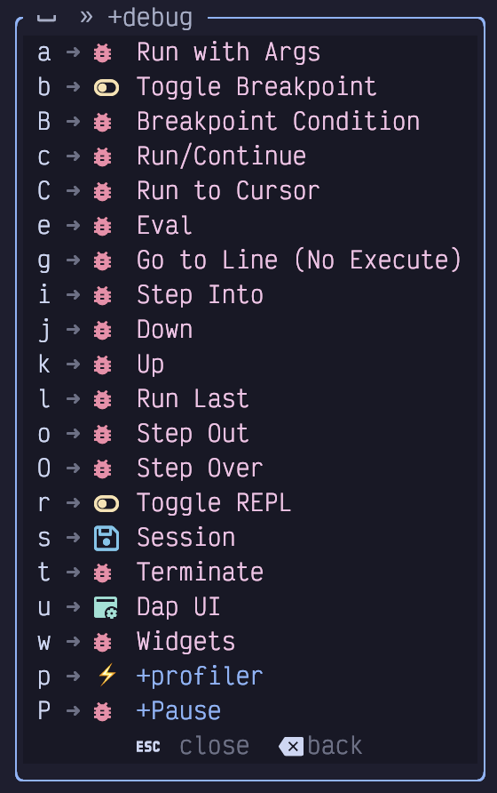
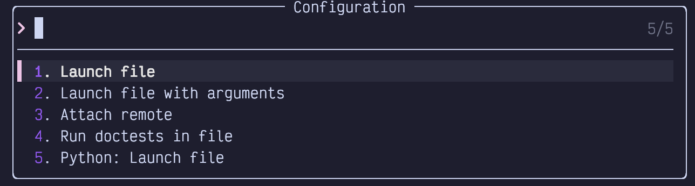
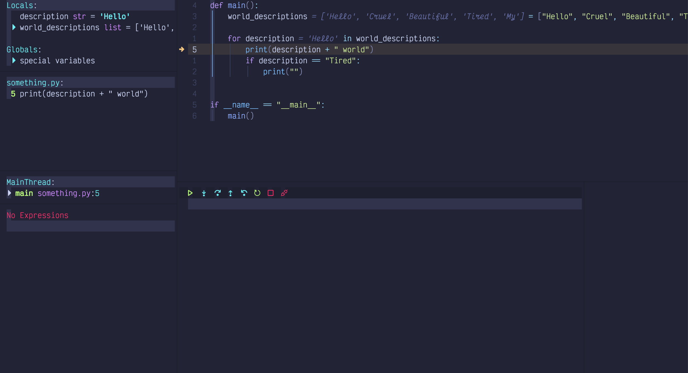
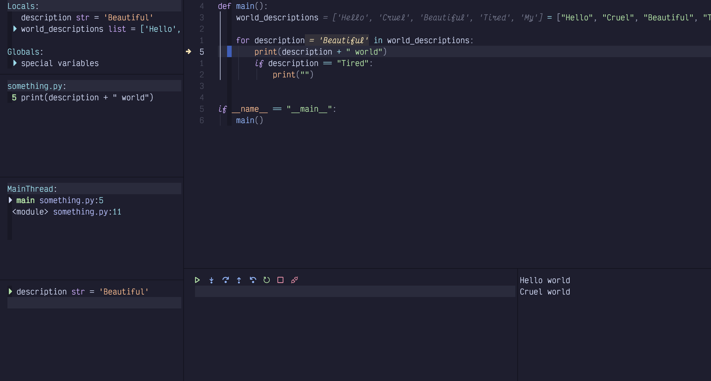
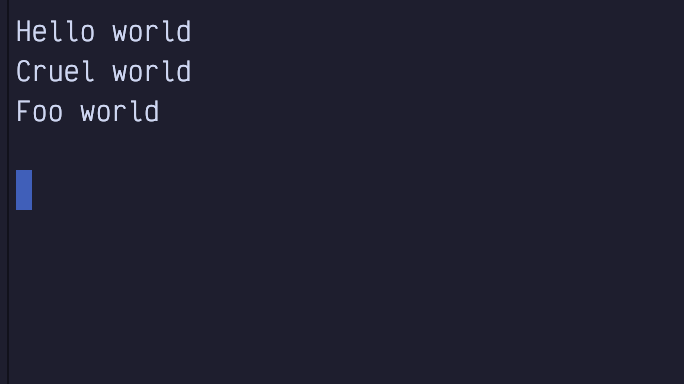
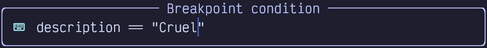

## Chapter 17. Debugging

LazyVim supports debugging various programming languages right in the editor. To be honest, I’ve spent my entire career debugging largely with logging statements. I’ve always found that the trouble of setting up and integrating a debugger is not worth the time it takes. They work well in toy projects, but once you’re trying to get the debugger to co-operate with e.g. Docker (or get anything to co-operate with Docker for that matter), or async third party libraries, it always feels like it just wasn’t worth the effort.

So what I’m saying is: I’ve never used LazyVim’s debugging system, so writing this chapter is a crash course for me as well. I always learn best by teaching (and teach best by learning)!

### 17.1. Debug Adapter Protocol

In addition to language server providers, VS Code also brought us the Debug Adapter Protocol, usually shortened to DAP. Like LSPs, DAP is an abstraction to allow editors to integrate with a variety of debuggers without having to reimplement the gritty language details of each one.

Neovim doesn’t have built-in support for DAP like it does for LSPs, but LazyVim can be configured to enable a collection of essential plugins to use it. To do so, simply install the `dap.core` LazyExtra.

If you have also enabled the lazy extras for your preferred programming language, it is probably already configured to work with DAP. To double check, see if the `lang.<your-preferred-language>` extra has a `nvim-dap` configuration section in it. If it does, you *hopefully* don’t need to configure anything.

### 17.2. Basic Example: Python

If you have installed the `dap.core` and `lang.python` Lazy Extras, and you have Python installed on your system, you are ready to start debugging.

I wrote a simple Python script to demonstrate this:

Listing 60. A Python Script

    def main():
        world_descriptions = ["Hello", "Cruel", "Beautiful", "Tired", "My"]

        for description in world_descriptions:
            print(description + " world")
            if description == "Tired":
                print("")

    if __name__ == "__main__":
        main()

(The `ifmain` snippet we noticed in chapter 14 came in handy!)

If you open this file in Neovim and press `<Space>d`, you’ll see a brand new menu of debugging commands:

Figure 90. Debugging Menu

Many of these only make sense if the debugger is already running.

Let’s move the cursor to the `print(description + "world")` line and hit `<Space>db` to set a breakpoint. Then we can use the `<Space>da` command to open the run menu, which has these options (for the Python Extra) to start debugging:

Figure 91. Run Args Menu

I don’t know why there are so many because options 1, 2, and 5 all seem to do the same thing. Even when you hit enter with option 1 selected it prompts for arguments. This example doesn’t need arguments, so I just hit enter a second time. The program will run up to the breakpoint and open FIVE new windows surrounding the current window (another vote for investing in big monitors):

Figure 92. Debug UI

Let’s start by discussing the two windows under the editor:

- The one on the left contains a toolbar with common debugging actions (most of which can also be accessed from the `<Space>d` mini-mode). Depending on language and environment, this window sometimes includes the program output, or messages about actions you’ve taken since the debug session started. In my Python setup, it remains blank.

- The small window on the right is where the console output so far is displayed, at least for Python. Since this is the first run through the loop, there is nothing in the console section, yet.

<table>
<tbody>
<tr>
<td class="icon"></td>
<td class="content">I’ve scaled the window down to fit in this book, but I would normally have this maximized on my largest monitor if I was in an active debugging session.</td>
</tr>
</tbody>
</table>

Let’s check out the left sidebar, split into several windows:

Locals and Globals  
Provide a list of known variables in the program and their current values. These update as you step through the program. Anything with a little triangle beside it can be expanded by moving the cursor to that line (`s` mode is delightful here because you can use it to jump directly to the window from the source code) and hitting `Enter`.

something.py  
Shows a list of all the breakpoints currently set. In this case, there is only one, but we can see it is at line 5 and get a preview of that line of code. This information is also highlighted in the code window itself with an arrow pointing at the currently breakpointed line or a big dot if it is not the current breakpoint. This icon stays visible even after I hide the DAP UI with `<Space>du`.

MainThread  
Shows me the current call stack, which is admittedly pretty simple in this particular program. As with locals and globals you may be able to expand certain lines if there is a small triangle beside it. This program doesn’t have any nested function calls so there’s nothing to see.

No Expression  
I don’t currently have any watch expressions. This window is super-powered because you can enter Insert mode in it. For example, I can add a watch on the `description` variable by typing `i` followed by `description` and then `enter`:

Figure 93. Watch Expression Input

I can now run `<Space>dc` a couple times to “continue” the debugging session, which means it will run to the next breakpoint. Since our single breakpoint is in a loop, it will break in the same place, but with new values:

Figure 94. Break on Beautiful

Notice the word `Beautiful` in a few different places:

- The `description` variable in the locals section

- The `description` watch we just added in the watches section

- In the editor window, we see `= Beautiful` beside the description in the loop. Yes, the editor is able to show us the value of variables while we debug, and this feedback is visible even after we hide the DAP UI!

Also notice that we’ve been through the loop twice now, so the console output section in the lower right now has two lines of output.

You can even edit the value of a variable *live* in the `locals` window by navigating your cursor to the line and hitting `e` to be prompted for a new value. After changing it to “Foo”, confirming with `Enter`, and continuing with `<Space>dc`,we see that this line gave different output from what was in the original list:

Figure 95. Live Edited Variable Output

If you want to step through the lines of a function, use `<Space>dO` for “step **O**ver”. This will act as if you have a breakpoint on every line in the function. If you want to jump “out” to the function that called the current function, use `<Space>do` (lowercase `o` this time). `<Space>di` will jump “into” the function call under the cursor so you can step through lines inside the called function.

For *conditional* breakpoints, use the `<Space>dB` (uppercase `B`) instead of `<Space>db`. You’ll be prompted to provide a condition as I’ve done here:

Figure 96. Conditional Breakpoint Input

Now if I run `<Space>dl` (run “last” debugging command, so I don’t have to select a debugging environment and enter arguments like I did with `<Space>da`), it will go through two iterations of the loop, outputting `Hello World` before breaking only when `description == "Cruel"`.

So that’s a whirlwind tour of the LazyVim debugger. It worked flawlessly in this example, but as I stated at the beginning, toy examples are normally easy with debuggers.

<table>
<tbody>
<tr>
<td class="icon"></td>
<td class="content">Most likely, a real world Python project needs to be run in a virtual environment. If you activate the virtualenv before launching Neovim, the debugger (and LSP tools) should just work with the venv. LazyVim’s Python extra does support selecting virtualenvs, but I find that activating it before I open the editor is the least surprising way to manage it.</td>
</tr>
</tbody>
</table>

### 17.3. Remote Debugging (An Example With Go)

You can also run a debug service in a remote location (typically a ssh server or Docker container) and connect to it from your local Neovim. Personally, I would rather install Neovim in the remote location and just run it from there, but that’s a separate rant.

The instructions to actually set up and run the debug adapter in the remote location are entirely too language dependent. For this example, I’m going to use Go. I have enabled the `lang.go` LazyExtra, and tested it on a local file using steps similar to those described for Python.

Now it’s time to test it in a container. I’m going to use Podman, but you can do this with Docker or ssh as well.

First, I ported the Python script above to Go:

Listing 61. A Go Script

    package main

    import "fmt"

    func main() {
      for _, description := range []string{
        "Hello",
        "Cruel",
        "Beautiful",
        "Tired",
        "My"
      } {
        fmt.Printf("%s world\n", description)
        if description == "Tired" {
          fmt.Println()
        }
      }
    }

Then I created the following simple `ContainerFile`:

Listing 62. Golang ContainerFile

    FROM golang:1.22-alpine
    WORKDIR /app
    COPY main.go ./
    RUN go build -o /hello main.go
    CMD ["/hello"]

`podman build -t somego .` and `podman run --rm somego` indicate that the two files are working.

Typically, your organization has a `Dockerfile` or `Containerfile` that it doesn’t want you to mess with to install useful things like a debugger (or Neovim).

So I always passive aggressively create a separate gitignored `Containerfile.local` that extends the company `Containerfile`.

The debugger for Go is called `delve`. You can install it temporarily by running the container as a shell:

Listing 63. Installing Delve in Container

    $ podman run --rm -it somego /bin/sh
    > go install github.com/go-delve/cmd/dlv@latest

Now the container should have a `dlv` command in it, but only until that container exits. To make it more permanent, my sneaky `Containerfile.local` looks like this:

Listing 64. Sneaky Container Extension

    FROM localhost/somego
    RUN apk add git
    RUN go install github.com/go-delve/delve/cmd/dlv@latest

    EXPOSE 40000

    CMD ["dlv", "debug", \
         "-l", "0.0.0.0:40000", \
         "--headless", \
         "--accept-multiclient", \
         "./main.go"]

You can run the `dlv` command on any port; just make sure you `EXPOSE` the same one.

Build this container with:

    `$ podman build -f Containerfile.local -t my-some-go`

then run it with:

    `$ podman run --rm -it -p 40000:40000 --name my-some-go my-some-go`

One of the many reasons I dislike containers is how verbose the commands have to be. Now it is *finally* ready to connect a debugger.

The next step is to configure `nvim-dap-go` to connect to this port. It’s really rather verbose and a bit fragile. I made a new `extend-dap-go.lua` file in my plugins directory that looks like this:

Listing 65. Nvim-Dap Remote Go Configuration

    return {
      "leoluz/nvim-dap-go",

      opts = {
        dap_configurations = {
          {
            type = "go",
            name = "Attach container",
            mode = "remote",
            request = "attach",
            substitutePath = {
              {
                from = "${workspaceFolder}",
                to = "/app",
              },
            },
          },
        },
        delve = {
          port = 40000,
        },
      },
    }

The port needs to go in a separate `delve` section, and has the unfortunate side-effect of always binding to that port, even if you are running a local debugging session. The `substitutePath` section is configured to map breakpoints from your local directory to the `/app` folder inside the container. Change it if your `Containerfile` uses a different `WORKDIR`.

Restart Neovim to pick up the new configuration and open the `main.go` file (on the local filesystem). Set a breakpoint in the usual way with `<Space>db`. Then hit `<Space>dc` to pop up a menu of possible debug configurations. You’ll see `Attach Container` in the menu. Select it, invoke whichever debugging prayers are working for you today, and wait for the breakpoint to hit.

Keep an eye on the podman container output, as that is where the `fmt.Print` statements will go. Console output won’t show up in the editor.

The dev experience with this isn’t great (although it’s pretty typical if you are used to working with containers). You have to stop and restart the container if you let it run to completion (or if you make changes to the code). So overall, I recommend doing your `go` coding and debugging outside the container. Go is designed to build statically self-contained binaries, after all. But if you have your reasons to use a container, now you know how to do it!

### 17.4. Example: Connect to Chrome

The Chrome debugger in the Browser dev tools window is excellent, so you are forgiven if you’d rather just use it than the nvim-dap-ui. (Hey, I won’t judge; I still use `console.log` for most of my Chrome debugging).

But it turns out to be surprisingly easy to connect from Neovim. First, start the Chrome browser from the terminal, passing it the `--remote-debugging-port=9222` flag. The exact path to Chrome is OS- and package-manager dependent; on Linux it might be in your path as `google-chrome` and on MacOS if you installed the `.dmg`, you’ll probably need to access something like:

Listing 66. Path to Chrome

    /Applications/Google\ Chrome.app/Contents/MacOS/Google\ Chrome --remote-debugging-port=9222

Second, open Mason from inside Neovim with `<Space>cm`. Search for `chrome-debug-adapter`. Install it with `i` and restart Neovim.

*There is no extra configuration required*. This kind of blew my mind, since I don’t see that LazyVim does anything extra to hook it up. Just open a `jsx`, `tsx`, `js`, or `ts` file. Then hit `<Space>db` to add a breakpoint and `<Space>dc` to connect to Chrome and have it break on that breakpoint. I didn’t even have to select a configuration!

I tested this in a brand new Vite-react app, putting the breakpoint inside a callback when a button is clicked. Click the button and the debugger pauses with all the locals set. I can even step deeply into React source code using `<Space>di` and LazyVim automatically opens the file from `node_modules`.

Again, I don’t really see the utility of this over just using the Chrome devtools debugger. Normally, when I’m debugging frontend code, I’m more interested in how my interactions with the *browser* affect the state of the debug tools, so switching to my editor to continue to the next breakpoint isn’t actually convenient. But there are lots of types of coders out there, and now you know that it works.

### 17.5. Summary

This chapter was all about debugging code directly from your editor. This is a tricky topic for an author to cover well because debuggers are surprisingly simple when they work, but they don’t often work out of the box. LazyVim does as good a job as I’ve seen (no worse than VS Code) at out-of-the-box configuration, but you’ll still probably be mucking around with configurations before it works with your system. There’s no getting around that.

If you can get it working well, you’ll probably find you’re a more efficient developer than if you just use `print` statements. But it can take a long time to regain the initial set-up time, and the skill isn’t transferable; as soon as you start a new project, you’ll probably have to go through a different configuration incantation all over again!

In the next chapter, we’ll discuss Neotest, a tool for running tests from inside your editor.
