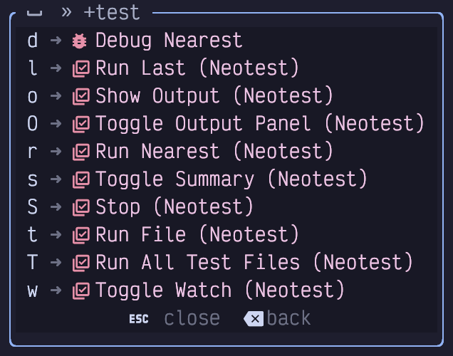
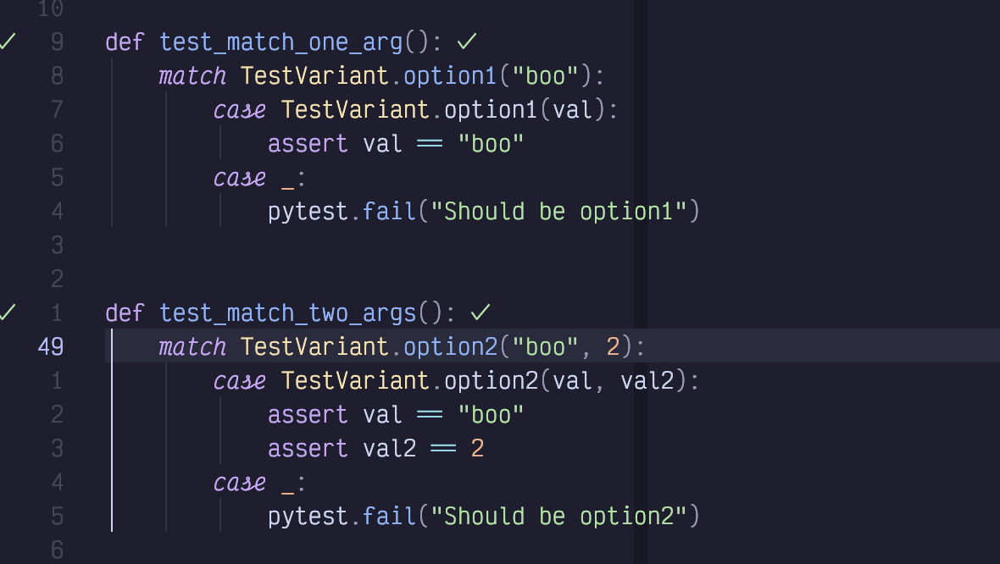
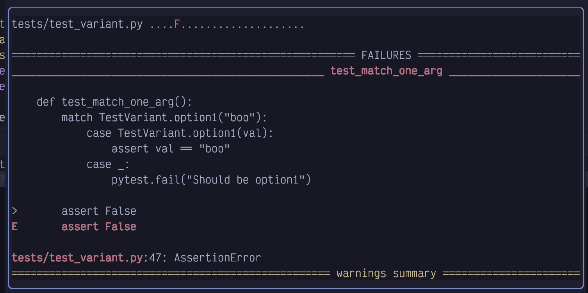
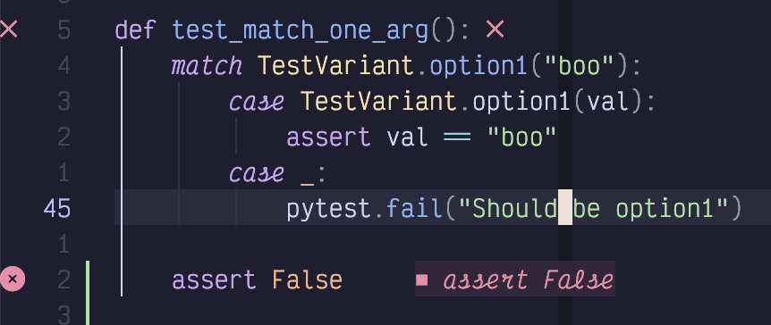
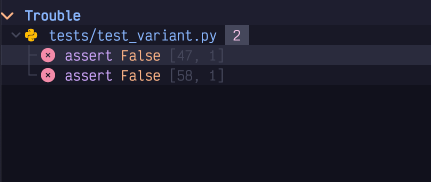
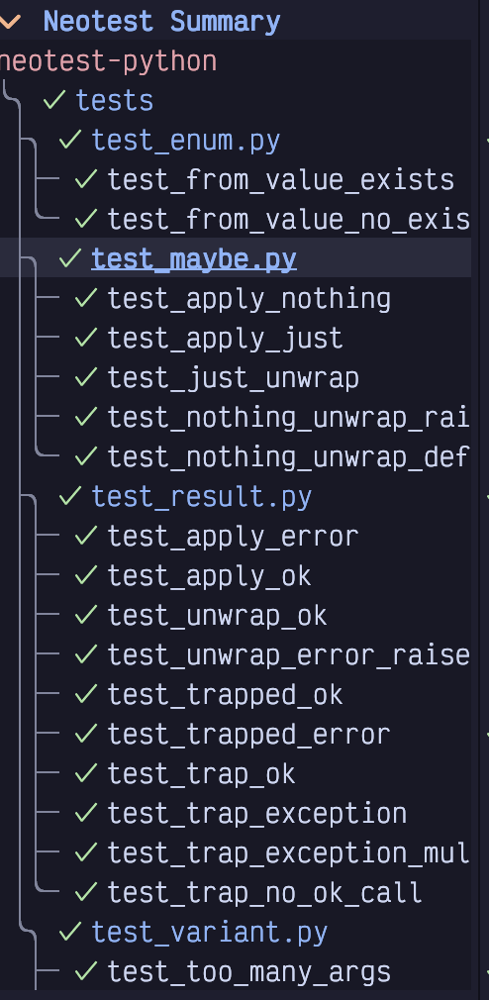
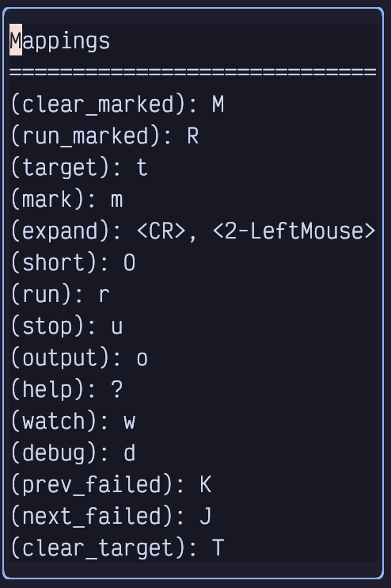

## Chapter 18. Testing

LazyVim can be configured with the Neotest plugin, a generic runner for selecting and running tests in a variety of languages and test frameworks. As with the debug adapter, Neotest is not enabled by default. However, if the plugin is enabled, most language extras ship with a pre-configured setup to make testing work automatically.

Except when it doesn't, of course. Much like debuggers, I find the in-editor features provided by testing extensions (regardless of editor) to be too finicky to be worth the effort of configuring them. I usually just have a test runner in watch mode running in a separate terminal, and that works well for me. I didn't previously use Neotest, but after writing this chapter I changed my mind!

### 18.1. Try Neotest

If you haven't already (as part of enabling recommended plugins) pop open the Lazy Extras interface and enable the `test.core` extra. This will set up Neotest and a couple dependencies for you.

Also make sure that the extras for whatever language you are working on are enabled, and double check if they include a test-related plugin. For this example, we'll be using `neotest-python`, which ships with the `lang.python` extra.

Once the extra is enabled, you'll see a new "test" top-level command in your space-mode menu, accessible with `<Space>t`:

Figure 97. Test Menu

As you would expect, the easy-to-type `<Space>tt` is the most important command in the menu; it runs the current file and parses the test results. You can also use `<Space>tr` (`r` for "Run") when your cursor is inside a test to run that single test.

After running tests successfully, Neotest puts a couple check icons in your interface so that you can see that they were successful:

Figure 98. Tests Run Successfully

This screenshot of two tests was taken after I ran all tests in the file with `<Space>tt`. There's one checkmark in the gutter and another to the right of the test in virtual text.

### 18.2. Error Reporting

Things get a bit more interesting when we introduce a test failure. First, a scrollable window pops up with the test output; this is the same output I would see if I had run the test command (`pytest` in this case) from the terminal:

Figure 99. Test Error Output

When this window pops up after running tests, it isn't focused by default, and you can close it simply by moving the cursor (similar to a diagnostic window). If you would prefer to focus the window (for example, so you can scroll it with `<Control-d>` and `<Control-u>`), you can use `<Space>to` where `o` means "output". You can use this keybinding to show the most recent test output at any time. Or you can use `<Space>tO` (capitalized `O`) to open the output in a pane under the editor instead of a floating window.

|||
| -- | -- | 
|  | The Neotest Output pane will behave better if you also have the edgy Extra enabled. |

Once the floating window is focused, you need to use the `q` shortcut to exit it.

When a test in Neotest fails, you obviously don't see a checkmark beside the test. Instead, you see a little red X. In addition, there will be an x in a circle in the specific line that has a failure and some (hopefully) informative virtual text to the right of the offending line:

Figure 100. Test Error Virtual text

Most helpfully of all, a Trouble window will open with a list of all failing tests. In this screenshot, I've added `assert False` to two different tests in the file:

Figure 101. Failing Tests In Trouble

This is **super** convenient because I can now navigate between failing tests (possibly in multiple files) using `]q` and `[q`, or by focusing the Trouble window and using basic cursor movements.

### 18.3. Test Summary

The `<Space>tT` with a capitalized T does a "but bigger" style action, running all tests in your project instead of just the ones in the current file. Of course, you won't see the test markers for any files that aren't open. So you'll probably want to use `<Space>ts` to toggle the summary window:

Figure 102. Test Summary

The summary view has some useful keyboard shortcuts (`J` and `K` are most useful) that you can see by typing `?` while it is focused:

Figure 103. Test Summary Keyboard Mappings

The `m` for "mark" command deserves a callout. It allows you to mark a test as "of interest", so that when you use the `R` or `Run marked` command it will only run those tests. Use `M` (capitalized) to clear all marks or `m` while a line is marked to toggle a single mark off.

### 18.4. Watch Mode and Debugging

You can toggle "watch" mode for the current file using `<Space>tw`. This will automatically run the test command every time your source code changes. The summary and test file icons will all update in real time.

If you have enabled the debug adapter as described in Chapter 18, you can even have the test automatically add a breakpoint on failure by running it with `<Space>td`. This can be useful for quickly inspecting locals or adding watch statements instead of adding a bunch of print statements before an assertion.

### 18.5. Installing a Test Runner

If you're lucky, your language has a LazyVim extra that is preconfigured to work with Neotest. For example, the `lang.go`, and `lang.python` extras both include configuration to set up Neotest with those frameworks.

Not all languages have a clear default test runner, however. For example, if you are coding in Typescript, you might prefer vitest or jest or the deno test runner. All three of these have Neotest support, but none of them are enabled by default with the Typescript extra.

For such languages, you'll need to do a bit of manual configuration. Let's try to set one up for vitest as an example.

The plugin we need is [neotest-vitest](https://github.com/marilari88/neotest-vitest). We need to combine the instructions from the README in that repo with LazyVim's example on the [Neotest](https://www.lazyvim.org/extras/test/core) page.

I created a new `vitest.lua` file in my plugins directory and added the following configuration to it:

Listing 67. Neotest-vitest Configuration

    return {
      { "marilari88/neotest-vitest" },
      {
        "nvim-neotest/neotest",
        opts = { adapters = { "neotest-vitest" } },
      },
    }

Then I restarted Neovim and opened a file that had a vitest test in it. `<Space>tt` did the right thing, and the plugin is configured.

In the repo I was testing, `vitest` was installed with npm, so no extra installation was needed. In most cases I would expect the tooling that Neotest plugins call into to be installed already when they access your project. If not, you may be able to install it from the Mason menu, accessible from `<Space>cm`.

### 18.6. Writing Your Own Test Adapter

This is a bit out of the scope of this book, but I decided to include it because a) I needed to do it anyway, b) this chapter is suprisingly short, and c) it's a good example for writing a simple plugin.

Writing your own Neotest adapter requires implementing just five methods to match the `neotest.Adapter` interface. However, the devil is in the details.

For this example, I'll be writing a test adaptter for the [Bun](https://bun.sh) test runner. I chose Bun partially because a Neotest adapter for it doesn't exist and I use Bun in my own projects. But it's also a good choice for demonstration because there are already three Typescript/Javascript Neotest adapters we draw on for examples and inspiration:

- [neotest-jest](https://github.com/haydenmeade/neotest-jest)

- [neotest-vitest](https://github.com/marilari88/neotest-vitest)

- [neotest-deno](https://github.com/MarkEmmons/neotest-deno)

We won't be implementing all the possible features (notably, the debugger will be missing), but we'll get the basics of running Bun tests and parsing output.

If you are unfamiliar with Bun, it is a Javascript/Typescript runtime and compiler, more or less an alternative to nodejs. The built-in command `bun test` runs a jest-like test suite. It is this command we will be binding to.

#### 18.6.1. Initializing a Local Plugin

By default, LazyVim downloads plugins from a provider such as GitHub. However, you can pass it any git url or point it at a local directory. We'll be doing the latter.

First, let's initialize a basic plugin structure in a new directory. You'll need to make three nested directories:

Listing 68. Neotest Bun Mkdir

    $ mkdir -p neotest-bun/lua/neotest-bun

The first `neotest-bun` can actually be any name. The `lua` is required for LazyVim to pick up any files inside it, and the last `neotest-bun` is a lua module that we will import in our configuration.

Inside this directory, create a file named `init.lua`. The contents of the file can just be some simple Lua code for now:

Listing 69. Simple Lua Script

    print("Hello, Lua!")

The next step is to hook this local plugin up to our LazyVim configuration. Create a new file in your LazyVim plugin directory (I called mine `neotest-bun.lua`). We'll use the same format we used for `vitest` above, except we'll point to our local plugin with the `dir` key:

Listing 70. Local Plugin Configuration

    return {
      { dir = "~/Desktop/Code/neotest-bun/" },
      {
        "nvim-neotest/neotest",
        opts = { adapters = { "neotest-bun" } },
      },
    }

To see if it's working so far, open any file in Neovim and run `<Space>tt` to attempt to kick off the test runner. It will fail because we haven't properly implemented the adapter interface, but it should also pop up a notification that says, "Hello, Lua!".

|||
| -- | -- | 
|  | The notification will disappear quickly, which is very inconvenient if it contains a traceback you want to introspect. You can always use `&lt;Space&gt;sna` to show all the recent messages in a pane. The `:messages` command also works. |

#### 18.6.2. Implementing the Neotest Adapter

Let's flesh out the adapter interface. Open the `neotest-bun/init.lua` file and replace the `print` statement with the following content:

Listing 71. Neotest Adapter Interface

    local BunNeotestAdapter = { name = "neotest-bun" }

    function BunNeotestAdapter.root(dir) end

    function BunNeotestAdapter.filter_dir(name, rel_path, root) end

    function BunNeotestAdapter.is_test_file(file_path) end

    function BunNeotestAdapter.discover_positions(file_path) end

    function BunNeotestAdapter.build_spec(args) end

    function BunNeotestAdapter.results(spec, result, tree) end

    return BunNeotestAdapter

This is the interface we need to implement. If you're wondering where I got this, it is defined in [the Neotest source code](https://github.com/nvim-neotest/neotest/blob/master/lua/neotest/adapters/interface.lua) and linked from the Neotest README. I also have the GitHub repositories for the `neotest-jest` and `neotest-deno` packages open for reference.

|||
| -- | -- | 
|  | You'll need to exit Neovim and restart it to pick up any changes you make to the init.lua file. Remember that you can use the `&lt;Space&gt;qq` command to exit Neovim and then the `s` command from the dashboard to restore your setup with a minimal amount of fuss. |

If you try to run tests on a Bun test file now, it will (probably) fail with a "No Tests Found" message. If it doesn't, there may be another test runner installed that thinks this is a legit test file.

Our adapter is currently correctly reporting that it is a Neotest adapter, but then it is failing to register the current folder or file as a test file. We can fix that by implementing the first three methods in the file.

The `root` directory is supposed to find the project root given a current directory. When using Bun, we can use the presence or absence of a `bun.lock` file as an indicator of the current project root. This file is generated when you run `bun install` and is used for keeping track of dependencies.

So let's implement the `BunNeoTestAdapter.root` method like this:

Listing 72. Root Directory Implementation

    local lib = require("neotest.lib")

    local BunNeotestAdapter = { name = "neotest-bun" }

    function BunNeotestAdapter.root(dir)
      return lib.files.match_root_pattern("bun.lock")(dir)
    end

The key here is the `neotest.lib` function `match_root_pattern`. We import that library and assign it to a local, then our `root` function just needs to create a callback and call it.

While we're at it, we can also implement the `filter_dir` function. This method is designed to filter out directories that shouldn't be scanned. In a Bun project, this includes the `node_modules` folder. We definitely don't want to waste time scanning for tests in that folder!

Listing 73. Filter Directory Implementation

    function BunNeotestAdapter.filter_dir(name, rel_path, root)
      return name ~= "node_modules"
    end

Now if you restart Neovim and try to run tests with `<Space>tT` (that is a capital `T` the second time) it will not show the "No Tests found" message. It won't *do* anything, but at least it won't error. However, `<Space>tt` will error, because it doesn't know that we are currently in a test file. We can address that from the `is_test_file` method.

In Bun, like most Javascript runtimes, tests are typically in a `something.test.js` or `somethingElse.test.ts` file. So we can use the following Lua function to check if we are in a test file:

Listing 74. Is Test File Implementation

    function BunNeotestAdapter.is_test_file(file_path)
      return string.match(file_path, ".*.test.[tj]s$") ~= nil
    end

If I open my `cohere.test.ts` file and run `<Space>tt`, I still get `No Tests found`. It is identifying the file as a Bun test file, but it doesn't know how to look inside the file to find any tests.

#### 18.6.3. Discovering Test Positions

Solving this requires implementing the `discover_positions` function, and that is…​ complicated. Typically, you would write Treesitter queries that identify namespaces and tests in the file. I suppose you could also write your own parser or use `string.match`, but Treesitter's parser is probably better than anything we can write.

I don't know anything about writing Treesitter queries, and I don't particularly want to. So I'm just going to rely on the fact that Bun uses the same describe/test syntax that Jest uses, and I'll copy the queries wholesale from the [neotest-jest](https://github.com/nvim-neotest/neotest-jest/blob/main/lua/neotest-jest/init.lua#L162) plugin!

It's a pretty long bit of code that will likely be hard to read in book format, but I'll include it here for completeness:

Listing 75. Borrowed Discover Positions Queries

    function BunNeotestAdapter.discover_positions(file_path)
      local query = [[
        ; -- Namespaces --
        ; Matches: `describe('context', () => {})`
        ((call_expression
          function: (identifier) @func_name (
            #eq? @func_name "describe"
          )
          arguments: (arguments (
            string (string_fragment) @namespace.name
          ) (arrow_function))
        )) @namespace.definition
        ; Matches: `describe('context', function() {})`
        ((call_expression
          function: (identifier) @func_name (
            #eq? @func_name "describe"
          )
          arguments: (arguments (
            string (string_fragment) @namespace.name
          ) (function_expression))
        )) @namespace.definition
        ; Matches: `describe.only('context', () => {})`
        ((call_expression
          function: (member_expression
            object: (identifier) @func_name (
              #any-of? @func_name "describe"
            )
          )
          arguments: (
            arguments (string (string_fragment) @namespace.name
          ) (arrow_function))
        )) @namespace.definition
        ; Matches: `describe.only('context', function() {})`
        ((call_expression
          function: (member_expression
            object: (identifier) @func_name (
              #any-of? @func_name "describe"
            )
          )
          arguments: (arguments (
            string (string_fragment) @namespace.name
          ) (function_expression))
        )) @namespace.definition
        ; Matches: `describe.each(['data'])('context', () => {})`
        ((call_expression
          function: (call_expression
            function: (member_expression
              object: (identifier) @func_name (
                #any-of? @func_name "describe"
              )
            )
          )
          arguments: (arguments (
            string (string_fragment) @namespace.name
          ) (arrow_function))
        )) @namespace.definition
        ; Matches: `describe.each(['data'])('context', function() {})`
        ((call_expression
          function: (call_expression
            function: (member_expression
              object: (identifier) @func_name (
                #any-of? @func_name "describe"
              )
            )
          )
          arguments: (arguments (
            string (string_fragment) @namespace.name
          ) (function_expression))
        )) @namespace.definition

        ; -- Tests --
        ; Matches: `test('test') / it('test')`
        ((call_expression
          function: (identifier) @func_name (
            #any-of? @func_name "it" "test"
          )
          arguments: (arguments (
            string (string_fragment) @test.name
          ) [(arrow_function) (function_expression)])
        )) @test.definition
        ; Matches: `test.only('test') / it.only('test')`
        ((call_expression
          function: (member_expression
            object: (identifier) @func_name (
              #any-of? @func_name "test" "it"
            )
          )
          arguments: (arguments (
            string (string_fragment) @test.name
          ) [(arrow_function) (function_expression)])
        )) @test.definition
        ; Matches: `test.each(['data'])('test')
        ((call_expression
          function: (call_expression
            function: (member_expression
              object: (identifier) @func_name (
                #any-of? @func_name "it" "test"
              )
              property: (property_identifier) @each_property (
                #eq? @each_property "each"
              )
            )
          )
          arguments: (arguments (
            string (string_fragment) @test.name
          ) [(arrow_function) (function_expression)])
        )) @test.definition
      ]]

      local positions = lib.treesitter.parse_positions(
        file_path, query, {
        nested_tests = false,
      })

      return positions
    end

Now you can restart Neovim and open a bun test file to get a new error! New errors are progress, right?

You'll now notice that Neotest is identifying the positions of `describe` and `test` calls in the gutter. Instead of the red cross or green check we would expect from a successful test run, it will be an eye with a cross through it. I suspect this means the test was skipped or not runnable. The good news is it is finding the tests. The bad news is it is not *running* the tests.

#### 18.6.4. Building the Spec

We can run the tests by implementing the `build_spec` function. This function accepts various parameters to determine how the user kicked off the tests. If they used `<Space>tr` it's in "single test" mode, but if they used `<Space>tt` it is in "file" mode, and `<Space>tT` would run it in "all tests" mode.

The return value of `build_spec` is essentially a command to be run and some context to read the results back.

The code is actually not that long, so here it is in its entirety, followed by discussion:

Listing 76. Build Spec Implementation

    function BunNeotestAdapter.build_spec(args)
      local results_path = async.fn.tempname()
      local position = args.tree:data()
      local cwd = assert(
        BunNeotestAdapter.root(
          position.path
        ),
        "could not locate root directory of " .. position.path)
      local command = nil

      if position.type == "test" or position.type == "namespace" then
        command = "bun test " ..
          position.path ..
          " --test-name-pattern " ..
          position.name
      elseif position.type == "file" then
        command = "bun test " .. position.name
      elseif position.type == "dir" then
        command = "bun test"
      end

      return {
        command = command .. " 2>" .. results_path,
        context = {
          results_path = results_path,
        },
        cwd = cwd,
      }
    end

We start by creating a temporary `results_path` using the `neotest.async` library. (You'll need to import this with `local async = require("neotest.async")` at the top of the file). We load the `position`, which is a structure constructed from the return value of the `discover_positions` method we just wrote.

The `if..elseif` block is essentially checking how the user kicked off the test, and running the appropriate Bun command. If they provided a test name, then we pass the `--test-name-pattern` argument to the `bun test` command. If they kicked it off as a file, we run `bun test filename`. And if they wanted to run all tests, we simply run all tests with `bun test`.

|||
| -- | -- | 
|  | The Bun test runner is so fast, that I would expect to mostly just use the last form with `&lt;Space&gt;tT` and the summary view open in the left sidebar. |

The returned object includes some necessary context that will be used when we parse results. The `bun test` command is rather unusual in that it outputs the results to standard error, so we pass a `2>` redirect to store the results in the temporary file we defined.

Now we just need to extract the results from that file.

#### 18.6.5. Parsing Results

This ended up being simpler than I expected, because `bun test` aggregates names in a way that maps to Neotest's expected form quite easily. But it took me half a day of fussing around to get code that actually worked!

The `results` method mostly just has to read through the `results_path` file that was created by our `build_spec` function and convert it to a simple Lua table. The keys of the result table are the names of the tests in question, and the values are just a second table with `{status = "passed"}` or `{status = "failed"}`. At least, that's all we're going to put in it. Neotest does accept some other details here that it can render in the UI, but I'll leave that as "an exercise for the reader."

|||
| -- | -- | 
|  | When reading other instructional books, "an exercise for the reader" is just authors being lazy, or (occasionally) publishers trying to cut word count. Now you know. |

The tricky part is the "keys are the names of the tests". I couldn't find any documentation on this, and it took some trial and error to discover that nested "namespaces" (`describe` calls, in this case) in Neotest are separated by `::`. The name also needs the absolute path to the test file. If we return that in the right format, Neotest will happily convert our results to the appropriate icons!

Here's the code:

Listing 77. Neotest Results Implementation

    function BunNeotestAdapter.results(spec, result, tree)
      local results = {}
      local file = assert(io.open(spec.context.results_path))
      local line = file:read("l")
      local test_suite = ""

      while line do
        local pass_match = string.match(line, "^%(pass%) (.*) %[.*%]$")
        if pass_match ~= nil then
          local test_name = pass_match.gsub(pass_match, " > ", "::")
          results[test_suite .. test_name] = { status = "passed" }
        end

        local fail_match = string.match(line, "^%(fail%) (.*) %[.*%]$")
        if fail_match ~= nil then
          local test_name = fail_match.gsub(fail_match, " > ", "::")
          results[test_suite .. test_name] = { status = "failed" }
        end

        local test_file = string.match(line, "^(.+.test.[tj]s):$")
        if test_file ~= nil then
          test_suite = spec.cwd .. "/" .. test_file .. "::"
        end

        line = file:read("l")
      end

      if file then
        file:close()
      end

      return results
    end

For context, this function is designed to translate output like this:

Listing 78. Bun Test Output

    src/clients/stability/stability.test.ts:
    (pass) Stability > generates a reference image [0.40ms]

    src/clients/passage/passage.test.ts:
    (pass) Passage > GetUserTier > Undefined [1.24ms]
    (pass) Passage > GetUserTier > with tier free
    (fail) Passage > GetUserTier > with tier hobby

into something like this:

Listing 79. Translated Bun Test Output

    {
      "/.../stability.test.ts::Stability::generates reference image" = {
        status = "passed"
      },
      "/.../passage.test.ts::Passage::GetUserTier::Undefined" = {
        status = "passed"
      },
      "/.../passage.test.ts::Passage::GetUserTier::with tier free" = {
        status = "passed"
      },
      "/.../passage.test.ts::Passage::GetUserTier::with tier hobby" = {
        status = "failed"
      },
    }

The method first grabs the filename from the context (the context was returned from the `build_spec` method). It opens the file and reads the lines from that file one by one. It then uses a matcher to determine if the line starts with `(passed)` or `(failed)` which is how Bun reports a test result. The rest of the test line will be the properly namespaced test name (minus a timing in square brackets), except the namespaces are separated by `>` instead of `::`. So we use `gsub` to replace the `>` with `::`. This is combined with the absolute path of the name of the file to get the right test name.

If a given line is not a test name, then it might be the name of the test file, which Bun kindly specifies as a relative path followed by a colon. So we do a match on that format and store the test name as an absolute path (that's what the `spec.cwd` is for) to be prepended to subsequent test results.

And that's the basics of implementing our own test runner! It's missing some features, notably debugging tests and capturing output, but it's a good start.

### 18.7. Summary

This chapter covered the Neotest plugin, including various ways to invoke it and how to set it up the easy way, hard way, and extra hard way.

We also learned a little bit about how to write a Neovim plugin. At its core, it's just a collection of Lua files that LazyVim can import. In this case, the Lua file is a Neotest adapter, and we configured it to load our plugin into Neotest.
