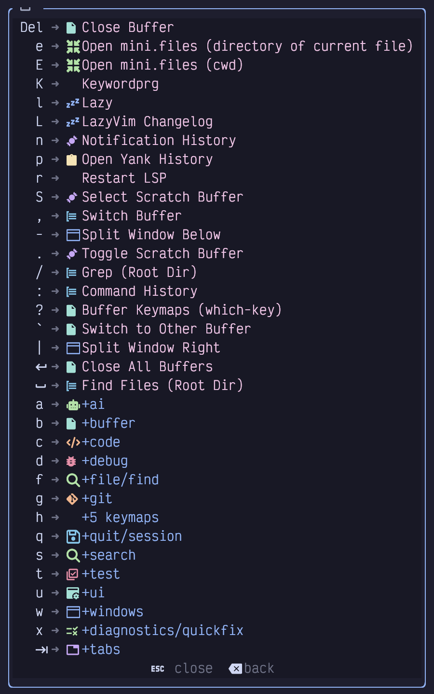
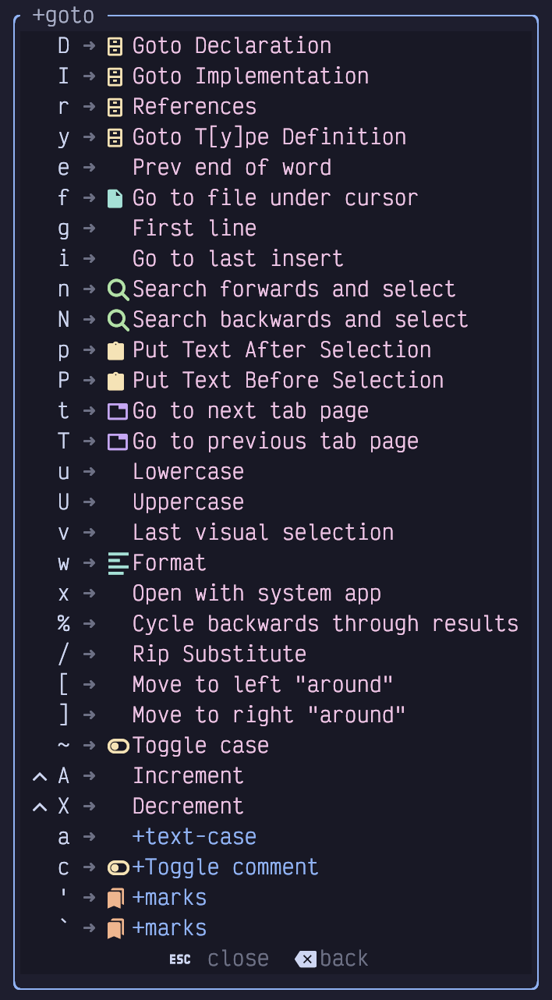
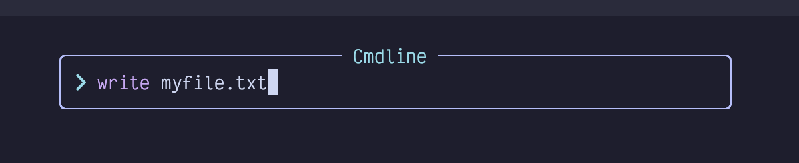
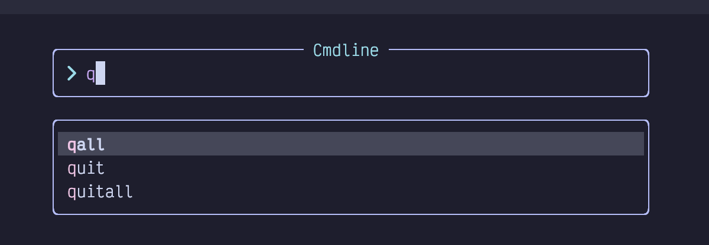
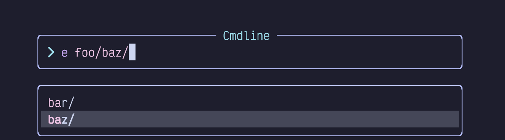

## Chapter 2. What is Modal Editing, Anyway?

As the letters on the dashboard suggest, LazyVim is keyboard-centric. As many actions as possible can be performed without moving your hands between mouse and keyboard. Of course, it’s still possible to use the mouse. You can click anywhere in the editor, interact with buttons and modals when they pop up, use the scroll wheel or touchpad gestures to scroll, and resize editor panes by dragging their borders. But you can also do all of these things using the keyboard, and usually more efficiently.

More importantly, you can do most things by holding at most two keys, most often only one. You will only rarely have to contort your hands into painful (and dangerous) positions to `Control + Shift + Alt + <some key>`.

How does Vim do this? Modal editing.

### 2.1. Introduction to Modal Editing

“Modes” in LazyVim simply mean that different keystrokes mean different things depending on which mode is currently active. For example, when you start the editor up, you are in a “Dashboard Mode”, and the most common interpretation of each keystroke in that mode are listed right on the dashboard. This discoverability of keybindings in a given mode is a common theme in LazyVim, and a huge improvement over the opaque default behaviour of Neovim itself.

To see what I mean, press the spacebar to enter “Space mode”. Entering Space mode pops up a menu in the bottom right corner of the screen. It will look something like this (my menu contains some customizations, so yours won’t be identical):

Figure 4. Space Mode

That’s a big menu. The important thing to focus on right now is the `f` key, which we will use to understand modal editing.

If you are in Dashboard mode and press the `f` key, you will open the `Find file` dialog using a picker plugin we’ll discuss later. However, now that you are in Space mode, if you press the `f` key, it will instead open the `file/find` Space mode submenu.

This is the crux of what modal editing means: The behaviour of a given key depends on the current mode. As indicated by the line at the bottom of the Space mode menu, you can press the `Escape` key to exit Space mode and return to the dashboard. Go ahead and do that.

Now you’re back in Dashboard mode, and you can press the `n` key to create a new, empty buffer.

Pay close attention to the lower left corner of that buffer, where you’ll see the word `INSERT`:

Figure 5. Insert Mode

While Space mode and Dashboard mode are technically LazyVim specific configurations, Insert mode is an original Vi concept, that the successors Vim, then Neovim, and now LazyVim have all inherited. In Insert mode, the vast majority of keystrokes do what you would expect in any editor: they insert text. So you can touch type as usual.

You can access *some* keyboard shortcuts in Insert mode using `Control` and `Alt` keys. For example, you can hit `Control-r` to enter the “Registers” mini-mode, which pops up a list of “registers” you can paste from. We’ll cover registers in detail in Chapter 8. For now, it is enough to know that `Control-r` followed by the plus key (i.e. `Shift-=`) will paste text from the clipboard when in Insert mode.

However, you will much more often change to *Normal* mode to perform non-text-entry operations, including pasting text. Normal mode is another major Vim mode that has been around since the days of Vi.

To get into Normal mode from Insert mode, hit the `Escape` key. The cursor will change from a bar to a block and the indicator in the lower left corner will change to `NORMAL`:

Figure 6. Normal Mode

In Normal mode, pressing various keyboard characters will **not** insert text like it does in Insert mode. For example, pressing `p` will, rather than inserting a literal `p` character into the document, instead paste from the system clipboard.

Vim and Neovim aren’t very discoverable, but they ARE generally memorable. As often as possible, the keyboard shortcuts to perform an action start with a letter that makes sense for the action being performed. You might think `p` stands for “**p**aste”, but in fact the concept has been around for longer than the clipboard abstraction. You are welcome to think of it as “paste” if that’s easier for you, but in Vim parlance, it actually stands for “put”, and I’ll use that word throughout the book.

For some contrast, the `Control-r` key that pops up the list of registers in Insert mode does **not** pop up a list of registers in Normal mode. Instead, `Control-r` means “redo” (i.e. undo an undo). In order to enter the Registers mini-mode from Normal mode, you would press the `"` (quote, as in `<Shift>-apostrophe`) key instead.

If that sounds confusing, don’t worry. Your brain and muscle memory will adapt more quickly than you expect and you’ll always understand that behaviours in Normal mode are not the same as in Insert mode.

I hardly ever use non-text-entry commands in Insert mode. I find it is easier to switch back to Normal mode and then perform the command from Normal mode. It doesn’t usually take a higher number of keystrokes to do so and I don’t have to hold down multiple keys at once.

The universal key to exit Insert mode and return to Normal mode is `Escape`. And that brings us to an important point: You will be using this key a lot, but moving your hands from the home row to the Escape key in the upper left corner and back again is somewhat inefficient.

You can choose from a few common solutions to this situation:

- If you have a customizable keyboard you can put the `Escape` key in a more accessible location. This is what I do. I have a MoErgo Glove 80, and I remapped the keys so that `Escape` is in the “thumb key” section of this admittedly bizarre keyboard. It’s as easy to hit as `Enter`, `Space`, and `Backspace`, other keys that I use very frequently.

- Your operating system is probably also capable of remapping keys. A lot of modal users replace the useless `Capslock` with the `Escape` key. (For non-modal paradigms it can be more comfortable to remap `Capslock` to the commonly-held `Control` key, especially on laptop keyboards).

- Neovim itself is also able to remap keys. We’ll discuss how to do this in LazyVim later. One common pattern is to map a series of uncommon keystrokes that you wouldn’t likely type together when inserting text to the escape key. So you can set it up to map something like `jk`, `jj` or `;;` in Insert mode to switch to Normal mode. I’ve tried this and don’t care for it as it introduces a timing thing when you hit the first character and Neovim is waiting to see if you’re going to type a command or let text insertion continue, but you might like it.

- The `Control-C` keyboard combination also works to exit Insert mode, with no remapping required. I don’t like this because it’s two keystrokes.

Don’t worry about actually changing it for now; just start getting used to using `Escape` where it is and see if you find it annoying.

Once you’re in Normal mode, you’ll obviously want to get back to Insert mode to enter text at some point! There are several different ways to do this. Here are a couple of the most common ones:

The `i` key always inserts text *before* the current cursor position. This means that you could (very clumsily) move your cursor left by pressing `i <Escape> i <Escape>` repeatedly. When you press `i`, you insert text before the current position, and then `Escape` takes you out of Insert mode at that new “before” position.

Commonly, you want to enter Insert mode *after* the current cursor position. To do that, use the `a` key instead (mnemonic: i for **I**nsert Before, a for **A**ppend, although I usually think of it as **A**fter).

You’ll find that you need to alternate between these a lot as you are navigating a document because the various navigation commands we’ll cover later will often put you just before or just after the position you need to insert at. So it’s important to remember both of them.

Two other very common operations are to insert at the very beginning or the very end of the current line. You *could* use navigation commands to move to the start or end and then use `i` and `a`, but it’s easier to use the commands `I` and `A` instead (The difference is that they are capitalized, so you need the `Shift` key with them).

#### 2.1.1. A Note on Keybinding Mnemonics

It is common for related keybindings like these to be assigned to the lowercase and uppercase versions of the same key. You will often find that the lower case version means “do something” and the uppercase version means either “do the same thing only BIGGER” or “do the OPPOSITE thing”, depending on the situation. In this case, `i` and `a` mean “insert one character before or after the cursor” and `I` and `A` are “insert before or after the cursor, only BIGGER (i.e. at the beginning or end of the line)”.

To illustrate the “do the opposite thing” situation, consider the `o` and (shifted) `O` keys, which are two more ways to get into Insert mode.

The `o` key is used to enter Insert mode on a new line *below* the current one. For the “do the opposite thing” scenario, the shifted `O` means “create a new line *above* the current one and enter Insert mode on it”.

<table>
<tbody>
<tr>
<td class="icon"></td>
<td class="content">The mnemonic “<strong>O</strong>pen a new line above/below” can help you remember the otherwise less than memorable <code>o</code> command.</td>
</tr>
</tbody>
</table>

One final useful command that takes two keystrokes is `gi`. That is a single press and release of `g` followed by `i`. It means “Go to the last place you entered Insert mode, and enter Insert mode again”. In this case, the `g` key is actually switching to a new mini-mode I call “Go To” mode, though not all the commands accessible from it are strictly related to going places. You can see the entire list of commands available in “Go To” mode by pressing the `g` key in Normal mode and waiting for the menu to pop up at the bottom of the window:

Figure 7. Go To Mode

We’ll cover most of them later, but notice that the `i` key is in there labelled “Move to the last insertion and INSERT”. So if you forget how to go to the last insertion point, you can enter Go To mode and scan the menu to find the `i` again.

Try all of those commands (`a`, `i`, `o`, `A`, `I`, `O`, and `gi`) repeatedly, entering some text and pressing `Escape` to return to Normal mode. Then try it again. Move your cursor around the text using the mouse (we’ll get to keyboard navigation soon, I promise), and try using the commands again to see how they behave in new locations.

Get *really* comfortable with switching between Normal and Insert mode. You might think you’ll spend most of your time in Insert mode, but the truth is code is edited far more often than it is written afresh, and you’ll be alternating between them constantly.

### 2.2. Visual Mode

The other major mode that LazyVim inherits from its ancestors is “Visual” mode. Visual mode is used to select text. In general, you can enter Visual mode and then use many of the same navigation keys you would use in Normal mode to move your cursor around. Since we haven’t covered those navigation keystrokes yet, I’m going to defer a detailed discussion of Visual Mode until Chapter 8, when we will have the necessary foundation.

### 2.3. Command Mode

Command mode is different from the other modes we’ve seen, which were mostly either submenus or the editor-level “major” modes. You can get into command mode from Normal mode by using the `:` (i.e. `Shift-<semicolon>`) command. In LazyVim, this will pop up a little widget where you can type what is known as an “Ex Command.” This name comes from `vi`'s predecessor, `ex`, which hasn’t really been used (other than as part of Vim) in decades.

Essentially, you can enter a wide variety of commands into this widget and expect certain behaviours to happen as a result. It is actually more similar to the command palette popularized by Sublime Text and VS Code than anything else, though it is quite a different experience.

You already know one ex command from Chapter 1! Remember `<Escape><Colon>q!<Enter>` the command to exit the editor? You now know that the `Escape` is to enter Normal mode from whatever mode you are in. The colon is used to switch to Command mode, and the `q` is short for quit (You could type the full word `quit` if you didn’t feel the need to conserve keystrokes). The exclamation point says “without saving" and the `Enter` means "submit the ex command”.

As another example, let’s consider the `write` ex command. Type `:` followed by `write myfile.txt` like this:

Figure 8. Write Command

Press `Enter` to confirm and execute the command, which will save the file with the given name.

<table>
<tbody>
<tr>
<td class="icon"></td>
<td class="content">Most commands can be shortened to their shortest unique common prefix. You usually type <code>:w myfile.txt</code> instead of <code>:write myfile.txt</code>. The most popular commands even have special combined commands, so <code>:wq</code> will save and exit, although you’ll probably prefer <code>:x</code> as it’s even shorter.</td>
</tr>
</tbody>
</table>

Command mode is kind of weird. It’s like an Insert mode in the sense that you can type text into it, and some of the keybindings that work in Insert mode also work in Command mode (including `Control-r` to paste from a register). But other keybindings work differently in Command mode. The most important one is the `Tab` key, which will do a sort of “tab completion” on the command. For example, `:q<Tab>` pops up a menu like this:

Figure 9. Tab in Command

This completion menu is disturbingly unintuitive to navigate. You’re probably going to want to bookmark this section or take some notes to refer to until you get used to it!

First, if you want to select a different entry in the menu, you would surely think you can use the arrow keys, right? No, you’ll need to use `Tab` and `Shift-Tab` to select different entries from the menu. It’s easier on the muscle memory: Tab once to show the menu, tab again to cycle through other entries in the menu.

Second, there is some nuance around *confirming* one of those menu entries. In the above example, you can just press `Enter` to confirm the selection **and execute it**. However, there are often cases where you want to confirm the selection and then continue editing the command. An excellent example is the `:e` or `:edit` command.

This command is used to open a file on your filesystem, but you have to type the entire path to the file. For example, if you have the following directory structure:

Listing 5. Nested Directory Structure

    .
    └── foo
        ├── bar
        └── baz
        │   └── fizz.txt

…​and you have Neovim open, you would have to type the following to open the `fizz.txt` file:

Listing 6. Edit File Command

    :e foo/baz/fizz.txt

That’s a lot of typing if you need to get to deeply nested directories. Luckily, you *can* use tab completion for this. You can type `:e f<tab>b<tab><tab><tab>` to select `foo/baz`, but at this point the menu is still open:

Figure 10. Edit Command with Completion Menu

If you press `Enter` now, it’s going to open the `baz` *folder* instead of just confirming the selection, which is not what you want. And if you press `Tab` again it will cycle through the menu some more.

Instead, you have a couple of options. The `Down` arrow key will (unintuitively) move “into” the selected directory, allowing you to tab through the files inside it. Alternatively, use the `Control-y` (`y` for “**y**es”) key combination. This will confirm the `baz` selection and close the menu but leave you in Command mode. Now you can press tab again to complete the `fizz.txt` portion of the command.

It **is** possible to remap these keys to be more like other software, and I honestly think this is one thing LazyVim should do by default. I haven’t found a combination that I like, though, so I just stick with the default keybindings.

You probably won’t spend a lot of time in Command mode. There are easier ways to open files in LazyVim, for example, as well as to quit the editor. And if you need to do something more complex with command history, there is a special window you can use to edit commands with Insert and Normal mode that we will cover later.

For now, remember `<Tab>` and `Control-y` and you’ll be able to navigate the Command menu when you need to.

The most important command, by the way, is `:help`. Vim was created before folks had ready access to the Internet, so it has a tradition of shipping all of its documentation with the editor. So for example, if you can’t remember the keyboard shortcut to `put` text, try `:help put`. Or, if you want to know what the `Control-R` keyboard shortcut does, try `:help CTRL-R`. Of course, the Vim help documents have also been indexed by your favourite search engines and AI chat bots, so you can go all new-school and ask them if you prefer.

### 2.4. Summary

In this chapter, we became comfortable with the concept of modal editing and the most important LazyVim modes. There are other mini-modes that will come up as we progress through this book, but becoming comfortable with Normal, Insert, and Command mode (and how to switch between them) will take you a long way on your LazyVim journey.

In the next chapter, we’ll learn a whole bunch of different ways to move the cursor around inside a document.
