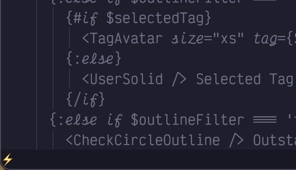
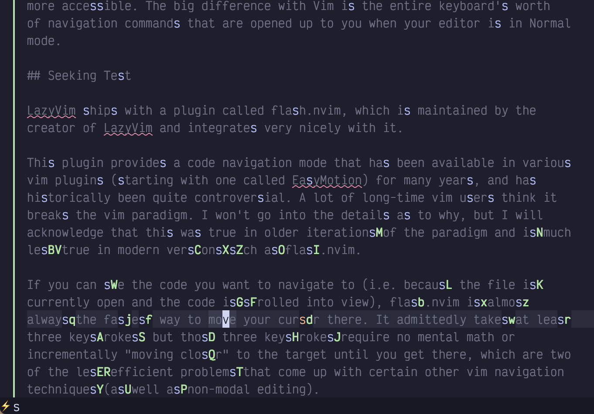
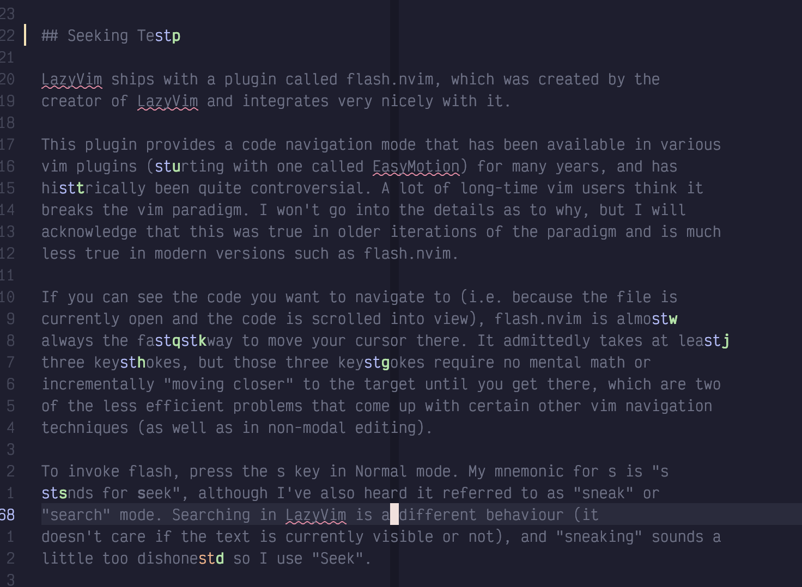
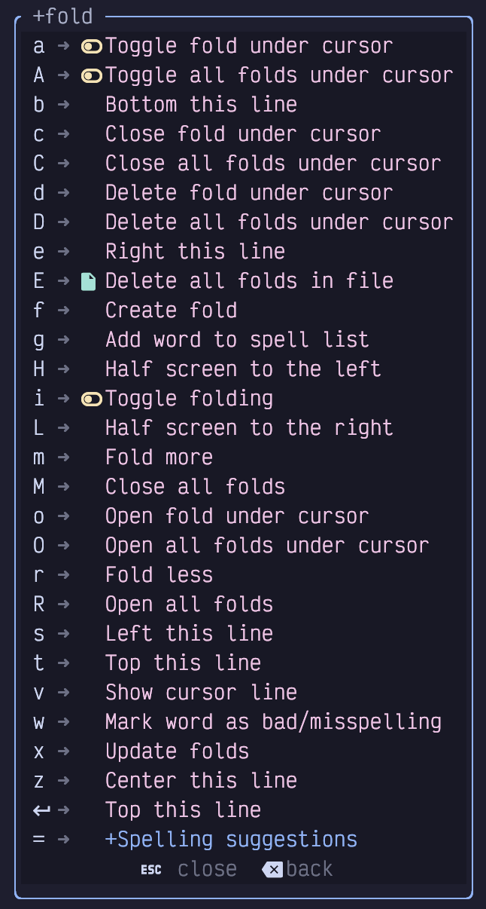
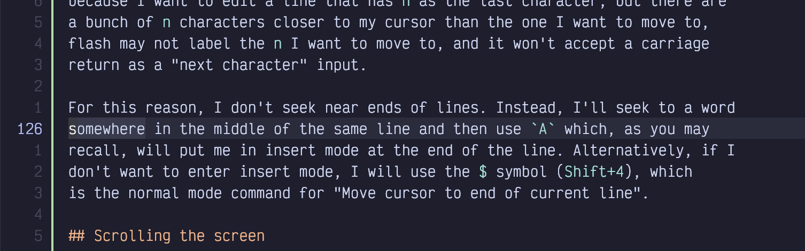

## Chapter 3. Getting Around

Software developers spend far more time editing code than we do writing it. We’re always debugging, adding features, and refactoring.

Indeed, the most common thing I ever do is add a print/printf/Println/console.log at some specific line in the codebase.

If you are coming from the more common word processing or text editing ecosystems, navigating code is the thing that is most different in Vim’s modal paradigm. Even if you’re used to Vim, some of the plugins LazyVim ships by default provide different methods of code navigation than the old Vim standbys.

In VS Code, often the quickest way to get from one point in the code to another is to use the mouse. For minor movements, the arrow keys work well, and they can be combined with `Control`, `Alt`, or `Cmd/Win` to move in larger increments such as by words, paragraphs, or to the beginning or end of the line. There are numerous other keyboard shortcuts to make getting around easier, and the Language Server support allows for easy semantic code navigation such as “Go to Definition” and “Go to Symbol”.

Vim also supports mouse navigation, but you’ll likely reach for it less often once you train up on the navigation keymappings. LazyVim has keybindings for the same Language Server Protocol features that VS Code has, and they are often more accessible. The big difference with Vim is the entire keyboard’s worth of navigation commands that are opened up to you when your editor is in Normal mode.

### 3.1. Seeking Text

LazyVim ships with a plugin called flash.nvim, which was created by the maintainer of LazyVim and integrates very nicely with it.

This plugin provides a code navigation mode that has been available in various vim plugins for many years, and has historically been quite controversial. A lot of long-time Vim users think it breaks the Vim paradigm. I won’t go into the details as to why, but I will acknowledge that this was true in older iterations of the paradigm but is somewhat less true in modern versions such as flash.nvim.

If you can see the code you want to navigate to (i.e. because the file is currently open and the code is scrolled into view), flash.nvim is almost always the fastest way to move your cursor there. It admittedly takes at least three keystrokes, but those three keystrokes require no mental math or incrementally “moving closer” to the target until you get there, which are two of the less efficient problems that come up with certain other Vim navigation techniques (as well as in non-modal editing).

To invoke `flash`, press the `s` key in Normal mode. My mnemonic for `s` for “**s**eek”, although I’ve also heard it referred to as “sneak” or “search” mode. Searching in LazyVim is a different behaviour (it doesn’t care if the text is currently visible or not), and “sneaking” sounds a little too dishonest, so I use “Seek”.

The first thing to notice when you press `s` is that the text fades to a uniform colour and there’s a little lightning symbol in the status bar indicating that Flash mode is active:

Figure 11. Flash Mode Active

Since you know where you want the cursor to be, your eyes are probably looking right at it, and you know exactly what character is at that location. So after entering Seek mode, simply type the character you want to jump to.

For example, in the following screenshot, I want to fix the typo in the heading of this section, changing `Test` to `Text`.

Figure 12. Seek `s` characters

I have hit `ss`, and every single `s` in the screenshot has turned blue, including capitals. There is an `s` character beside the flash icon in the status bar indicating that I have seeked an `s`.

In addition, all the `s` characters nearest to the cursor (which is in the bottom paragraph) have a green label beside (to the right of) them. If I wanted to jump to any of those `s` characters, I would just have to type that label and boom, I’d be there.

However, the character I want to hit is too far away to have a unique label, as there are a lot of `s` characters in my text. No matter! I just have to type the character to the right of the target `s` character, which is a `t`. Now my screen looks like this:

Figure 13. Seek `st` characters

Now, all instances of `st` in the file are highlighted in blue, and since there aren’t as many `st` as `s`, all of those instances have a label beside them. The text I want to move to is labelled with a `p`, so I press `p` and my cursor is moved to the `s` character I wanted to change. Now I can type `rx` to replace the `s` with an `x` (we’ll discuss *editing* code in chapter 6, but now you’ve had a taste of it).

If you have multiple files open in split windows (which we’ll discuss in Chapter 9), Seek mode can be used to move your cursor *anywhere* on the screen, not just in the currently active split.

Seek mode does have drawbacks however, at least the way flash.nvim implements it. There are some characters you can’t move to directly because you run out of text to search for before a labelled match targets that location. For me this happens most often when I want to edit the end of a line. If I type `sn` because I want to edit a line that has `n` as the last character, but there are a bunch of `n` characters closer to my cursor than the one I want to move to, flash may not label the `n` I want to move to, and it won’t accept a carriage return as a “next character” input.

For this reason, I don’t seek near ends of lines. Instead, I’ll seek to a word somewhere in the middle of the same line and then use `A` which, as you may recall, will put me in Insert mode at the end of the line. Alternatively, if I don’t want to enter Insert mode, I will use the `$` symbol (`Shift+4`), which is the Normal mode command for “Move cursor to end of current line”.

### 3.2. Scrolling the Screen

Seek mode only works if the text you want to jump to is visible on the screen. You can’t label something you can’t see! Often, this means you want to use search or one of the larger or more specific motions discussed later, but there are also a few keybindings you can use to scroll the screen so you can see your target before you jump to it.

These keybindings are a little unusual by Vim standards because they mostly involve using the control key. How anti-modal! In my experience, these keybindings don’t actually get a ton of use. Indeed I’ve forgotten some of them and had to look them up to write this chapter.

The scrolling keys I use the most are definitely `Control-d` and `Control-u`, where the mnemonics are **d**own and **u**p. They scroll the window by half a screen’s worth of text. The cursor stays in the same spot relative to the **window**, which means that it is moved up or down by half a screen’s worth of text relative to the **document**.

If you need to move even further, you can use the `Control-f` and `Control-b` keybindings (**f**orward and **b**ackward), which scroll by a full page of text. I don’t like these ones because I never quite know where the cursor is going to end up and I become disoriented. But it can be handy if you need to scroll something into view quickly to use Seek mode on it. Unlike `Control-d` and `Control-u`, `Control-f` and `Control-b` can be prefixed with a count, so you can type `5<Control-f>` if you need to scroll ahead by `5` pages.

To scroll the window by a single line, use `Control-y` and `Control-e`. I have no idea why these keybindings were chosen. There is no mnemonic. I easily forget them, and so I never use them. These keybindings accept a count, so if you can remember them, they are useful for subtle repositioning of the text. The main advantage of these keybindings is that they don’t move the cursor unless it would scroll off the screen, so if you are working on a line and need more visibility but don’t want to move the cursor, you could use `Control-y` and `Control-e` to do it.

The reason I don’t use these keys (other than lack of a decent mnemonic) is that I prefer to do relative cursor positioning using `z` mode.

#### 3.2.1. Z Mode

The `z` menu mode is an eclectic mix of cursor positioning, code folding, and random commands. You can see a list by pressing the `z` key while in Normal mode:

Figure 14. The `z` Menu

If that looks like a big menu, you don’t know the half of it! There are a ton of other z-mode keybindings that are obscure enough that the which-key plugin doesn’t bother to list them in the menu! I’ll cover the three most useful scrolling related ones here and we’ll discuss others later.

The relative cursor keybindings I use exclusively are `zt`, `zb`, and `zz`. These move the line that the cursor is currently on to the **t**op, **b**ottom, or middle of the screen, respectively, where middle is represented by the easy-to-type double letter. When moving to the top or bottom it will leave a few lines of context above or below the cursor.

There are others that will also move the cursor to the first column of the window, but instead of memorizing those shortcuts, I recommend combining the previous commands with `0` instead, as in `zt0`, `zb0`, and `zz0`. The `0` command just means “Go to the start of the line”. You can also use *home* if your keyboard has a *home* key, but `0` is easier to hit on many keyboards.

You can find other scrolling keybindings in the Neovim documentation by typing `:help scrolling`, but the ones I just mentioned will probably more than cover your needs as you learn far more nuanced methods of navigating code.

### 3.3. The First Rule of Vim

So there is a holy rule in Vim that I constantly break for valid reasons. Unless you are the very strange combination of weird that I am, you probably should not break it quite so often:

**Never use the arrow keys to move the cursor.**

The background behind this rule is that it takes a tenth of a second or so to move your hand to the arrow keys on most keyboards, and another tenth of a second to move it back to the home row. I’m not convinced these tenths of a second add up to an appreciable amount of time, even considering the millions of characters I have typed in my lifetime. (Yes, millions. I did the math once).

But I do think the arrow keys on most keyboards can do nasty things to the long term health of your hands, and honestly, the more you get used to the alternative Vim keybindings, the more you’ll prefer to use them.

The Vim keybindings for arrow keys seem rather unintuitive when you first look at them: `h`, `j`, `k`, and `l`. These map to the directions, left, down, up, and right. If it seems weird that `l` means `right` instead of `left`, or you’re wondering why they skipped `i` since that appears to be an alphabetic sequence, look at your keyboard.

If you are an English-speaker with a standard Qwerty keyboard, the letters `h`, `j`, `k`, and `l` are on the home row under your right hand, in that order, and are therefore the easiest keys to hit on the entire keyboard.

Open a largish file in Neovim (you can use `:e path/to/filename`) and experiment with moving the cursor left, right, up and down using the home row keys.

Vim, Neovim, and LazyVim are all *really* good at reusing motions, so you will find that `h`, `j`, `k`, and `l` are used for a lot of different navigation sequences as you progress through this book. Take enough time to really get used to them. But recognize that if you ever have to push these keys more than twice in succession to move the cursor, you’re wasting keystrokes.

### 3.4. Counting

The vast majority of commands in Vim can be prefixed with a *count* to repeat the motion multiple times. The count is typically entered as a sequence of digits before the command you want to repeat.

So, for example, to move the cursor up 15 lines, you would enter Normal mode and hit the keys `15k`. To move it five characters to the right, use `5l`.

This is why LazyVim has such weird line numbering by default. Consider the following screenshot:

Figure 15. Relative Line Numbering

My cursor in this screenshot is on line 126, which is highlighted in the left gutter. It is also visible in the lower right corner of my window, though I cropped it out in this screenshot. But directly above line `126` we see the line number 1, and directly below it we also see the line number 1.

Let’s say I want to move my cursor to the `Scrolling the screen` heading.

This line has the number `5` beside it, so I don’t have to count lines or do any mental arithmetic to figure out the count to use to move my cursor. I just type `5j` and my cursor moves to the desired line.

Now that you know what they are for, I suggest leaving relative numbers on until you get used to them. If you find them distracting or just don’t use them, you can change to normal line numbers by editing your LazyVim configuration. Open the file `~/.config/nvim/lua/config/options.lua`, which should have been created for you by LazyVim but currently won’t have anything in it other than a comment describing what it is for.

<table>
<tbody>
<tr>
<td class="icon"></td>
<td class="content">You can use the Space mode command <code>&lt;Space&gt;fc</code> to quickly find files in the LazyVim configuration directory. This will pop up one of the file pickers that we’ll discuss in detail in the next chapter. Type <code>options</code> and press <code>&lt;Enter&gt;</code> to open the file.</td>
</tr>
</tbody>
</table>

To disable relative file numbers by default, add this line to the file and save it:

Listing 7. Disable Relative Line Numbers

    vim.opt.relativenumber = false

Then reopen Neovim, and you should see the absolute value of line numbers in the left column.

Personally, I find line numbers to not be very useful and I don’t like wasting valuable screen width on displaying those characters. As has become a running theme, I recognize that I am somewhat odd! But if you also want to disable line numbers altogether, you’ll need a second line in `options.lua`:

Listing 8. Disable All Line Numbers

    vim.opt.number = false
    vim.opt.relativenumber = false

### 3.5. Find Mode

If you need to move your cursor to a position that is relatively close to its current position, you may want to use LazyVim’s Find mode instead of the Seek mode we described earlier. The default Find mode in Neovim is rather limited, but the flash.nvim plugin that enables Seek mode makes it much nicer to use.

To enter Find mode, press the `f` key. Like Seek mode, a portion of your screen will dim, indicating that you should type another character. After you do so, all instances of that character *after the cursor* will be highlighted. For example, `fs` will highlight all instances of the letter `s` after the current cursor position.

This is where the similarities between `Find` mode and `Seek` mode end, however. Instead of showing a label, the cursor immediately jumps forward to the first matching character after the cursor. You’ll also notice that none of the text before the cursor has been dimmed, and that none of the matching characters in the lines before the cursor are highlighted.

Instead, we need to use counts to jump to later instances of the character. If I want to jump ahead to the third highlighted `s`, I type `3f` and my cursor will move there. However, if you want to jump to a much later `s`, you probably don’t want to individually count how many `s` keys there are. Luckily, after you use a count, LazyVim leaves you in Find mode, so you can just guess how many `s` characters there are, and then once you are closer, repeat with a new count. If you only want to jump ahead by one `s` character, you don’t need to enter a count, just press `f` by itself and you’ll move ahead.

If you miscounted or misguessed and jump too far, don’t worry! You can take advantage of the fact that (Shifted) `F` means “find backwards”, and can also be counted. So if you need to move to the 15th highlighted `s`, it’s totally fine to guess `18f`, realize you’ve gone three too far, and use `3F` to jump back to the previous character.

Moreover, if you know that the character you are looking for is behind or above your cursor in the document, you can enter Find mode with `F` instead of `f` in the first place. This will immediately start a backwards find operation instead of a forward one. And if you know right off the bat that you want to jump back or ahead by three instances of the given character, you can use a count when you first enter Find mode.

There is also a subtle variation of Find mode that I call “**T**o” mode, although the official Vim mnemonic is actual “'**T**il” mode. You enter it with a `t` or `T` depending on what direction you want to go.

“To” mode behaves identically to Find mode except that it jumps to *just before* the target character.

You might think that To mode is kind of redundant because you could fairly easily use Find mode followed by a single `h` to move the cursor left. But “To” mode is extremely useful when you are combining it with operations to edit the text, which we will discuss later. As a taste, if you use the command `d2ts`, it will delete all text between the cursor and the second `s` it encounters, but leave that `s` alone. This is much easier than the `d2fsis<Escape>` that would be required if you used a find command and then had to enter Insert mode to add the `s` back.

### 3.6. Moving by Words

When `f` or `t` feels too big, and cursors with counts feel too small, you’ll most likely want to use the word movement commands. In other editors and IDEs you might be used to getting this functionality by holding `Control`, `Alt`, or `Option` while using the arrow keys.

Neovim is easier; you don’t have to move your hands to the arrow key section of the keyboard and you don’t have to hold down multiple keys at once.

Instead, you can just enter Normal mode and press the `w` key to move to the beginning of the next word. If you instead want to move to the *end* of the current word, use the `e` key. If you are *already* at the end of the current word, `e` will go to the end of the *next* word.

This is useful when you want to combine it with counts: If you need to move to the end of the word that is two words after the current word, press `3e`. This is the same as pressing `e` three times, which would move to the end of the current word, then the next word, and finally to the end of the word you want to hit. `w` can also be prefixed with a count if you need to move to the beginning of a word that is a certain number of words after the current one.

Use the `b` key if you want to move backwards instead. This will move you to the beginning of the current word, or if you are already at the beginning of the word, it will move to the beginning of the previous word. As before, use a count to move to the beginning of even more words.

Surprisingly, it takes a bit more work to move to the end of the *previous* word, as you need to press two keys: `g` followed by `e`. The mnemonic for this is “**g**o to **e**nd of previous word”. In practice, you’ll find that you hardly ever need this functionality for some reason, and the honest truth is I usually use `be` (`b` to move to beginning of previous word, then `e` to go to end of that word) to move to the end of the previous word. If you do use `ge`, however, it can be combined with a count as well. You’ll need to type something like `4ge`, depending on the count. The command `g4e` wouldn’t do anything useful.

Collectively, you may occasionally hear the `w`, `e`, and `b` commands referred as the “web” words. It just means "moving by words". These are probably the most common movements you will use, more than individual cursor positions, simply because most editing actions tend to involve changing or deleting a word or sequence of words.

### 3.7. Moving by Words, Only BIGGER

The “shifted” form of the `web` words also move by words, but the definition of “word” is subtly different. Specifically, a capital `W` will move to just after the next whitespace character, where a lowercase `w` will use other forms of punctuation to delimit a word. Consider a method call on an object that looks something like this in many languages:

Listing 9. Example Method Call

    myObj.methodName('foo', 'bar', 'baz');

If your cursor is currently at the beginning of that line, a `w` will move your cursor to the period on the line, a second `w` will move you to the `m`, and subsequent `w` presses will stop at the paren and quotes as well.

On the other hand, if your cursor is at the beginning of the line, a `W` will move you all the way to the first quote in the `"bar"` argument, since that is where the first whitespace character is.

As a visualization, here are all the stops on that line of code when you use `w` compared to when you use `W`:

Listing 10. Behaviour of `w` and `W`

    myObj.methodName('foo', 'bar', 'baz')
    -----ww---------w-w--w--ww--w--ww--w---->
    ------------------------W------W-------->

The `B`, `E`, and `gE` motions behave similarly, moving in the appropriate direction by whitespace-delimited words instead of punctuation ones.

One thing that is kind of annoying both in Vim and the way LazyVim is configured is that there’s no way to navigate between the individual words of `CamelCaseWords` or `snake_case_words`. You can use `fC` or `t_` and similar if you want to, but I will later show you how to set up the `nvim-spider` plugin that makes navigating these common programming constructs simpler.

### 3.8. Line Targets

Very frequently, you need to move to the beginning or end of the line you are currently editing. Often you can use `I` or `A` for this if your goal is to move to that location and enter Insert mode, but if you need to move there and stay in Normal mode (e.g. for other purposes such as to delete or change a word) you can use the `^`, `$`, and `0` commands.

If you are familiar with regular expressions, you might know that `^` is used to match the start of text or start of the line and that `$` is used to match the end, so the mnemonic of using these two keybindings to match the beginning and end of the current line will hopefully be less unmemorable than they seem at first.

There is a certain lack of symmetry between the two, however. The `$` (`Shift-4`) command simply means “go to the end of the line”, as in the last character before the ending newline, no matter what that character is. The `^` or caret (`Shift-6`) means “go to the beginning of the text on this line”. The “of the text” there is important: if your line has whitespace at the beginning (e.g. indentation), the `^` caret will **not** go to the very first column, but will instead go to the first non-whitespace character.

To move to the very beginning of the line, use the `0` key. `0` is the **only** numeric key that maps to a command because the others all start a count. But it wouldn’t make sense to start a count with `0`, so we get to use it for “move to the zeroth column”.

There is also a command to go to the end of the line excluding whitespace, but I have never used it, probably because I usually have formatters configured to trim trailing whitespace so it doesn’t come up.

The two character combination `g_` (g underscore) means “go to the last non-blank character”. I guess `_` kind of looks like "not a space", so it’s kind of mnemonic? I include it to be comprehensive, but you’ll likely not use it much. You also have the option of combining other commands you’ve learned so you don’t have to memorize this one-off. For example, you can use the three character `$ge` (combining “end of line” with go backwards to end of word) or `$be` to move to the last non-blank on the line. You have options; pick the one that you find is easiest to remember or type!

### 3.9. Jumping to Specific Lines

If you compile some code or run a linter, you will invariably be given a line number where the error occurred (unless the compiler is particularly useless).

You can jump to a specific line by entering the line number as a count, followed by (shifted) `G`. So `100G` will move your cursor to line 100. Alternatively, you can use the `:100<Enter>` ex command.

`G` can also be issued without a count, in which case the `G` command will always take you to the end of the file.

You can go to the top of the file with `1G` if you want, but since this is such a common operation, you can instead use `gg` (two lower-case `g`s). The mnemonic for `g` in all cases is “Go to”, and there are a lot of things that can come after a `g` (`:help g` will introduce you to the ones I don’t cover, although be aware that LazyVim has overridden some of them).

Since the most common place you are likely to want to “go to” is a line number, the easiest to type `G` and `gg` commands are used for line number navigation.

### 3.10. Jump History

All this jumping around can make you feel a little lost. Luckily, there are two super-useful keybindings for going back to places you previously jumped.

`Control-o` is the non-modal control-based keybinding that I use most often. I should honestly bind it to something more accessible, I use it so much. It basically means “Go to the place I jumped from”.

This is super handy when you’re editing code deep in a file or module and realize you need to import a library at the top of the file. You can use `gg` to jump to the top of the file, `s` to seek to the line you want to add the import on, and then enter Insert mode to add the import. Now you want to go back to the code you were working on so you can actually use the import. `Control-o` a couple times will take you there.

Neovim keeps a history of *all* your jumps, so you can jump between several locations (perhaps to look up documentation or the call signature for a function) and always find a way back.

If you jump too far, you can use the `Control-i` keybinding to jump *forward* in history. It’s just the opposite of `Control-o`. I don’t know why `i` and `o` were chosen for these; maybe because they are side-by-side on a Qwerty keyboard? They are used commonly enough that once you learn them, you won’t forget.

### 3.11. Summary

Navigating code is a huge topic in Vim. You’ve already learned enough commands that you can navigate a Vim window more efficiently than most non-modal editors can dream of. But we’ve barely scratched the surface, and we’ll be covering a bunch of even more useful code navigation commands later.

We covered the LazyVim `Seek` mode to jump anywhere in the visible window, and then the scrolling commands to make sure the thing you want to jump to is visible. Then we covered moving the cursor with the home row keys and multiplying them with counts.

We learned how Find mode differs from Seek mode, even though they are superficially similar. Then we covered some standard keybindings for moving by words and to key places on a line before jumping to specific lines. We wrapped up by covering how to navigate to places you have jumped before.

In the next chapter, we’ll learn more about opening files and navigating the filesystem.
