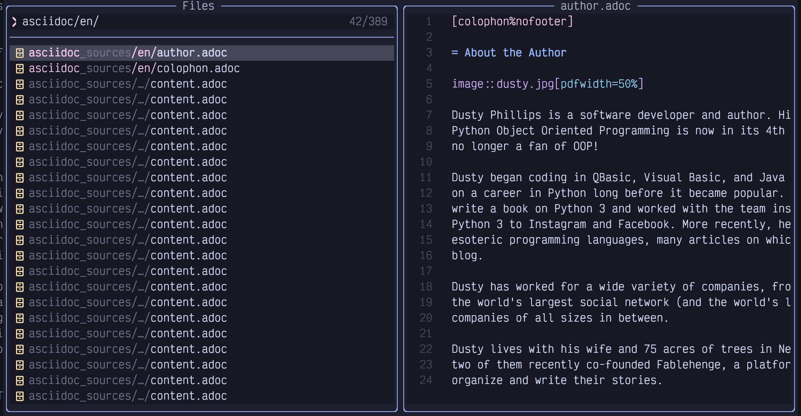
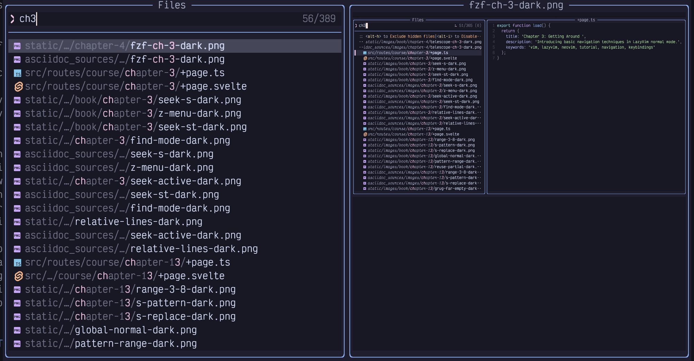
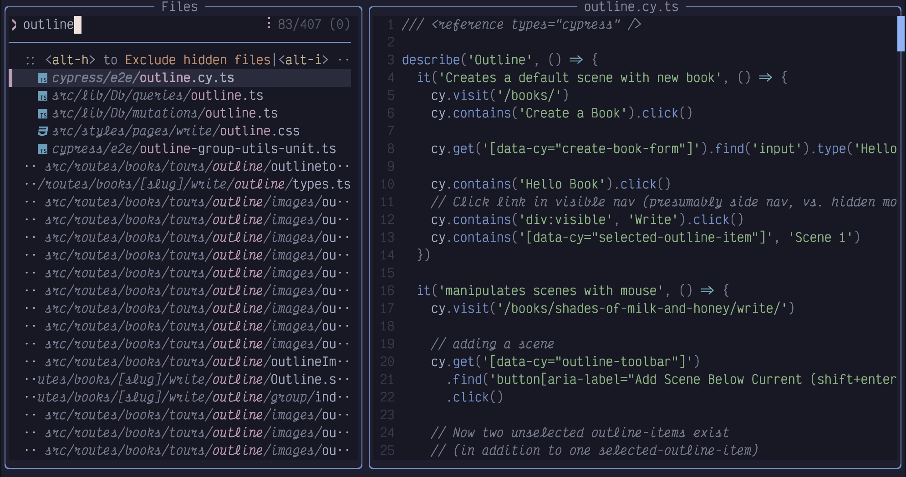
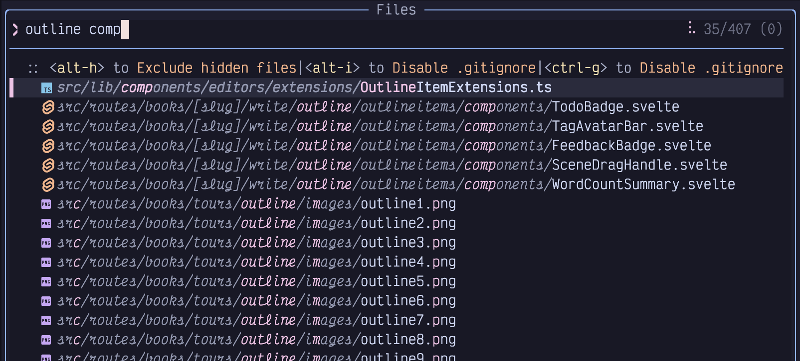
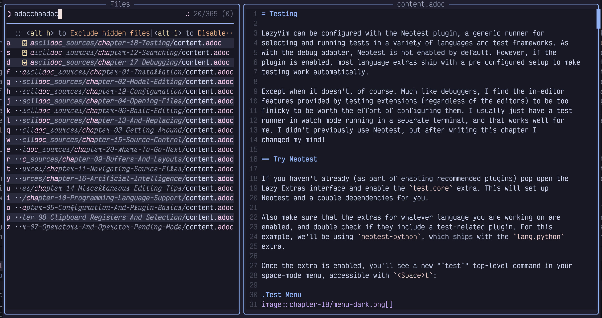
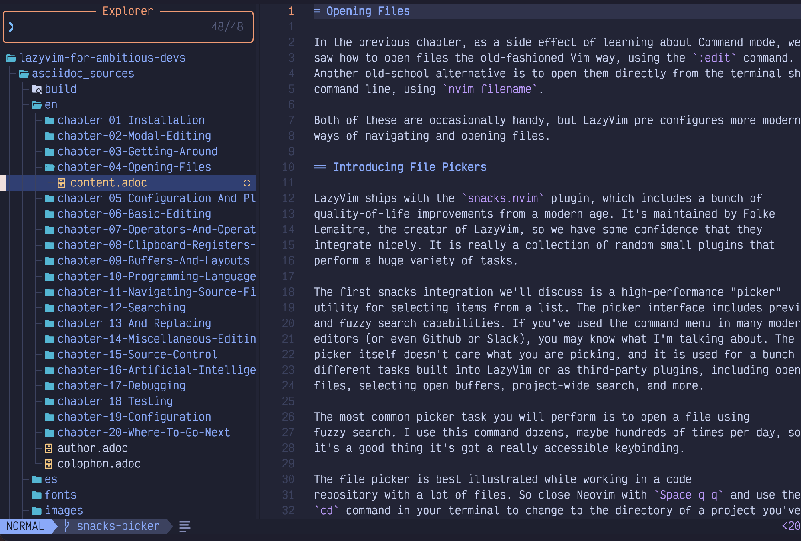
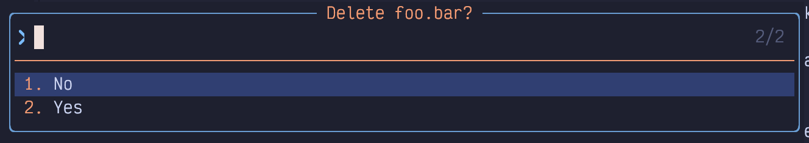
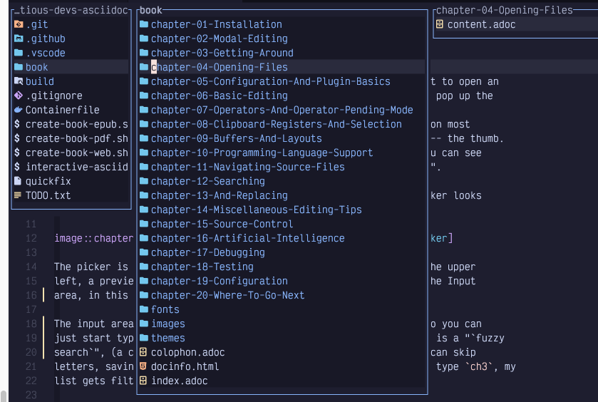

## Chapter 4. Opening Files

Earlier, as a side-effect of learning about Command mode, we saw how to open files the old-fashioned Vim way, using the `:edit` command. Another old-school alternative is to open them directly from the terminal shell command line, using `nvim filename`.

Both of these are occasionally handy, but LazyVim pre-configures more modern ways of navigating and opening files.

### 4.1. Introducing File Pickers

LazyVim ships with the `snacks.nvim` plugin, which includes a bunch of quality-of-life improvements for a modern age. It’s maintained by Folke Lemaitre, the creator of LazyVim, so we have some confidence that they integrate nicely. It is really a collection of random small plugins that perform a huge variety of tasks.

The first snacks integration we’ll discuss is a high-performance "picker" utility for selecting items from a list. The picker interface includes preview and fuzzy search capabilities. If you’ve used the command menu in many modern editors (or even Github or Slack), you may know what I’m talking about. The picker itself doesn’t care what you are picking, and it is used for a bunch of different tasks built into LazyVim or as third-party plugins, including opening files, selecting open buffers, project-wide search, and more.

The most common picker task you will perform is to open a file using fuzzy search. I use this command dozens, maybe hundreds of times per day, so it’s a good thing it’s got a really accessible keybinding.

The file picker is best illustrated while working in a code repository with a lot of files. So close Neovim with `Space q q` and use the `cd` command in your terminal to change to the directory of a project you’ve been working on recently (If you don’t have one close to hand, clone your favourite open source project and use that instead). Then type `nvim` to open Neovim again.

<table>
<tbody>
<tr>
<td class="icon"></td>
<td class="content">I had you exit to the terminal above because it’s easy to reason about, but it is also possible to change directories from inside LazyVim using the <code>:cd</code> command. Type <code>:cd the/path/to/the/directory</code> and hit <code>Enter</code>, remembering that you can use the <code>Tab</code> key to autocomplete the path. Now if you use <code>:e</code> to open files, they will be relative to the directory you specified. If you are using a file picker, they may be relative to that working directory or to the project containing the current file, as discussed shortly. Use <code>:pwd</code> to see what the current directory is.</td>
</tr>
</tbody>
</table>

Ok, so you’re in the root directory of a large project and you want to open an arbitrary file. Simply press `Space` twice (i.e. `Space Space`) to pop up the “Files In Current Project” picker. As I mentioned, this is the easiest keybinding to type on your entire keyboard. The Space bar on most keyboards is big, and you’re hitting it with your strongest digit: the thumb. As usual, just one `Space` will pop up the Space mode menu, and you can see that a second `Space` will present you with “Find Files (Root Dir)”.

For the project containing the current state of this book, the picker looks like this:

Figure 16. Snacks picker

The picker is divided into three main areas: The input area, in this case labelled “Files” in the upper left, the results list in the lower left, and a preview of the currently selected file on the right.

The input area is actively focused and currently in Insert mode, so you can just start typing the name of whatever file you want to open. This is a “fuzzy search”, (a concept popularized by Sublime Text) which means you can skip letters, saving oh-so-precious milliseconds. For example, if I type `ch3`, my list gets filtered down to the following files:

Figure 17. Pick Chapter 3

Only files whose paths contain those three characters in order, with possibly other characters in between, are visible. The picker has helpfully highlighted the three letters in the results so you can easily see why it matched.

Also notice that by default, the match is case **in**sensitive. I typed the lowercase letter `c`, but it matched the uppercase `C` in the filename. This is usually sufficient to narrow the search results to what you need. However, if you *do* use **any** capitalized letters in your search, it switches to a case sensitive mode (this is sometimes referred to as “smart case”).

That means that `Ch` will match all the `Chapters`, but `cH` will not match anything. More interesting, `chF` will *also* not match anything at all because the presence of the capitalized `F` makes the whole thing case sensitive, and the chapters are all named with a capital `C`, so the lowercase `c` is not able to match them.

Sometimes you will start typing a word and realize you need to match something *earlier* in the path to distinguish it. For example, I started typing `outline` in these source files from [Fablehenge](https://www.fablehenge.com):

Figure 18. Outline in Picker

“Outline” is a common word in this app. There are 243 matching files, and I realize I should probably have typed `comp` in front to narrow it to just files in the `component` directory. I *could* switch to Normal mode and edit the beginning of the line, but it’s faster to just type `<space>comp`. The picker will interpret the space as “filter the lines again, fuzzy matching this new word from the beginning”. Here we can see that only `comp…​outline` files have been matched:

Figure 19. Narrow picker to “comp”

This image might be surprising; the most promising match is obviously the selected one at the top of the list. The other 35 matching lines contain all the letters of the word “outline” **and** all the letters of the word “comp” in order from left to right. However, because of the fuzzy matching algorithm, the two can actually overlap! So on e.g. the `outline1.png` entry, the `c` of the matching “comp” is in the `src` part of the path, **before** the word `outline`, the `o` is **in** it, and the `m` and `p` both come **after** the word `outline`. The picker doesn’t care, though it will rank matches with the matching letters closer together as more important, so they’ll be visible at the top of the results.

You can use the up and down arrow keys to select a different file in the search results, and its preview will show up in the right-hand window. Once you find the file you want to open, press the `Enter` key to open it in the currently active Neovim window.

You can even use a sort of Seek mode, as we discussed in Chapter 3, though it works a bit differently in the picker. Press the `Alt-s` keys while in the picker’s input area. You’ll see a label show up beside every line in the picker:

Figure 20. Seek Labels

These characters are labels for each line in the picker. Simply press one of the shown letters on your keyboard, and whichever line the label associated with that letter is on will be selected. Then press `Enter` to actually open the file (or, if it is not a file picker, perform the default action for that picker).

If you want to open multiple files from the picker, instead of pressing `Enter`, press `Tab` to **select** the file. Navigate to other lines and press `Tab` to select them as well. Press `Enter` to confirm your selection. We’ll discuss other things you can do with a group of selected files later.

If you need to scroll the *results* window to see something lower down in the list, use the `Control-d` and `Control-u` keys. If you want to scroll the *preview* window, use `Control-f`, and `Control-b` instead.

Finally, if you are in the picker window and decide you don’t want to open any files after all (or you got the information you needed from looking at the preview), press `Escape` **twice**. Why twice? The first time you press escape will put you into normal mode so you can use all the usual normal mode commands to edit your filter.

### 4.2. The Difference Between “Root” and “Cwd”

The `<Space><Space>` command is mapped to “Find Files (Root Directory)”. Two other ways to open the file picker are to use `<Space>f` to open the “file/find” menu, and follow it with either `f` again or `F`.

`<Space>ff` is the same as `<Space><Space>`. It opens “Find Files (Root Directory)” and is just another longer way to get there. I assume it exists in both places so that users can choose to map some other action to to the super-accessible `<Space><Space>` and still be able to access the picker functionality through `<Space>ff`.

`<Space>fF`, where the second `F` is shifted, is slightly different; it is mapped to an action called “Find Files (cwd)”. If you run it in your project, you’ll *probably* find that it appears to do the exact same thing as “Find Files (Root Directory)” (depending on how your project is set up), so the purpose of two separate keybindings may be confusing.

#### 4.2.1. Current Working Directory

“Cwd” stands for “Current Working Directory”, and by default, it refers to whatever directory your terminal was in when you typed `nvim` to open the editor. You can change the `cwd` for the entire editor by entering Command mode with `:` and then typing `cd path/to/directory` (remember, all commands are followed by a carriage return, so press `Enter` or `Return` afterwards). Now if you use `<Space>fF`, the list of files will be shown relative to the new directory you have changed into.

If you are unsure what directory you are in, you can use the `:pwd` (short for “print working directory”) command to have it pop up in a little notification window. `cd` and `pwd` are the same commands used by `bash`, `zsh`, and many other shells for changing and printing the working directory, so they may already be familiar to you.

We haven’t discussed splitting your editor or opening new tabs yet, but for future reference: It is actually possible to have *different* working directories for different windows. The command to change just the current window’s directory is `:lcd`, short for “local change directory”. This can be a powerful way to work on multiple projects at the same time (for example, if you are a full stack developer working on backend and frontend projects). However, the LazyVim concept of a “Root” directory can semi-automate this.

#### 4.2.2. Root Directory

The root directory is not a Vim concept, but is instead a Language Server Protocol (LSP) concept. LSPs are the reason that VS Code became so popular so quickly; the idea was that the editor could call out to an external service running on your computer to find out useful things about the codebase. The LSP powers a lot of useful stuff such as go to definition and references, highlighting errors in your code, and showing documentation for a variable or class. It can even help with formatting and syntax highlighting.

The root directory is the directory that the LSP infers is the “home” directory of the currently open file. How the LSP does this is language (and language server) dependent. For example, in Javascript or Typescript projects it probably searches parent directories for the presence of a `package.json` or `tsconfig.json` file to detect the root directory. whereas in a Python project it might instead look for things like `pyproject.toml` or `poetry.lock`. and Rust projects use the directory that contains a `Cargo.toml`. Alternatively, some LSPs might just use the presence of a `.git` folder as the “root” of the project’s workspace.

The only reason this root directory is “often the same as your `cwd`” is that this is usually the folder you want to work from when you are working on a project, so it’s the one you `cd` into before you open Neovim.

This automatic root directory thing can be super useful if you are working on multiple projects. Instead of using `lcd` as discussed in the previous section, you can just open a file in a different project using `:e` or one of the file finding extensions we’ll discuss next. Then if you invoke the “Find files (root dir)” command using `<Space><Space>` or `<Space>ff`, it will look for other files in the same root directory as the one you just opened.

However, it can sometimes be confusing, especially if you are working in a monorepo or if you have root directories in places you don’t expect. For example, I have a fairly normal Svelte project that has a `package.json` file in it. This project uses Cypress for testing, and the Cypress folder contains a `tsconfig.json` file that causes the Typescript language server to interpret that as a separate root. So if I am working on one of the cypress test files and press `<Space><Space>`, the root directory is considered the Cypress folder and I can only open other Cypress tests. But often the thing I *wanted* to do was open a source file in the main folder to see why a test is failing. In this case, I have to press `<Escape>` to exit the picker, then `<Space>fF` to open the picker in current working directory mode instead.

<table>
<tbody>
<tr>
<td class="icon"></td>
<td class="content">The snacks picker is inspired by the command line tool fzf which means "fuzzy find". This tool allows you to quickly access files and open directories from your shell, and I highly recommend it to augment your terminal workflow.</td>
</tr>
</tbody>
</table>

### 4.3. The Snacks Explorer Plugin

Snacks.nvim also has an "explorer" a left-sidebar file explorer experience that should be familiar to users of many modern IDEs and editors. While, like many of those environments, the explorer works with the mouse, it is optimized for keyboard interactions, making it faster to work with once you learn “Explorer mode”.

I want to be upfront and honest here: I don’t personally use the Explorer. I find that the file pickers we just discussed are the fastest way to open files, and when I need to manipulate the filesystem, I prefer to use `mini.files`, which we will discuss later in this chapter. The primary reason I prefer `mini.files` is that it uses the same keybindings as Vim Normal mode instead of having a custom "explorer mode" that I have to memorize. Modes are great, but having more of them than necessary is not!

However, I suspect that many readers will prefer the familiar tree view experience the explorer provides, and since this plugin ships with LazyVim by default, I want to make sure this book gives it fair coverage.

Let’s start by opening an explorer using the `<Space>-e` keybinding, where the mnemonic is “**e** for Explore”. If you pop up the Space mode menu, you’ll see that, as with the picker, there are two ways to open the explorer: `<Space>-e` for `Explore Snacks (root directory)` and `<Space>-E` for `Explore Snacks (cwd)`.

“Root directory” and “cwd” have the same meanings we discussed in the previous section, and you will notice the consistent relationship between lowercase and uppercase letters: `<Space>ff` and `<Space>e` both open the root directory, and `<Space>fF` and `<Space>E` both open the current working directory.

<table>
<tbody>
<tr>
<td class="icon"></td>
<td class="content">To hide the explorer window, just press <code>&lt;Space&gt;e</code> again while it is visible, or press <code>q</code> or <code>Escape</code> while it is focused.</td>
</tr>
</tbody>
</table>

When the explorer is opened, it shows all the files and folders in the relevant directory, with all the folders collapsed, except for the one containing the currently active file, if there is one. For example, while editing this file, my explorer looks as follows:

Figure 21. Explorer

The cursor is on the file I’m currently editing. I can move that cursor up and down using the ubiquitous `j` and `k` keys.

Folders are collected to the top of the view. If you move the cursor to one of these folders, you can press the `Enter` key to see the files inside the folder. And if you move it to a file, you can open the file in the current Vim window with `Enter` as well.

You can also select multiple files to manipulate using `Tab`, similar to the picker window (In fact, the explorer is just a fancy picker window in disguise).

Of course, you could expand and collapse folders and open files by double clicking with the mouse, but my guess is you won’t want to do that once you learn proper keyboard navigation.

Speaking of keyboard navigation, yes, `j` and `k` to move up and down can be super slow if there are a lot of files to navigate. All of the commands that we discussed in Chapter 3 can be used to move faster. For example, `10j` will move the cursor 10 lines down with just three keystrokes compared to pressing `j` 10 times, and `Control-d` or `Control-u` can be used to scroll the tree down or up.

Use `i` to enter Insert mode while the explorer is focused to search for a specific file. Since this is a picker under the hood,`Alt-s` can be used to Seek to any line in the picker view. You can also use the normal mode `s` command to seek to text in any window, including the explorer.

The explorer will show either the root or cwd as the topmost directory. If you need to navigate “up” the tree to a higher-level directory, use the `Backspace` key.

<table>
<tbody>
<tr>
<td class="icon"></td>
<td class="content">Backspace is often coded as <code>&lt;BS&gt;</code> in Vim, so if you see a keybinding or instructions telling you that <code>&lt;BS&gt;</code> does something, they aren’t full of (bull)! It just means Backspace.</td>
</tr>
</tbody>
</table>

In addition to navigating and opening files, you can even make changes to the file system using the explorer. For example, to delete a file, you can move the cursor over that file and hit the `d` key. You’ll be prompted with a popup window asking if you are sure. Hit `y` and then `Enter` to confirm it:

Figure 22. Delete Confirmation in Explorer

To add a file or folder/directory, use the `a` key and enter a new name. Use a trailing slash (`/`) to indicate a folder.

The `r` key can be used to rename the file or folder under the cursor.

To copy or move a file, you can use the explorer’s pseudo-clipboard. I say “pseudo-” because you can’t use this to copy a file to be pasted in e.g. MacOS Finder or Windows Explorer; only to other places in the explorer.

If you want to *copy* the file, use `y`. The mnemonic for `y` is `yank`, and is actually the same key you would use to copy text in the normal editor. To complete the copy, you’ll need to navigate to the destination folder and use the `p` key (which you may recall means “put” or “paste”).

Use the `m` keybinding to move a file to a new location or name.

There is a *ton* of other cool stuff that the explorer can do. Use the `?` (mnemonic “ask question for help”) key while the explorer window is focused to get an overview.

### 4.4. The Mini.files Alternative

As I mentioned, I don’t actually use the explorer for file navigation. I find that it feels kind of “foreign and un-vim-like”. To me, it is a completely separate experience that just happens to be embedded in a Neovim window. That said, I *also* don’t like the tree view sidebar experience in VS Code and the editors it emulates / is emulated by, so it’s possible that tree views just aren’t right for me.

These are just **my** opinions, and one of the golden rules of text editors is “all opinions are valid” (otherwise there would be war). A large number of Neovim users love the explorer, and you should use it if it matches your mental model.

That said, I’m clearly not alone in these opinions, because LazyVim optionally provides a different file management experience with a plugin called mini.files. It is disabled by default.

<table>
<tbody>
<tr>
<td class="icon"></td>
<td class="content">Mini.files is part of a suite of fairly random Neovim packages known as mini.nvim. These plugins are independent from each other and provide a lot of common features that in many cases ought to ship with Neovim. Occasionally, the mini.nvim plugins are inferior to other plugins that they clone, but many are best in class. Mini.files is not the only mini.nvim plugin that ships with LazyVim, and we’ll touch on others later.</td>
</tr>
</tbody>
</table>

The mini.files file manager is kind of like a Neovim-native experience of the columnar view that is popular in MacOs finder, among other file managers. The main reason I like it is that editing the directory listing is just like editing a normal text buffer. I don’t have to remember that `a` means “after” in Normal mode, but it means “add file/folder” in Explorer mode. Instead, in mini.files, I use the `o` key to “create a new line below the current line”, and then enter a new file name in Neovim Insert mode. Later, I tell mini.files to sync my changes and it will create the file for the new row.

In order to use mini.files, you have to enable it as a Lazy Extra. We’ll go into this in more detail in the next chapter, but for now, these steps should be sufficient:

- Type `:LazyExtras<Enter>`

- Move your cursor to the line that contains mini.files (Seek mode is fastest)

- Press `x` to install the e**X**tra

- Wait a moment for the plugins to install

- Restart Neovim

#### 4.4.1. Using Mini.files

Once installed, you can show the mini.files view using `<Space>fm` and `<Space>fM`. By default, these are *not* quite the same as the `cwd/root` structure we’ve seen in the picker and explorer. Instead, they are listed in the `<Space>f` menu as follows:

Listing 11. Mini.files keybindings

    m -> Open mini.files (Directory of Current File)
    M -> Open mini.files (cwd)

The default mini.files configuration doesn’t have an open in root option. I like having the ability to open the directory of the currently open file, but I don’t like *losing* the ability to open the root of the current project. I show how to address this when we discuss customizing plugins in Chapter 5.

Instead of a sidebar, the mini.files menu shows up as columns of windows (known as Miller columns) side-by-side. For example, here’s what happens when I open mini.files to the current working directory of this book:

Figure 23. Mini.files

The left-hand panel shows the current working directory, and the middle column shows the contents of the `book` directory, where my cursor is currently on chapter 4. The right column shows the preview of that chapter 4 directory, which contains only one file.

Interacting with mini.files is *very* similar to interacting with a standard vim window. You can use the `j` and `k` keys to move the cursor up and down. If this places your cursor over a folder, the contents of that folder will immediately show up to the right, and if it is over a file, you will see a preview of the file.

If you want to move “into” a folder to interact with the contents of that folder instead, simply press the `l` key to move “right”.

Similarly, pressing `h` will move “out” of the current folder. If the cursor is in the left-most column, moving left will open a new left-most column, so you can navigate right up to the root of your file-system if you need to.

To open a file in the currently active Neovim window, press `l` on that file again. The behaviour here may be a bit surprising; the file will open *under* the mini.files view, but it won’t hide the file menu. This allows you to open multiple files before closing the navigator, which can be done with the `q` key.

The beautiful thing about mini.files compared to the explorer is that the little windows act like normal editors, and all the navigation features you have become used to are available. For example creating a file or folder is done with the `o` command, which is the same command to open a new line in a normal editor.

We haven’t really covered editing yet (I’m just as surprised as you are), but here’s a quick overview:

- To rename a file or folder, navigate to the line that has it, and enter Insert mode to change or add text.

- Deleting a file or folder uses the command `dd` which is the keybinding to delete an entire line of text in normal Neovim windows.

- Copy a file or folder with `yy`, the command to copy (“**y**ank”) a line of text.

- Put/paste a deleted or yanked file with `p`.

We’ll discuss these commands and more in Chapter 6. The main point is that pretty much any navigation or editing command you learn in the future will work with mini.files.

##### Saving Filesystem Changes

Any modification that you make using these keybindings will not actually be saved on the filesystem until you type the `=` key, which is a (rare) mini.files specific keybinding. I think of it as meaning “make the filesystem **equal** to what I’ve typed”. This will pop up a little window telling you what actions mini.files wants to take on your behalf, such as deleting, moving, renaming, or copying files. You can confirm or decline the changes with a `y` or `n` (**y**es or **n**o, of course).

I encourage you to play with both the Snacks explorer and mini.files until you can make a decision as to which of the two you prefer. Eventually, you will arrive at one of the following conclusions:

- You prefer the explorer and don’t need mini.files. In this case, revisit the LazyExtras mode and disable mini.files with the `x` key.

- You use explorer for some interactions (possibly things we haven’t covered yet, such as navigating git, buffers, or symbols) and mini.files for others. In this case, you are probably content with the default LazyVim configuration of the mini.files extra.

- You are *my kind of weird* and don’t want to use the explorer at all, preferring only mini.files. Disabling plugins is discussed in the next chapter.

### 4.5. Summary

In this chapter, we learned not one, but three different ways to open files and interact with the filesystem in LazyVim: the Snacks picker, explorer, and mini.files. Each provides a different mechanism for opening and managing files, and you will find some of them more comfortable than others.

As a side-effect of studying these filesystem tools, we got a tiny preview of configuring plugins and installing LazyVim extras. We will go into more detail on this in the next chapter.
