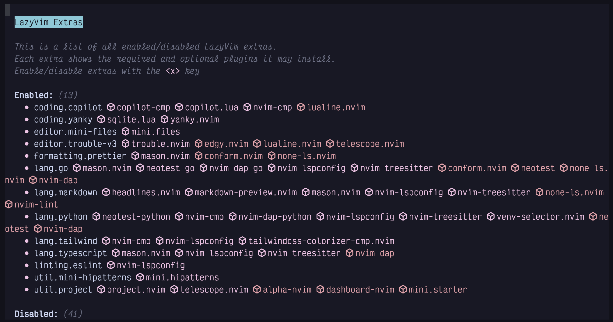

## Chapter 5. Configuration and Plugin Basics

I’ve talked about plugins several times and you even got to see the Lazy.nvim plugin manager in action back in Chapter 1. LazyVim has a unique multi-layered approach to managing plugins that requires a bit of description, but is quite elegant in practice.

Installing plugins allows you to configure Neovim to do things it can’t do by default. Plugins are typically written in either Lua or VimScript, though other languages are supported with Neovim’s remote plugin architecture.

### 5.1. The Three Categories of Plugins in LazyVim

The simplest plugins to use in LazyVim are pre-installed by LazyVim itself. You’ve used many of them already. Some, such as Snacks.nvim’s picker and explorer windows, and Lazy.nvim provide custom UI components to interact with them. Others, such as flash.nvim and which-key provide new commands or modes to work with. Still others operate quietly in the background auto-matching parentheses or tags and drawing indent guides.

These plugins are preconfigured in LazyVim with (generally) sane defaults. Because they are deeply integrated, customizing those defaults is doable, but sometimes requires a few tricks that we will cover in this and later chapters.

The second category of plugin in LazyVim are the “Lazy Extras”. These plugins are **not** enabled by default, but can be enabled with just a couple of keystrokes if you want them. Lazy Extras exist to make it easy to install popular plugins with a configuration that is expected to play nicely with the other plugins that ship with LazyVim.

The third category includes third-party plugins that LazyVim has no awareness of. You will have to configure these plugins from scratch and do your own due diligence to ensure that keybindings and visual artifacts don’t conflict with the plugins that LazyVim manages. In a non-LazyVim configuration, all plugins fall in this category, and it can be a headache to maintain as plugins evolve and fall out of use over time. In LazyVim, this category includes relatively few plugins, so the whole experience is much more pleasant.

As some specific examples consider these three Neovim plugins for file management, two of which we discussed in the previous chapter:

Snacks explorer  
ships with LazyVim and is active by default. The LazyVim configuration for the Explorer does not conflict with other LazyVim plugins by default. However, if you want to tweak that configuration, there may be some hoops to jump through.

Mini.files  
ships as a Lazy Extra, and is basically a “one click” (or, since this is Vim we’re talking about, one keypress!) install that is expected to cooperate well with LazyVim.

Oil.nvim  
is an alternative plugin for filesystem management that LazyVim does not explicitly support. You can install it in LazyVim with a few lines of configuration, but it’s not quite as easy to set up as an extra and there is no guarantee it won’t have command or keybinding conflicts you need to sort out yourself.

From the underlying Neovim client’s point of view, all these plugins are exactly the same, as Neovim only knows about third-party plugins. LazyVim just comes with a bit of extra structure that you need to think about when using plugins. Usually this structure simplifies things, but occasionally it adds extra hassle.

### 5.2. Lazy Extras

In the previous chapter, I covered how to enable and use `mini.files`, but I was pretty terse on the installation instructions. Now we’ll get to dive deep.

The Lazy Extras mode can be accessed by pressing `x` from the dashboard. If you aren’t on the dashboard, you’ll need to enter Command mode with `:` and type `LazyExtras` followed by the usual `Enter` to confirm a command (Incidentally, you can also show the dashboard at any time by typing the command `:lua Snacks.dashboard()` or binding that to a keypress).

Either way, you’ll be presented with a list of possible plugins to install. On my setup this looks as follows:

Figure 24. Lazy Extras

I’ve installed over a dozen extras at the moment, mostly for the various programming languages I dabble in. You can navigate this file using all the standard navigation commands such as `j`, `k`, or `s`.

No matter how you get there, once your cursor is on the extra you want to install (such as `editor.mini-files`) line, just hit the `x` key to install the extra. If you want to uninstall it, do the same thing; move to the appropriate line (now under the list of `Enabled` extras), and hit `x` to disable the extra. The mnemonic here is that `x` means “E**x**tra”.

You may need to quit and restart Neovim for Lazy.nvim to pick up that the extra has been installed and sync its dependencies.

While we’re in the `LazyExtras` screen, I recommend enabling the `lang.*` extras for whichever programming languages you use most frequently. You should also install all the plugins in the “Recommended plugins” section (they have star icons beside them).

I wouldn’t install any other non-recommended extras until you’ve either encountered them later in this book or had a chance to research them after you finish the book. Otherwise, they may change behaviours in ways that I won’t have the foresight to write about.

You can find more information on each extra by visiting https://lazyvim.org and clicking the “Extras” menu item on the left menu bar. It includes links to the list of plugins each extra installs as well as the configuration LazyVim brings for that extra.

### 5.3. Disabling a Built-in Plugin

Sooner or later, you’re going to want to edit your LazyVim configuration. The out-of-the-box defaults are wonderful, but the odds are that they don’t 100% exactly match your personal needs.

While the vast majority of LazyVim’s default plugins are no-brainers that you want to keep, you may find there are one or two plugins that you just don’t need. In most cases, it doesn’t matter, since LazyVim only loads plugins when you actually use them, so you can just ignore the ones that aren’t relevant to you.

The only LazyVim plugin I have disabled is the bufferline. I’ll show how to do that and you can adapt it to any other built-in plugins you want to disable.

First I want to give an introduction to the LazyVim configuration directory. You can open the config directory from the dashboard by simply pressing the `c` key. Or you can use Space mode to access the configuration files at any time using `<Space>fc` for “Find Config File”.

This will load the LazyVim config folder in your file picker. This folder is typically `$HOME/.config/nvim`. Neovim loads `$HOME/.config/nvim/init.lua` by default, and if you weren’t using LazyVim, this is where you would do all your configuration.

With LazyVim, `init.lua` just uses the Lua `require` statement to include the LazyVim configuration infrastructure. **You will normally not have to touch this file**, even though most third party plugins have installation files that presume your configuration is in it. Instead follow the “LazyVim way” as outlined in this chapter.

In addition to a barebones `init.lua`, LazyVim has put a few configuration files and a bit of folder structure in the configuration directory.

For now, the main thing we need to know is that *any* Lua files inside the `lua/plugins` subdirectory will automatically be loaded by LazyVim, no matter what their name is. I have a number of different files in this folder for my custom configurations.

I call the one that holds my disabled plugins `disabled.lua`. The easiest way to create this file is to open one of the existing config files and use either the explorer or mini.files to create a new file in the same folder, as described in Chapter 4.

When I created my `disabled.lua` file in the `lua/plugins` directory, my intention was to collect all the LazyVim plugins I don’t want in it because I assumed LazyVim wouldn’t perfectly match my needs. In reality, it’s a fairly short list. To disable a plugin simply set `enabled = false`:

Listing 12. Disabling LazyVim Plugins

    return {
      { "akinsho/bufferline.nvim", enabled = false },
    }

If there are any other plugins that LazyVim enables by default that you don’t want to use, just follow the same syntax. The first argument in each Lua table is a string containing the github repo (with owner) you want to disable. The second argument is to set `enabled = false`. That’s it!

|||
| -- | -- | 
|  | You will inevitably forget the `return` statement at the beginning of a plugins file at some point. Now you know to watch out for it. |

If you don’t know the Lua language…​ honestly, don’t worry about it. I’ve never formally studied it, but I’ve picked up enough by osmosis to easily maintain my Neovim configuration.

If you’re less foolish than me, you might want to type `:help lua` and read the official Neovim docs on the topic. Then check out `:help lua-guide-api` to learn about the vim-specific APIs.

If you want to disable the Snacks Explorer like I have, it’s a little bit more involved. The Snacks plugin has a bunch of disparate features so I don’t want to disable the whole plugin. Instead, I’m disabling a single feature using Snacks-specific configuration:

Listing 13. Disabling Snacks featres

    return {
      { "akinsho/bufferline.nvim", enabled = false },
      {
        "folke/snacks.nvim",
        keys = {
          { "<leader>e", false },
          { "<leader>E", false },
        },
        opts = {
          explorer = {
            enabled = false,
          },
        },
      },
    }

The main point here is that I’ve disabled the `explorer` feature in opts. I also had to unset two keybindings by setting them to `false` so I can reuse them in the next section. You don’t need to do this if you like the Snacks Explorer view, but with Snacks providing such a large number of features for LazyVim, I wanted to make sure you knew how to turn any one of them off.

### 5.4. Modifying Keybindings (Example)

Keybindings are one of the few things I don’t love about working with LazyVim, although it’s not strictly LazyVim’s fault. I just never quite know **where** to define them!

There are three possible places to configure keybindings, depending on how any one plugin is configured:

- In `.config/nvim/lua/config/keymaps.lua`. This is typically where you configure or modify keybindings that are not specific to plugins, but rather modify core Neovim or LazyVim functionality.

- In the `keys` field of the Lua table (in Lua, a “table” is like a combination of an array and a record or dict in many other dynamic languages) passed to a plugin. This is typically where you map global Normal mode keybindings to set up a plugin. This is what we will do with mini.files.

- In the `opts` (options) argument passed into a plugin’s configuration. The format of the options for any one plugin are plugin-specific, but many plugins prefer to set up keymaps on your behalf through options instead of having you do the mapping yourself. This is especially true if the keymaps define a different “mode” or only apply if the plugin is currently open or active. I’ll give an example of this with mini.files as well.

To demonstrate, I want to “fix” the fact that mini files doesn’t have a “open in root” option. I like the “open in directory of current file” option, but I also want to be able to open in the root directory.

|||
| -- | -- | 
|  | Remember that the root directory is the top level directory of the current project according to the existence of some language-specific file such as `package.json` or `Cargo.toml`. The `cwd` is the current working directory of the editor. |

Since I don’t use the explorer, I’m going to steal the `<Space>e` and `<Space>E` keybindings and use them for mini.files instead, then I’ll remap the existing `<Space>fm` keybinding to open the root so I can access all three commands. You can, of course, choose different keybindings if they map better to your mental model or you want to keep the explorer for some things.

I used mini.files to create a new file named `extend-mini-files.lua` in my `.config/nvim/lua/plugins/` directory. As with the `disabled.lua` file, this file can be named anything so long as it’s in the `plugins` directory.

I have a habit of prefixing any configuration that I am using to change the defaults provided by LazyVim with the word `extend`. This makes it easy to distinguish it from non-LazyVim plugins I’ve installed when I’m listing the directory using mini.files or a picker.

Inside this new file, I used this code:

Listing 14. Mini.files Custom Keymaps

    return {
      "nvim-mini/mini.files",
      keys = {
        {
          "<leader>e",
          function()
            require("mini.files").open(vim.api.nvim_buf_get_name(0), true)
          end,
          desc = "Open mini.files (directory of current file)",
        },
        {
          "<leader>E",
          function()
            require("mini.files").open(vim.uv.cwd(), true)
          end,
          desc = "Open mini.files (cwd)",
        },
        {
          "<leader>fm",
          function()
            require("mini.files").open(LazyVim.root(), true)
          end,
          desc = "Open mini.files (root)",
        },
      },
    }

I constructed this by borrowing relevant function calls from the default configuration for the Snacks.nvim configuration conveniently provided on the LazyVim website.

To satisfy the contract with Lazy.nvim, we need to return a Lua table, wrapped in curly braces. Lua tables can act like an array and a dictionary at the same time. In this case, the first element in the table is the string `"nvim-mini/mini.files"`. It doesn’t have a named key, so it’s kind of like a “positional argument”.

The second element in the table is more like a “named argument” in that it is indexed with the name `keys`, and the value is another Lua table. However, that second table acts more like an “array” of three values (three more separate Lua tables) because it doesn’t have named indices.

It is important to understand that the `keys` field is **merged** with the keys that are provided by the default LazyVim (extras) configuration for mini.files. If there are conflicts (such as with `<space>fm`), my values take precedence over the defaults.

This is a powerful feature of LazyVim that allows you to use hosted configuration provided by LazyVim but override it as needed. Older Neovim distros tended not to have this much flexibility, so you were either stuck with their configuration or had to copy the whole thing and edit it, which made updates a nightmare.

To be clear, `keys` is a LazyVim concept (technically, it’s actually part of the underlying Lazy.nvim plugin manager). Any plugin configuration can have a `keys` array table, and those keybindings will be merged with the default Neovim keybindings, the LazyVim keybindings, your custom global keybindings, AND any other plugin keybindings.

Yes, that’s a lot of potential for conflicts, which is why I’m so glad LazyVim has done most of the configuration for me!

#### 5.4.1. Structure of a Keys Entry

Each item in the `keys` table is another Lua table with (in this case) three fields. The first two fields are positional and represent the keybinding name and the Lua callback function that gets called whenever that keybinding is invoked. The third field is a named field, `desc` and provides a string description that will be shown in the Space mode menu.

The keybinding sequence in the first entry is using a standard syntax that comes from Vim. Note that `<leader>` is an old Vim concept that allows you to configure which key is used as the prefix for custom keybindings. In LazyVim (and indeed, for most modern Neovim users), the leader is `<Space>`. Special keys are indicated to Vim’s keybinding engine using angle brackets, so you will often see notations such as `<Space>`, `<Right>`, `<Left>` or `<BS>`.

After the `<leader>` string, we include any additional keys that need to be pressed. For the simple ones, we have `e` and `E` to replace the explorer keybindings we disabled with new mini.files keybindings. The third one is a bit more complicated, as the `f` indicates that this action will be available under the `file/find` submenu in Space mode, and the `m` indicates which letter will be in this menu.

For the callbacks, we use Lua functions, which always start with `function` and end with `end`. These are anonymous (unnamed) functions, and they don’t accept any parameters inside the parentheses. In the function bodies, we call specific code to *open* mini.files the way we want. In two cases I just copied this code from LazyVim’s default mini.files configuration, and in the third, I cobbled it together by combining code from the Snacks.nvim and mini.files configurations. The `LazyVim` global is a handy library with a collection of utility functions to aid with configuration. The `LazyVim.root` function is used to find the root of a project and returns a string that we pass to `mini.files.open`.

#### 5.4.2. Customizing Mini.files Options

As I mentioned, the `keys` table is merged with the default `keys` table that LazyVim has configured for mini.files. Similarly, most Neovim plugins can be configured with an `opts` table that contains custom configuration specific to that plugin. If you supply an opts `table`, it will be *merged* with the default LazyVim one (if there is one).

You’ll need to read each plugin’s documentation (often available on Github, and usually available with `:help plugin-name`) to know exactly what options are available for it. You’ll also need to review the default configuration that LazyVim sets up for that plugin so you understand how it will merge.

In my case, I pass the following `opts` array to mini.files:

Listing 15. Mini.files Custom Opts

    return {
      "nvim-mini/mini.files",
      keys = {
        -- the keybindings from above
      },
      opts = {
        mappings = {
          go_in = "<Right>",
          go_out = "<Left>",
        },
        windows = {
          width_nofocus = 20,
          width_focus = 50,
          width_preview = 100,
        },
        options = {
          use_as_default_explorer = true,
        },
      },
    }

The mappings table in mini.files is used to override the default keymappings that are active *while* the mini.files view is open. This is different from the *global* keymaps we defined earlier to open mini.files. In my case, I have mapped `go_in` and `go_out` to use the arrow keys instead of `h` and `l` because it makes slightly more sense for my keyboard layout. I don’t recommend you make this change; `h` and `l` will work better for most anybody who isn’t me.

The window options are there because I have a 32-inch 6k monitor, which means I can afford to have larger-than-normal explorer columns. Refer to `:help mini.files` for more information on these and other options.

So now you know a little bit about configuring plugins in LazyVim. It is both a little bit easier and a little bit harder than configuring plugins from scratch:

- It is easier because you only need to change the values that are non-default in LazyVim, instead of setting up an entire configuration, and LazyVim comes with sane defaults.

- But it is harder because you sometimes have to think about how the option and keybinding merging happens, which wouldn’t be necessary if you just had one great big configuration object to begin with. This merging can get quite tricky for plugins that have complicated default LazyVim configurations. We’ll see some examples later.

### 5.5. Modifying Existing Options

Sometimes the “merging” behaviour LazyVim uses to overwrite options with the ones you provide in your plugin overrides is too simplistic. This most often happens when you are modifying a plugin that calls or defines a function for options behaviour instead of customizing it.

To support this situation, the `opts` entry in a Lazy.nvim plugin’s configuration table can be a function instead of a static table. The function accepts the previous `opts` table as it was configured by LazyVim as an argument. Your function needs to *modify* this table to suit your desired behaviour.

|||
| -- | -- | 
|  | The function based version of `opts` **does not** return a new `opts` table; it needs to **modify** the one that was passed in. |

For example, the default configuration for the LazyVim dashboard, which is configured as part of the `snacks.nvim` suite of plugins is a table that contains several entries in the keys array. The dashboard already allows you to restore the most recent session using the `s` key, but if you want to select from a *list* of recent sessions, you have to use the `<Space>qs` keybinding. (Sessions are discussed further in Chapter 9).

Let’s say you want to add a "select session" entry to the Dashboard. You can use the following structure to **modify** the existing keys array, as configured by LazyVim and add a new entry:

Listing 16. `snacks dashboard` Options Function

    return {
      "snacks.nvim",
      opts = function(_, opts)
        table.insert(
          opts.dashboard.preset.keys,
          7,
          { icon = "S", key = "S", desc = "Select Session", action = require("persistence").select }
        )
      end,
    }

|||
| -- | -- | 
|  | You may want to replace the icon with something from the nerd fonts suite. |

This `opts` function accepts the LazyVim-defined `opts` table as its second parameter. My code *changes* those `opts` using the `table.insert` function provided by Neovim. I add a new entry that is positioned at index 7 in the list, just after the related `Restore Session` entry, which autoloads your most recent session.

This is harder to maintain than if I just had the whole configuration the way I wanted it in the first place, but easier to maintain than if I had to write that entire configuration from scratch. I am willing to accept that tradeoff for all the places that LazyVim configures things better than I would have done on my own.

### 5.6. Installing Third-Party Plugins

Installing a third-party plugin is little different from configuring a LazyVim provided plugin, except that you don’t have to worry about how the keys and opts are merged with a default config. Instead you have to worry if they conflict with all the other plugins installed in your editor.

Simply create a new Lua file in the `plugins` directory (named appropriately for the plugin). Inside the file, return a Lua table where the first entry is the GitHub repo and name of the plugin, with other configuration (`opts` and `keys`, among others) after that name.

For example, I like the guess-indent.nvim plugin to set my shift width based on the contents of the file I am currently editing. It is maintained by the github user `nmac427`, so my `plugins/guess-indent.lua` file looks like this:

Listing 17. Guess-indent.nvim Third Party Plugin

    return {
      "nmac427/guess-indent.nvim",
      opts = {
        auto_cmd = true,
        override_editorconfig = true
      },
    }

The `opts` table depends entirely on what the plugin expects. In this case, I read the guess-indent.nvim README and found two options that I wanted to set.

Most modern Lua plugins will be documented as having to call a `setup` function with a Lua table containing the configuration. If the plugin you are trying to set up does not have explicit Lazy.nvim instructions, don’t worry: Whatever the plugin documents as being passed into that `setup` function is what you need to include in the `opts` passed to the LazyVim plugin manager.

Often, you don’t need to specify any opts, if the defaults are acceptable. For example, another third-party plugin I recommend is `chrisgrieser/nvim-spider`, which subtly changes the `w`, `e`, and `b` commands to support navigating within CamelCase and snake\_case words. I have a file named `nvim-spider.lua` in my `plugins` directory as follows:

Listing 18. `nvim-spider` Third Party Plugin

    return {
      "chrisgrieser/nvim-spider",
      opts = {},
      keys = {
        {
          "w",
          "<cmd>lua require('spider').motion('w')<CR>",
          mode = { "n", "o", "x" },
          desc = "Move to start of next of word",
        },
        {
          "e",
          "<cmd>lua require('spider').motion('e')<CR>",
          mode = { "n", "o", "x" },
          desc = "Move to end of word",
        },
        {
          "b",
          "<cmd>lua require('spider').motion('b')<CR>",
          mode = { "n", "o", "x" },
          desc = "Move to start of previous word",
        },
      },
    }

This plugin doesn’t automatically set up keybindings, so I pass a `keys =` table to the plugin configuration. This array is **not** passed to the plugin. Rather, the keys are parsed by the Lazy.nvim plugin manager and added to the global keybindings. It is convenient to keep the keys with the plugin so all the configuration is in one place.

I am satisfied with the default options that `nvim-spider` passes to its `setup` function (after reading the README), so I pass an empty `opts` array.

The best resource for finding third-party plugins is the github repository [rockerBOO/awesome-neovim](https://github.com/rockerBOO/awesome-neovim). The list is well-maintained and (most importantly) pruned regularly, so there are few outdated or unmaintained plugins on the list.

In practice, LazyVim already ships with the best-in-class versions of most plugins (built-in or as extras), so you won’t have to add too many. But if you come across any “I wish LazyVim could…​” scenarios, the answer is probably “it does and the plugin to do it is listed in the Awesome Neovim repo”.

### 5.7. Summary

In this chapter, we learned about how LazyVim integrates with the wider Neovim plugin ecosystem. It provides sane default plugins and configuration, but makes it easy to customize that configuration for your own needs.

We learned that built-in, extras, and unknown third party plugins are all treated slightly differently (though consistently), and saw examples of how to install some third-party plugins.

Now that you know how to open files and configure plugins, we can get back to some of the nuts and bolts of modal editing. You already know how to switch between Normal and Insert mode and you can navigate around your code. In the next chapter, we’ll cover some basic editing features that blur the line between navigating and inserting text.
