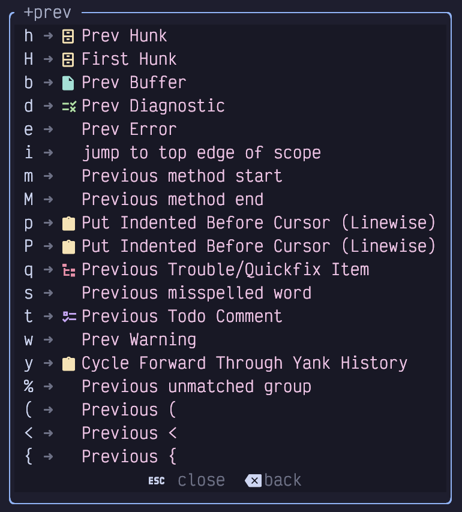
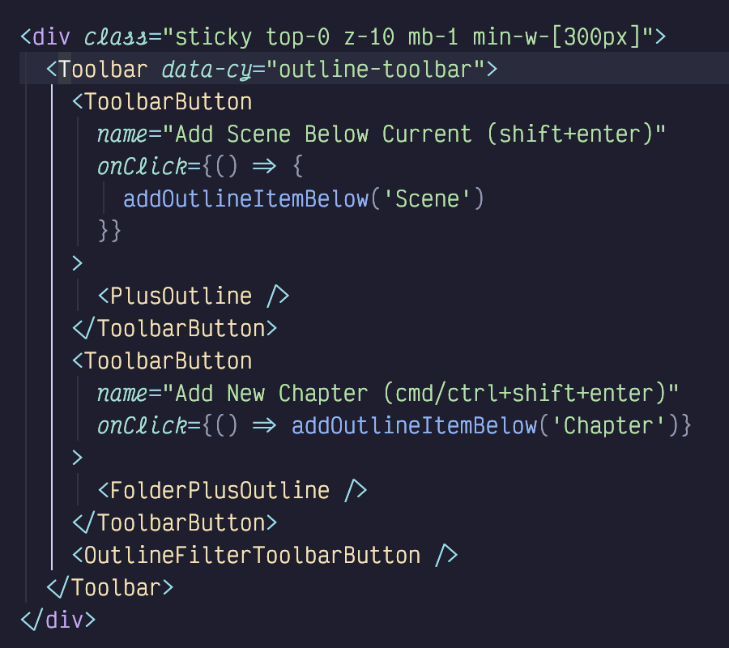
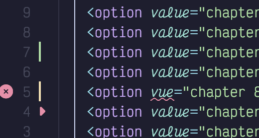
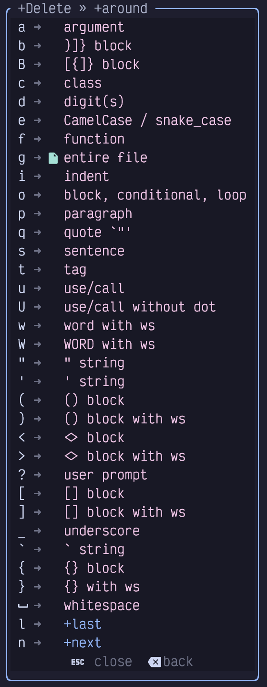
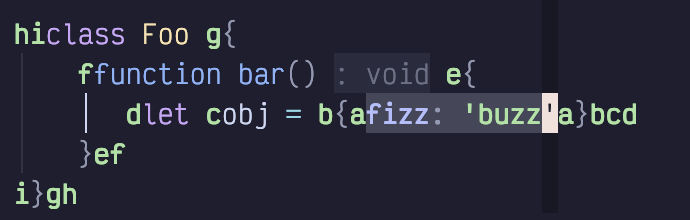
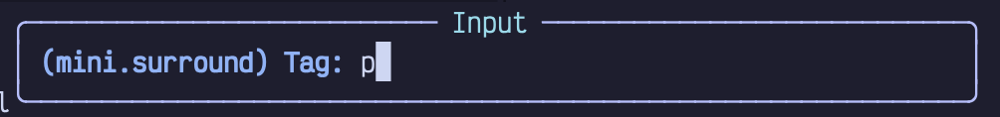
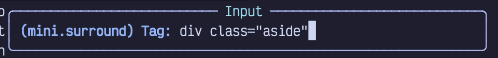

## <a href="#_objects_and_operator_pending_mode" class="link">Chapter 7. Objects and Operator-Pending Mode</a>

The navigation and motion commands we’ve learned so far are invaluable, but Neovim also comes with several more advanced motions that can supercharge your editing workflow. LazyVim further amends this collection of motions with other powerful navigation capabilities powered by a variety of plugins.

For example, if you are editing text rather than source code, you will find it useful to be able to navigate by sentences and paragraphs. A sentence is defined in Vim as anything that ends with a `.`, `?`, or `!` followed by whitespace.

The sentence keybindings are two of the hardest for me to remember. I use them rarely enough that it hasn’t become muscle memory, and it doesn’t have a good mnemonic I can remember.

Have I built enough suspense? Pay attention, because you will forget this. To move one sentence forward (to the first letter after the whitespace following sentence ending punctuation), type a `)` (right parenthesis) command in normal mode. To move to the start of the current sentence, use `(`. Press the parenthesis again to move to the next or previous sentence or a add count if you want to move by multiple sentences.

I hate that the command is `(` since that feels like it should be moving to, you know, a parenthesis! But it’s not; it’s moving by sentences. Since the `.`, `!`, and `?` characters rarely mean “sentence” in normal software development, I just don’t use it that much until I start writing a book (something I keep telling myself I won’t commit to again, but it never lasts).

<table>
<tbody>
<tr>
<td class="icon"></td>
<td class="content">In addition to stopping after punctuation followed by whitespace, navigating by sentences also stops on "paragraph boundaries", which is to say "blank lines". If you are using sentences with counts, this can throw your navigation off because you need to add an extra step for each paragraph, as well as the punctuation that normally defines a sentence.</td>
</tr>
</tbody>
</table>

I do use the paragraph motions all the time, though. A paragraph is defined as all the content between two empty lines, and that is a concept that makes sense in a programming context. Most developers structure their code with logically connected statements separated by blanks. The commands to move up or down by one “paragraph” are the curly braces, `{` and `}`. If you need to jump multiple paragraphs ahead or back, they can, as usual, be prefixed by a count.

Again, you might expect `{` to jump to a curly bracket, so it is a bit annoying that it means “empty line” instead, but once you get used to it, you’ll probably reach for it a lot.

### <a href="#_unimpaired_mode" class="link">7.1. Unimpaired Mode</a>

LazyVim provides a bunch of other motions that can be accessed using square brackets. It will take a while to internalize them all, but luckily, you can get a menu by pressing a single `[` or `]`. Like the sentence and paragraph motions, the square brackets allow you to move to the previous or next *something*, except the *something* depends what key you type after the square bracket.

Collectively, these pairs of navigation techniques are sometimes referred to as “Unimpaired mode”, as they harken back to a foundational Vim plugin called [vim-unimpaired](https://github.com/tpope/vim-unimpaired) by a famous Vim plugin author named Tim Pope. LazyVim doesn’t use this plugin directly, but the spirit of the plugin lives on.

Here’s what I see if I type `[` and then pause for the menu:

Figure 25. Unimpaired Mode Menu

Not all of these are related to navigation, and one of them is only there because I have a Lazy Extra enabled for it. We’ll cover the motion related ones here and most of the others in later chapters.

First, the commands to work with `(`, `<`, and `{` are quite a bit more nuanced than they look. They **don’t** blindly jump to the *next* (if you started with `]`) or *previous* (if you used `[`) parenthesis, angle bracket, or curly bracket. If you wanted to do that, you could just use `f(` or `F(`.

Instead, they will jump to the next **unmatched** parenthesis, angle bracket, or curly bracket. That effectively means that keystrokes such as `[(` or `]}` mean “jump out”. So if you are in the middle of a block of code surrounded by `{}` you can easily jump to the end of that block using `]}` or to the beginning of it using `[{`, no matter how many other curly-bracket delimited code blocks exist inside that object. This is useful in a wide variety of programming contexts, so invest some time to get used to it.

As a shortcut, you can also use `[%` and `]%` where the `%` key is basically a placeholder for “whatever is bracketing me.” They will jump to the beginning or end of whichever parenthesis, curly bracket, angle bracket, or square bracket you are currently in.

That last one (square bracket), is important, because unlike the others, `[[` and `]]` do *not* jump out of square brackets, so using `[%` and `]%` is your only option if you need to jump out of them.

#### <a href="#_jump_by_reference" class="link">7.1.1. Jump by Reference</a>

Instead of jumping out of square brackets as you might expect, the easy to type `[[` and `]]` are reserved for a more common operation: jumping to other references to the variable under the cursor (in the same file).

This feature typically uses the language server for the current language, so it is usually smarter than a blind search. Only actual uses of that function or variable are jumped to instead of instances of that word in the middle of other variables, types, or comments as would happen with a search operation.

As you move your cursor, LazyVim will automatically highlight other variable instances in the file so you can easily see where `]]` or `[[` will move the cursor to.

#### <a href="#_jump_by_language_features" class="link">7.1.2. Jump by Language Features</a>

The `[c`, `]c`, `[f`, `]f`, `[m`, and `]m` keybindings allow you to navigate around a source code file by jumping to the previous or next class/type definition, function definition, or method definition. The usefulness of these features depends a bit on both the language you are using and the way the Language Service for the language is configured, but it works well in common languages.

By default, those keybindings all jump to the *start* of the previous or next class/function/method. If you instead want to jump to the *end*, just add a `Shift` keypress: `[C`, `]C`, `[F`, `]F`, `[M`, and `]M` will get you there.

Note that these are *not* the same as “jump out” behaviour: if you have a nested or anonymous function or callback defined inside the function you are currently editing, the `]F` keybinding will jump to the end of the nested function, not to the end of the function after the one you are currently in.

I personally don’t use these keybindings very much as there are other ways to navigate symbols in a document that we will discuss later. But if you are editing a large function and you want to quickly jump to the next function in the file, `]f` is probably going to get you there faster than using `j` with a count you need to calculate, or even a `Control-d` followed by `S` to go to seek mode.

#### <a href="#_jump_to_end_of_indention" class="link">7.1.3. Jump to End of Indention</a>

If you are working with indentation-based code such as Python or deeply nested tag-based markup such as HTML and JSX, you may find the `[i` and `]i` pairs helpful.

These are provided as part of the `snacks` suite of plugins, via `snacks.indent`. This plugin helps visualize the levels of indentation in a file. Here’s an example from a Svelte component I was working on recently:

Figure 26. Indent Guides

This Svelte code uses two spaces for indentation. Each level of indentation has a (in my theme) grey vertical line to help visualize where that indentation level begins and ends, and the “current” indentation level is highlighted in a different colour.

In addition, the plugin adds the unimpaired commands `[i` or `]i` to jump out of the current indentation level; it will go either to the top or the bottom of whichever indentation line is currently highlighted.

I use this functionality all the time when editing Python code and Svelte components. I use it less often in other languages where `[%` and `]%` tend to get me closer to where I need to go next. But the visual feedback of indent guides can be super helpful, even in bracket-heavy languages; I may be surprised by which curly bracket I will “jump out” to, but the indent guides are always obvious.

#### <a href="#_jumping_to_diagnostics" class="link">7.1.4. Jumping to Diagnostics</a>

I don’t know about you, but when I write code, I tend to introduce a lot of errors in it. Depending on the language, LazyVim is either preconfigured or can be configured to give me plenty of feedback about those errors, usually in the form of a squiggly underline.

<table>
<tbody>
<tr>
<td class="icon"></td>
<td class="content">If you aren’t seeing squiggly underlines, go back to Chapter 1 and pick a better terminal.</td>
</tr>
</tbody>
</table>

These squiggly underlines are usually created by integration with compilers, type checkers, linters, and even spell checkers, depending on the language. Some of them are errors, some are warnings, some are hints. Some are just distractions, but most of them are opportunities to improve your code.

Because I am so incredibly talented at introducing problems in my code, a common navigation task I need to perform is “jump to the next squiggly line”. Collectively, these are referred to as **d**iagnostics, so the key combinations are `[d` and `]d`. If you only want to focus on errors and ignore hints and warnings, you can use `[e` and `]e`. Analogously, the `[w` and `]w` keybindings navigate between only warnings.

If you are editing a file in a language that enables spellcheck, or you have enabled it explicitly with `<Space>us`, misspellings can be jumped to with `[s` and `]s`. This tripped me up when I started this book because I expected the `]d` to take me to the squiggly underlines under misspelled words, but it doesn’t. I need `]s` instead.

Finally, if you use `TODO` or `FIXME` comments in your code, you can jump between them using `[t` and `]t`.

Note that unlike most of the previous `]` and `[` keybindings, it is not possible to combine diagnostic jumps with a verb. So `d[d` will **not** delete from the current location to the nearest diagnostic. This is (probably) just an oversight in how LazyVim defines the keybindings.

#### <a href="#_jumping_to_git_revisions" class="link">7.1.5. Jumping to Git Revisions</a>

This is actually my favourite of the square bracket pairs: `[h` and `]h` allow you to jump to the next git “hunk”. If you aren’t familiar with the word (or if you’re from a generation that thinks it means a gorgeous man), a “git hunk” just refers to a section of a file that contains modifications that haven’t been staged or committed yet.

A lot of my coding work involves editing a large file in just three or four places. For example, I might add an import at the top of the file, an argument to a function call somewhere else in the file, and change the function that receives that argument in a third place. Once I’ve started editing, I may have to jump back and forth between those locations. `]h` and `[h` are *perfect* for this, and I don’t need to remember my jump history or add named marks (essentially bookmarks) to do it.

Even better, LazyVim gives you a simple visual indicator as to which lines in the file have been modified, so you have an idea where it’s going to jump. Have a look at this screenshot:

Figure 27. Git Hunk Indicators

On the left side, to the right of the line numbers, you can see a green vertical bar where I inserted two lines, an orange bar where I changed a line, and a small red arrow indicating that I deleted a line. (As a bonus, it also shows a diagnostic squiggly and a red x-in-circle to the left of the line numbers on the line where my modification introduced the error). If I place my cursor at the top of the file and type `]h` three times, I will jump between those three places.

Like diagnostics, `[h` and `]h` cannot be combined with a verb.

### <a href="#_text_objects" class="link">7.2. Text Objects</a>

Combining verbs with motions is very useful, but it is often more helpful to combine those same verbs with *objects* instead of motions. Vim comes with several common objects, such as words, sentences and the contents of parenthesis. LazyVim adds a ridiculous pile of other text objects.

The grammar for objects is `<verb><context><object>`. The verbs are the same verbs you have already learned for working with motions, so they can be `d`, `c`, `gU`, etc.

The context is always either `a` or `i`. As you know, these are two commands to enter Insert mode from Normal mode. But if you have already typed a verb such as `d` or `c`, you are technically not in Normal mode anymore!

You are in the so-called “Operator Pending Mode”. The navigation keystrokes you are familiar with are generally also allowed in Operator-Pending mode, which is the real reason you can perform a motion after a verb. But if a plugin maintainer neglects to define the operator-pending keymaps, you end up with situations where you can navigate but not perform a verb.

It doesn’t make sense to switch to Insert mode directly after a verb, so the `a` and `i` keystrokes mean completely different things. Typically, you can think of them as `around` and `inside` (though in my head I always just pronounce them as “a” and “in”). The difference is that `a` operations tend to select everything that `inside` selects **plus** a bit of surrounding context that depends on the object that is defined.

For example, one common object is the parenthesis: `(`. If you type the command `di(`, you will delete all the text inside a matched pair of parenthesis. But if you instead type `da(`, you will delete all the text inside the parenthesis as well as the `(` and `)` at each end.

To see a list of many possible text objects in LazyVim, type `da` and pause for the menu. Here’s what I see:

Figure 28. Operator Pending Menu

Let’s cover most of these in detail next.

#### <a href="#_textual_objects" class="link">7.2.1. Textual Objects</a>

The operators `w`, `s`, and `p` are used to perform an operation on an entire word, sentence, or paragraph, as defined previously: word is contiguous non-punctuation, sentence is anything that ends in a `.`, `?`, or `!`, and paragraph is anything separated by two newlines.

The difference between the `around` and `inside` contexts with these objects is whether or not the surrounding whitespace is also affected.

For example, consider the following snippet of text and imagine my cursor is currently at the `|` character in the middle of the word `handful` in the second sentence:

Listing 19. A Plain Text Paragraph

    This snippet contains a bunch of words. There are a hand|ful of
    sentences.

    And two paragraphs.

If I want to delete the word `handful` while I’m at that location, I *could* type `bde` to jump to the back of the word, then delete to the end of the word. Or I can use the `inside word` text object and type `diw`.

Either way, I end up with an extra space between `a` and `of` because `diw` is `inside` the word and doesn’t touch surrounding whitespace.

If I instead type `daw`, it will delete the word and *one* surrounding space character, so everything lines up correctly afterward with a single space between `a` and `of`.

There is also a `W` (capitalized) operator that has a similar meaning to the captial `W` when navigating by words: it will delete everything between two whitespaces instead of interpreting punctuation as a word boundary.

Similarly, I can use `dis` and `das` from that same cursor position to delete the entire “There are a handful of sentences.” sentence. The former won’t touch any of the whitespace before `The` or after the `.`, while the latter will sync up the whitespace correctly.

Finally, I can delete the entire paragraph with `dip` or `dap`. The difference is that in the former case, the blank line after the paragraph being deleted will still be there, but in `around` mode, it will remove the extra blank.

Typically, I use `i` when I am changing a word, sentence or paragraph, with a `c` verb, since I want to replace it with something else that will need to have surrounding whitespace. But I use `a` when I am deleting the textual object with `d` because I don’t intend to replace it, so I want the whitespace to behave as if that object never existed.

#### <a href="#_quotes_and_brackets" class="link">7.2.2. Quotes and Brackets</a>

The objects `"`, `'`, and `` ` `` operate on a string of text surrounded with double quotes, single quotes, or backticks. If you use the command `ci"`, you will end up with your cursor in Insert mode between two quotation marks, where everything inside the string was removed. If you use `da"`, however, it will delete the quotation marks as well.

As a shortcut, you can use the letter `q` as a text object and LazyVim will figure out what the nearest quotation mark is, whether single, double, or backtick, and delete that object. I don’t use this, personally, but I guess it would save a keypress on double quotes.

Similarly if you want to apply a verb to an entire block contained in parentheses or curly, angle, or square brackets, you just have to type one of those bracketing characters. Consider these examples: `di[`, `da(`, `ci{` or `ca<`. As with quotes, the `i` versions will leave the surrounding brackets intact, and the `a` version will delete the whole thing.

The shortcut to select whatever the nearest enclosing bracket or parenthesis type is the `b` object. (Mnemonic is “**b**racket”).

These actually work with counts so you can delete the “third surrounding curly brackets” instead of the “nearest surrounding curly brackets” if you want to. I can never remember where to put the count, though! If your memory is better than mine, the syntax is to place the count **before** the `a` or `i`. So for example, `d2a{` will delete everything inside the second-nearest set of curly brackets. I’m not sure if that makes sense, so here’s a visual:

Listing 20. An Odd Little Class

    class Foo {
        function bar() {
           let obj = {fizz: 'buzz'}
        }
    }

If my cursor is on the colon between `fizz` and `'buzz'` then you can expect the following effects:

- `di{` will delete `fizz: 'buzz'` but leave the surrounding curly brackets.

- `c2i{` will remove the entire `let obj =` line and leave my cursor in Insert mode inside the curly brackets defining the function body.

- `c2a{` will do the same thing, but *also* remove those curly brackets, so I’m left with a `function bar()` that has no body.

- `d3i{` will remove the entire function and leave me with an empty `Foo` class.

You can also delete things between certain pieces of punctuation. For example, `ci*` and `ca_` are useful for replacing the contents of text marked as bold or italic in Markdown files.

If you want to operate on the entire buffer, use the `ag` or `ig` text object. So `cag` is the quickest way to scrap everything and start over and `yig` will copy the buffer so you can paste it into a pastebin or chatbot. The `g` may seem like an odd choice, but it has a symmetry to the fact that `gg` and `G` jump to the beginning or end of the file. If you need a mnemonic, think of `yig` as “yank in **g**lobal”.

#### <a href="#_language_features" class="link">7.2.3. Language Features</a>

LazyVim adds some helpful operators to perform a command on an entire function or class definition, objects, and (in HTML and JSX), tags. These are summarized below:

- `c`: Act on **c**lass or type

- `f`: Act on **f**unction or method

- `o` Act on an “**o**bject” (the mnemonic is a stretch) such as blocks, loops, or conditionals

- `t` Act on an HTML-like **t**ag (works with JSX)

- `i` Act on a “scope”, which is essentially an **i**ndentation level

#### <a href="#_git_hunks" class="link">7.2.4. Git Hunks</a>

Remember the git hunks we discussed with Unimpaired mode? You can similarly act on an entire hunk with the `h` object. So one way to quickly revert an addition is to just type `dih`. But you probably won’t do this much as there are better ways to deal with git, as we will discuss in Chapter 15.

#### <a href="#_next_and_last_text_object" class="link">7.2.5. Next and Last Text Object</a>

The text object feature is great if you are already inside the object you want to operate on, but LazyVim is configured (using a plugin called mini.ai) so that you can even operate on objects that are only *near* your cursor position.

Once installed, the next and last text objects can be accessed by prefixing the object you want to access with a `l` or `n`.

Consider the `Foo.bar` Javascript class again:

Listing 21. That Odd Class Again

    class Foo {
        function bar() {
           let obj = {fizz: 'buzz'}
        }
    }

If my cursor is on the `{` of the `function bar` line, I can type `cin{` to delete the contents of the `fizz: 'buzz'` object and place my cursor there in insert mode. I can save myself an entire navigation with just one extra `n` keystroke. I think this is a really neat feature, but I tend to forget it exists…​ hopefully writing about it here will help me remember!

### <a href="#_seeking_surrounding_objects" class="link">7.3. Seeking Surrounding Objects</a>

The flash.nvim plugin that gave us `Seek` mode, has another trick up its sleeve: the holy grail of text objects. After specifying a verb, you can use the `S` key (there is no `i` or `a` required) to be presented with a bunch of paired labels around the primary code objects surrounding your cursor.

As an example, I’m going to lean on that `Foo` class again. I have placed my cursor on the `:` and typed `cS`. The plugin identifies the various objects surrounding my cursor and places labels at both ends of each object:

Figure 29. Seek Surrounding Object

The labels in this image are in green, and (typically) go in alphabetical order from “innermost” to “outermost”. The primary difference from Seek mode is that each label comes in pairs; there are two `a` labels, two `b` labels, and so on. The text object is whatever is between those labels.

If the next character I press is `a` (or enter, to accept the default), then I will change everything inside the curly brackets defining the `obj`. If I press `b`, it will also replace those curly brackets. Pressing `c` will change the entire assignment and `d` will change the contents of the function. Hitting `e` replaces the curly brackets as well, and `f` changes the full function definition. The `g` label is the contents of the class, while `h` changes the entire class.

This is a super useful tool when you need to change, delete, or copy a complex structure that does not immediately map to any of the other objects.

#### <a href="#_seeking_surrounding_objects_remotely" class="link">7.3.1. Seeking Surrounding Objects Remotely</a>

The `S` Operator-pending mode is useful for acting on objects that surround the cursor, but if your cursor isn’t currently within the object you want to select, it won’t suffice. You could use `s` to navigate to inside the object followed by `S` to select it, but you can save yourself a few keystrokes by instead using the `R` operator.

With a mnemonic of “**R**emote”, `R` is easy to use, but hard to explain. It is an operator-pending operation, so you need to type a verb first, followed by `R` (as with `S` , there is no `i` or `a` required).

At this point, LazyVim is essentially in Seek mode, so you can type a few characters from a search string to find matches anywhere on the screen. However, instead of showing a single label at any matches for the string you searched for, flash.nvim will automatically switch to surrounding object mode, and show pairs of labels of all constructs that surround the matching locations.

To put the icing on the cake, you can also perform a remote seek on any kind of object without using the surround mode. In this case, you would type a verb followed by a lowercase `r` (it still means “**r**emote”). This will also put you in Seek mode, and you can start typing the matching characters. Single (normal Seek mode, rather than Surround Seek mode) labels will pop up, and you can enter a character to temporarily move your cursor to that label, just like normal Seek mode. But when your cursor arrives there, it is automatically placed in Operator-pending mode again. So you can now type any other operator such as `aw` or `i(`. Once the operation completes, your cursor will move back to where it was before you entered the remote Seek mode.

As a specific example, the command `drAth2w` will delete two words starting at the word “At” that gets the label `h`, then jump your cursor back to the position it was at before you started the delete. In other words, it is the same as the command `sAthd2w<Control-o>`, which will seek to the word “At” at label h, then delete two words, and use `Control-o` to jump back to your previous history location. The remote command is a little shorter, but it’s another one that I tend to forget to use. My brain goes into “move the cursor” mode before it figures out “delete” mode, so by the time I realize I could have done it remotely, it’s too late.

### <a href="#_operating_on_surrounding_pairs" class="link">7.4. Operating on Surrounding Pairs</a>

We’ve already seen the text objects to operate on the *contents* of pairs of quotation marks or brackets, but what if you want to keep the content but change the surrounding pair?

Maybe you want to change a double quoted string such as `"hello world"` to a single quoted `'hello world'`. Or maybe you are changing a `obj.get(some_variable)` method lookup to a `obj[some_variable]` index lookup, and need to change the surrounding parentheses to square brackets.

LazyVim ships with the mini.surround plugin for this kind of behaviour, but it’s not installed by default. It is a recommended extra, so if you followed my suggestion to enable all the recommended plugins, you may have it already.

#### <a href="#_add_surrounding_pair" class="link">7.4.1. Add Surrounding Pair</a>

The default verb for adding a surrounding pair is `gsa`. That will place your editor in operator-pending mode, and you now have to type the motion or text object to cover the text you want to surround with something. Once you have finished inputting that object, you need to type the character you want to surround it with, such as `"` or `(` or `)`. The difference between the latter two is that, while both will surround the text with parentheses, the `(` will also put extra spaces *inside* the parentheses.

That may sound complicated, but it should make sense after you see some examples:

- `gsai[(` will select the contents of a set of square brackets (using `i[`) and place parentheses separated by spaces inside the square brackets. So if you start with `[foo bar]` and type `gsai[(`, you will end up with `[( foo bar )]`.

- `gsai[)` does the same thing, except there are no spaces added, so the same `[foo bar]` will become `[(foo bar)]`.

- `gsaa[)` will place the parentheses *outside* the square brackets, because you selected with `a[` instead of `i[`. So this time, our example becomes `([foo bar])`.

- `gsa$"` will surround all the text between the current cursor position and the end of the line with double quotation marks.

- `gsaSb'` will surround the text object that you select with the label `b` after an `S` operation with single quotation marks.

- `gsaraa3e*` will surround the remote object that starts with `a` that is labelled with an `a` followed by the next three words with an asterisk at each end of the three words.

Depending on the context it can be a lot of characters to type, but it’s typically fewer keystrokes than navigating to and changing each end of the pair independently.

#### <a href="#_delete_surrounding_pair" class="link">7.4.2. Delete Surrounding Pair</a>

Deleting a pair is a little easier, as you don’t need to specify a text object. Just use `gsd` followed by the indicator of whichever pair you want to remove.

So if you want to delete the `[]` surrounding the cursor, you can use `gsd[`.

If you want to delete deeply nested elements, you need to put a count *before* the `gsd` verb. So use `2gsd{` to delete the second set of curly braces outside your current cursor position. For example, if your cursor is inside the `def` of the string `{abc {def}}`, typing `2gsd{` results in `abc {def}`, leaving the “inner” curly braces around `def`, but removing the second outer set around the whole.

#### <a href="#_replace_surrounding_pair" class="link">7.4.3. Replace Surrounding Pair</a>

Replacing is similar to deleting, except the verb is `gsr` and you need to type the character you want to replace the existing character with *after* you type the existing character.

So if you have the text `"hello world"` and your cursor is inside it, you can use `gsr"'` to change the double quotes to single quotes: `'hello world'`.

#### <a href="#_navigate_surrounding_characters" class="link">7.4.4. Navigate Surrounding Characters</a>

Performing operations on surrounding pairs or on the entire contents of the pair is convenient, but sometimes you just want to move your cursor to the beginning or end of the pair. You can often do this using Seek mode, Find mode, or the Unimpaired mode commands such as `[(`, but there are other commands that are more syntax aware if you need them.

The easiest one has been built into Vim for a long time. If your cursor is currently on the beginning or ending character of a parenthesis, bracket, or curly brace pair, just hit `%` to jump to its mate at the other end of the parenthetical. If you use `%` in Normal mode when you aren’t on a pair, it will jump to the nearest enclosing pair-like object. This only works with brackets, though, so arbitrary pairs including quotes are not supported.

The mini.pairs plugin comes with `gsf` and `gsF` keybindings, which can be used to move your cursor to the character in question. I don’t use these, because the mini.ai plugin provides a similar feature using the `g[` and `g]` shortcuts. These shortcuts both need to be followed by a character type, so e.g. `g[(` will jump back to the nearest surrounding open parenthesis, and `g]]` will jump to the nearest closing square bracket. If you give it a count, it will jump out of that many surrounding pairs.

#### <a href="#_highlighting_surrounding_characters" class="link">7.4.5. Highlighting Surrounding Characters</a>

If you just need to double check where the surrounding characters are, you can use something like `gsh(`, where `h` would mean “**h**ighlight”. This can sometimes be used as a dry run for a delete or replace operation that is using counts so you can double check that you are operating on the pairs you think you are.

#### <a href="#_bonus_xml_or_html_tags" class="link">7.4.6. Bonus: XML or HTML Tags</a>

The mini.surround plugin is mostly for working with pairs of *characters*, but it can also operate on html-like tags.

Say you have a block of text and you want to surround it with `p` tags. String together the command `gsaapt`. That is `gsa` for “add surrounding” followed by `ap` for “around paragraph”. So we’re going to add something around a paragraph. Instead of a quote or bracket, we say the thing we are going to add is a `t` for **t**ag.

mini.surround will understand that you want to add a tag, and pop up a little prompt window to enter the tag you want to add. Type the `p` for the tag you want to create. You don’t need angle brackets; just the tag name:

Figure 30. Surround With Tag

If the tag you want to add has attributes, you can add them to the prompt. mini.surround is smart enough to know that the attributes only go on the opening tag.

Figure 31. Suround Tag Attributes

#### <a href="#_modifying_the_keybindings" class="link">7.4.7. Modifying the Keybindings</a>

I love the mini.surround behaviour. I use it a lot. So much that I quickly got tired of typing `gs` repeatedly. I decided to replace the `gs` with a `;` so I can instead type `;d` or `;r` instead of `gsd` or `gsr`. For adding surrounds, I decided to leverage the fact that double keypresses are easy to type, so I used `;;` for that action instead of `gsa` or even `;a`.

In order for this to work correctly, I also had to modify the flash.nvim configuration to remove the `;` command. (By default the `;` key can be used as a “find next” behaviour for the `f` and `t` keys, but the way flash is designed, you don’t need a separate key for it; just press `f` or `t` again).

If you want to do the same thing, just create a new Lua file named whatever you want (mine is `extend-mini-surround.lua`) inside the `lua/plugins` directory.

The contents of the file will be:

Listing 22. Configuring Mini.surround And Flash

    return {
      {
        "nvim-mini/mini.surround",
        opts = {
          mappings = {
            add = ";;",
            delete = ";d",
            find = ";f",
            find_left = ";F",
            highlight = ";h",
            replace = ";r",
            update_n_lines = ";n",
          },
        },
      },

      {
        "folke/flash.nvim",
        opts = {
          modes = {
            char = {
              keys = { "f", "F", "t", "T" },
            },
          },
        },
      },
    }

Since we are modifying *two* plugins, I put two Lua tables inside a wrapping Lua table, which Lazy.nvim parses as multiple plugin definitions. The first passes `mappings` to the `opts` that are passed into mini.surround. These will replace the default keybindings that LazyVim has defined for that table (the ones that start with `gs`).

The second definition also passes a custom `opts` table. It replaces the default keys, which include `;` and `,` with a new table that only defines `f`, `F`, `t`, and `T`.

<table>
<tbody>
<tr>
<td class="icon"></td>
<td class="content">If I had known that <code>;</code> was being rebound by flash.nvim, I could have found this solution by reading the config for flash.nvim on the <a href="https://www.lazyvim.org">LazyVim website</a> and seeing what needed to be overwritten. However I wasn’t able to figure out where the <code>;</code> was being defined, and ended up asking for help on the LazyVim GitHub Discussions. People are really helpful there, and I encourage you to come say hello if you have any questions.</td>
</tr>
</tbody>
</table>

### <a href="#_summary_7" class="link">7.5. Summary</a>

In this chapter, we learned a bunch of advanced code motion techniques that LazyVim gives us by its reimplementation of Unimpaired mode. Then we learned what text objects are and took in a crash course on the many, many text objects LazyVim provides.

We then covered the exceptionally useful `S` motion, which can be used to pick text objects on the fly, as well as the remote variations of `R` and `r`.

We wrapped up by going over several new verbs that can be used to work with surrounding pairs of characters such as parentheses, brackets, and quotes.

In the next chapter, we’ll cover clipboard interactions and registers, as well as an entire new Visual mode that can be used for text selection.
