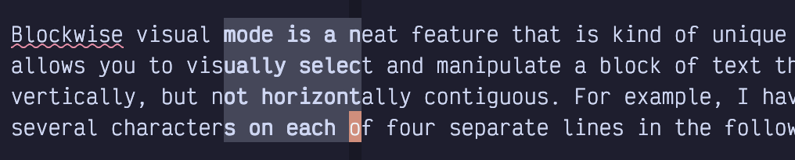

## Chapter 8. Clipboard, Registers, and Selection

Vim has a robust copy and paste experience that predates the operating system clipboard you are used to in other editors. Happily, the LazyVim configuration sets up the Neovim clipboard system to work with the OS clipboard automatically.

In fact, you already know how to cut text to the system clipboard: Just delete it.

That’s right. Any time you use the `d` or `c` verb, the text that you deleted is automatically cut to clipboard. This is usually very convenient, and occasionally somewhat annoying, so I’ll show you a workaround to avoid saving deleted text later in this chapter.

### 8.1. Pasting Text

Pasting (typically referred to as “putting” in Vim) text uses the `p` command I mentioned briefly in Chapter 1. In Normal mode, the single command `p` will place whatever is in the system clipboard at the current cursor position. This is usually the text you most recently deleted, but it can be an URL you copied from the browser or text copied from an e-mail or any other system clipboard object.

The position of the text you inserted can be somewhat surprising, but it usually does what you want. Normally, if you deleted a few words or a string that is not an entire line, it goes immediately after the current cursor position. However, if you used a command that operates on an entire line, such as `dd` or `cc`, the text will be placed on the next line. This saves a few keystrokes when you are moving lines around, a common task in code editing.

The `p` command can be used with a count, so in the unlikely event you want to paste 5 consecutive copies of whatever is in the clipboard, you can use `5p`.

When you paste with `p`, your cursor will stay where it was, and the text is inserted after the cursor. If you want to instead paste the text *before* the current cursor position, use a capital `P`, where the shifting action is interpreted as “do `p` in the other direction.” As with `p`, the text will be inserted directly before the cursor position unless it was a line-level edit such as `dd`, in which case it will be placed on the previous line.

If you are already in Insert mode and need to paste something and keep typing, you can use the `Control-r` command, followed by the `+` key. The `r` may be hard to remember, but it stands for “**r**egister.” We’ll go into more detail about what registers really are, soon.

### 8.2. Copying Text

Copying text requires a new verb: `y`. It behaves similarly to `d` and `c`, except it doesn’t modify the buffer; it just copies the text defined by whatever motion or text object comes after the `y`.

“Why `y`?” you might ask? It stands for “yank”, which is Vim speak for “copy.” I have no idea why `vi` called it “yank,” but my guess is that it was a reverse acronym. The original authors probably noticed that `y` was currently free on the keyboard and decided to come up with a word that matches it. The concept of a clipboard or copy/paste had not been standardized yet, so they were free to use whatever terminology worked for them.

The `y` command works with all of the motions and text objects you already know. It is especially useful with the `r` and `R` Remote Seek commands. If you need to copy text from somewhere else in the editor (even a different window) to your current cursor location, `yR<search><label>p` is the quickest way to be on your way without adding unnecessary jumps to your history.

The `yy` and `Y` commands yank an entire line, and from the cursor to the end of the line, analogous to their counterparts when deleting and changing text.

LazyVim will briefly highlight the text you yanked to give a nice indicator as to whether your motion command copied the correct text.

### 8.3. Selecting Text First

Your Vim editing experience so far has not involved the concept of selecting text. Isn’t that weird? We’re 8 chapters in! In normal word processors and VS Code-like text editors, you have to select text before you can perform an operation such as deleting, copying, cutting, or changing it. Considering how awkward text selection is in those editors (you have to use your mouse or some combination of shift, and cursor movements, with extra modifier keys to make bigger movements), it’s amazing anyone gets anything done!

In Vim-land, you normally perform the verb first and follow up with a text motion or object to implicitly select the text before manipulating it. This is *usually* the most effective way to operate, but in some situations it is convenient to invert the mental model and highlight text *before* operating on it.

This is where Visual mode comes in. Visual mode is a Vim major mode, like Normal and Insert mode. Technically, there are three sub-modes of Visual mode. We’ll start with “Visual Character mode” and dig into the other two shortly.

<table>
<tbody>
<tr>
<td class="icon"></td>
<td class="content">You might think that it makes sense to always select text first so you can see what you are acting on. Two newish editors called Kakoune and Helix have been experimenting with this paradigm. They are pretty cool, but I found that the “select text first” model was kind of a let-down. The editor isn’t able to determine whether any given motion is meant to <strong>move</strong> the selection or to <strong>extend</strong> the selection, so you end up with an extra keypress to tell it to do an extension. At that point, it’s no different from pressing <code>v</code> to enter Visual mode in Neovim. After using Helix for several months, I determined that it actually required more keystrokes on average than Neovim and I switched back.</td>
</tr>
</tbody>
</table>

To enter Visual Character Mode, use the `v` command from Normal mode. Then move the cursor using most of the motions that you are used to from Normal mode. I say “most” only because Visual mode keymaps are independent of Normal mode keymaps, and plugins occasionally neglect to set them up for both modes. LazyVim is really good about keymaps, though, so you will rarely be surprised.

<table>
<tbody>
<tr>
<td class="icon"></td>
<td class="content">You can also get into Visual mode by clicking and dragging with your mouse.</td>
</tr>
</tbody>
</table>

Once you have text selected in Visual mode, you can use the same verbs you usually use to delete, change, or yank the selection. The difference is they will happen instantly to the selection rather than requiring a motion. You can even use single character verbs like `x` (which does the same thing as `d`) or `r` to replace all the characters with the same character. After you complete the verb, the editor automatically switches back to Normal mode. You can also exit visual mode without performing an action using either `Escape` or another `v`.

You can exit Visual mode temporarily without completely losing your selection. From Normal mode, use the `gv` (“**g**o to last **v**isual selection”) command to return to the selection. This is useful if you are about to perform a visual operation and realize you need to look something up, make an edit, or copy something from elsewhere in the file, then go back to the selection.

Use the `o` (for “**o**ther end”) command to move the cursor to the opposite end of the block. Useful if e.g. you’ve selected a few words, and realize you forgot one at the other end of the block. You can’t get into Insert mode from Visual mode, so the `o` command gets reused for this purpose.

#### 8.3.1. Line-wise Visual Mode

The `v` command is useful for fine-grained selections, but if you know that your selection is going to start and end on line boundaries, you can use a (shifted) `V` instead, to get into Line-wise Visual mode. Now wherever you move the cursor, the entire line the cursor lands on will be selected.

Other than selecting entire lines, the main difference with Line-wise Visual mode is that when you apply a verb that manipulates the clipboard, (including `d`, `c`, and `y`), the lines will be cut or copied in Line-wise mode. When you put them later they will show up on the next or previous line instead of immediately after the cursor.

#### 8.3.2. Block-wise Visual Mode

Block-wise Visual mode is a neat feature that is kind of unique to Vim. It allows you to visually select and manipulate a block of text that is vertically, but not horizontally contiguous. For example, I have selected several characters on each of four separate lines in the following screenshot:

Figure 32. Block-wise Visual Mode

To enter block-wise Visual mode, use `Control-v` instead of `v` or `V` for Visual and Line-wise Visual mode.

In plain text like this, Block-wise Visual mode doesn’t appear to be very useful, but it is handy if you need to cut and paste columns of tabular data in a csv file or markdown table, for example. I don’t use it for that functionality terribly often, but when I need it, I know there is no other way to efficiently perform the action I need.

<table>
<tbody>
<tr>
<td class="icon"></td>
<td class="content">If you use <code>Control-V$</code>, you will get a slight adaptation of Block-wise Visual Mode where the block extends to the end of each line, in the block. This is handy if you need the block to extend to the longest line as opposed to the line your cursor is currently on.</td>
</tr>
</tbody>
</table>

Block-wise Visual mode can also be used as a (poor) imitation of multiple cursors. If you use the `I` or `A` command after selecting a visual block, and then enter some text followed by `Escape`, the text you entered will get copied at either the beginning or end of the visual block. A common operation for this feature is to add `*` characters at the beginning of Markdown ordered lists or a block comment that needs a frame.

### 8.4. Registers

Registers are a way to store a string of text to be accessed later (so think of the Assembly-language definition of the word). In that regard, they are no different from a clipboard. In fact, the system clipboard in Vim **is** a register that LazyVim has set up as the default register.

But Vim has dozens of other registers. This means you can have *custom clipboards* that each contain totally different sequences of text. This feature is pretty useful, for example, when you are refactoring something and need to paste copies of several different pieces of code at multiple call sites.

There are several different types of registers, but I’ll introduce the concept with the named registers, first. There are over two dozen named registers, one for each letter of the alphabet.

To access a register from Normal mode, use the `"` character (i.e, `Shift-`) followed by the name of the register you want to access. Then issue the verb and motion you want to perform on that register.

So if I want to delete three words and store them in the `a` register *instead* of the system clipboard, I would use the command `"ad3w`. `"a` to select the register, and `d3w` as the normal command to delete three words. And if I later want to put that same text somewhere else, I would use `"ap` instead of just `p`, so the text gets pasted from the `a` register instead of the default register.

`"ad<motion>` will always *replace* the contents of the `a` register with whatever text motion or object you selected. However, you can also build up registers from multiple delete commands using the capitalized name of the register. So `"Ad<motion>` will *append* the text you deleted to the existing `a` register.

I find this useful when I am copying several lines of code from one function to another but there is a conditional or something in the source function that I don’t need in the destination. Copy the text before the conditional using `"ay` and append the text after the conditional using `"Ay`, and then paste the whole thing in one operation with `"ap`.

I can copy totally different text into the `b` register using e.g `"byS<label>`. Now I can paste from either the `a` or `b` register at any time using `"ap` and `"bp`.

If you forgot which register you put text in, just press `"` and wait for a menu to pop up showing you the contents of all registers. If that menu is too hard to navigate, you can instead use the `<Space>s"` command to open a picker dialog that allows you to search all registers. Just enter a few characters that you know are in the register you want to paste, use the usual picker commands to navigate the list, and hit `Enter` to paste that text at the last cursor position.

To show the same menu from Insert or Command mode, use `Control-r` instead of `"`.

If you’re in the `<Space>s"` picker dialog, you’ll notice a bunch of other registers besides the named alphabet registers. I’ll discuss each of those next.

#### 8.4.1. Clipboard Registers

In LazyVim, by default, the registers named `*` and `+` are always identical to the default (unnamed) register, and represent the contents of the system clipboard.

To understand why, we need some history: vi had registers, and then operating systems got excited about the ideas of clipboards and vi users wanted to copy stuff to the system clipboard. A default (non-lazy) Vim configuration means that if you want to copy text to the system clipboard, you have to always type `"+` before the `y`. The three extra keystrokes (`Shift`, `'`, and `+`) can get pretty monotonous in modern workflows where you’re copying stuff into browsers, AI chat clients, and e-mails on a regular basis.

On top of that, some operating systems (Unix-based, usually) actually have *two* Operating System clipboards, an implicit one for text you select, and one for text you explicitly copy with `Control-c` (in most programs). This text would be stored in the `"*` register and the OS lets you paste it elsewhere with (typically) a middle click.

I recommend sticking with LazyVim’s synced clipboard configuration, but if you already have muscle memory from using Vim the old way or you’re tired of deleted text arbitrarily overwriting your system clipboard, you can disable this integration so that the three registers behave as described above instead of being linked together. To do so use `space f c` to open the `options.lua` configuration file and add the following line:

Listing 23. Disable Clipboard Sync

    vim.opt.clipboard = ""

Speaking of having your clipboard contents randomly overwritten, if you know in advance that you don’t want a specific delete or change operation to overwrite the clipboard contents, use the “Black Hole” register, `"_` (that’s an underscore). So type `"_d<motion>` to delete text without storing it in any registers including the system clipboard.

If you want to copy the *contents* of one register to another register, you can use the ex command `:let @a = @b` where `a` and `b` are the names of the registers you want to copy to and from. The most common use of this operation is to copy the contents of the system clipboard (which may have come from a different program) into a named register so it doesn’t get lost the next time you issue a verb. For example, `:let @b = @+` will copy the system clipboard into register `b`.

#### 8.4.2. The Last Yanked or Last Inserted Text

Whenever you issue a `y` command without specifying a destination register, the text will always be stored in the `"0` register *as well as* the default register. And it will stay in `"0` until the next yank operation, no matter how many deletes or changes you do to change the default register.

So if you yank the text `abc` and then delete the text `def`, the `p` command will paste the text `def`, but you still can paste `abc` using `"0p`.

You can also use the `".` (period) register to paste a copy of the text that was most recently inserted. So if you type the command `ifoo<Escape>` somewhere in the document and move somewhere else in the document and type `".p`, it will insert the word “foo” at the new cursor position. `".` is a register that you may occasionally want to copy into a named register if you have inserted text you want to reuse. Use the previously discussed syntax `:let @c = @.` command to do this.

#### 8.4.3. The Delete (Numbered) Registers

The numbered registers *should* be really useful, but I find them rather confusing. The registers `"1` through `"9` always contain the text that you most recently changed or deleted, in ascending order. So after a delete operation, whatever was in `"1` gets moved to `"2`, `"2` moves to `"3` and so on, and whatever is in `"9` gets dropped.

I can *never* remember the order of my recent deletes, so I would normally have to use the `"` menu to see the contents of the numbered registers. It’s handy that my recently deleted text is stored and I can find it this way. However, I usually use the yanky.nvim plugin (discussed later in this chapter) instead, so the numbered registers are not that useful to me.

There is also a “small delete register” that can be accessed with `"-`. Whenever you delete any text, it will be stored in the numbered registers, but if that text is less than one line long, it will *also* be stored in this minus register. I have little use for this feature, as the majority of my changes are smaller than one line. That means it gets cleared before it drops out of the numbered registers.

#### 8.4.4. The Current File’s Name

The name of the file that you are currently editing is stored in the `"%` register. It is always relative to the current working directory of the editor (usually the folder you were in when you started Neovim). The only time I ever want to access this register is to copy the filename to the system clipboard with `:let @+ = @%` so I can paste it into a GUI app or my terminal.

### 8.5. Recording to Registers

Remember the recording commands I told you about in Chapter 6: `qq` to record and `Q` to play back the recording? Turns out I was a little overly simplistic there.

Recorded commands are actually stored in a named register. In that chapter, I arbitrarily chose the `q` register when I said to use `qq` to start recording. But you can just as easily store it in the `a` register using `qa` or the `f` register using `qf`.

The `qQ` command to “append to recording” operation is analogous to the capitalized `"A<command>` used to append to a register. In this case, `Q` is still an arbitrary name. You can append a recording to a different named register besides `q`, using `qA` or `qZ`, for example.

Having multiple sets of recordings can be really handy when you are performing a complex refactoring that requires you to make one of several different repetitive changes in different locations across your codebase.

The `Q` command to play back a recording always plays back the most recently recorded command, regardless of register. If you want to play back from a different register, you would use the `@` command, followed by the name of the register. So if you recorded using `qa`, you would play it back with `@a`. As a shortcut, `@@` will always replay whichever register you most recently *played* (which is different from `Q` which always plays back the most recent *recording*).

#### 8.5.1. Editing Recordings

To be clear, recordings are placed in normal registers. So if you record a sequence of keystrokes to a register using `qa` and then put the register using `"ap`, you will actually see the list of Vim commands you recorded.

This can be useful if you mess up while recording and need to modify the keystrokes. After recording the keystroke, paste it to a new line using e.g. `"a]p`. At this point it’s just a normal line of text that happens to contain vim commands. You can modify it to add other Vim commands, since they are all just normal keystrokes.

For example, let’s say I recorded a command as `qadw2wdeq`, which records to the `a` register (`qa`), deletes a word (`dw`), skips ahead two words (`2w`), and then deletes the next word (`de`), then ends the recording with `q`. But too late, I realize I should have skipped over 3 words, not two words.

I can use `"ap` to paste the contents of the recording, which will look like this: `dw2wde`. Then I can use `f2` to jump to the `2` digit, followed by `r3` to replace it with a `3`. Now I can use `"ayiw` to replace the contents of the register with `dw3wde`.

Now if I want to play back that modified command, I can just use `@a` as usual.

### 8.6. The Yanky.nvim Plugin

Yanky.nvim has some niceties such as improving the highlighting of text on yank and preserving your cursor position so that you can keep typing after pasting, but its primary feature is better management of your clipboard history. LazyVim also configures it with several new keybindings to make putting text more pleasant.

The plugin is not enabled by default, but it is a recommended extra, so if you followed my suggestion of installing all recommended extras back in Chapter 5, you may have it enabled already. If not, head to `:LazyExtras`, find yanky.nvim and hit `x`. Then restart Neovim.

Now that Yanky is enabled, the easiest interface to see your clipboard history can be accessed with `<Space>p`. It pops up a picker menu of all your recent clipboard entries. Up to a hundred entries are stored, which is a lot more than you get in the numbered registers, and it stores your yanks, not just your deletes and changes. If you need to paste something that is no longer in the clipboard, `<Space>p` is probably the quickest way to find it.

Another super useful keybinding is `[y`. If you invoke this command *immediately* after a put operation, the text that was put will be replaced with the text that was cut or copied prior to the most recent yank. And if you press it again, it will go back one more step in history, up to 100 steps. So if you aren’t sure exactly which numbered register a delete operation is in, or you want to access text that was yanked but is no longer in the `"0` register, you can use `p[y[y[y…​` until you find the text you really wanted to pasted. If you go too far, you can cycle forward with `]y`.

LazyVim also creates some useful keybindings to improve how text is put, especially with respect to indentation. The two most useful are `[p` and `]p`.

These commands will paste the text in the clipboard on the line above or below the current line, depending on whether you used `[` or `]`. You may think this would be identical to the automatic Line-wise pasting described above, but it’s slightly different for two reasons:

- It pastes on a new line regardless of what command was used to cut or copy the text that is in the clipboard.

- It automatically adjusts the indentation of the text on the new line to match the indentation of the current line.

So if you’re moving code into a nested block and need to change indentation, use `]p` instead of relying on Line-wise paste. Then you don’t have to format it afterwards. (Not that formatting is hard in LazyVim; it happens on save).

You can also use `>p`, `<p`, `>P`, and `<P` to automatically add or remove indentation when you put code.

### 8.7. Summary

This chapter was all about selecting and copying text. We learned the `yank` verb for copying text and then dug into the various Visual modes that can be used for selecting text.

Then we learned that Vim has multiple “clipboards” called registers, and how to cut and copy to or paste from those registers. We even went into more detail about using registers to record multiple separate command sequences before discussing the yanky.nvim plugin to make your pasting life a little easier.

In the next chapter, we’ll learn about various ways to view and work with multiple open files as well as how to show and hide code with folding.
