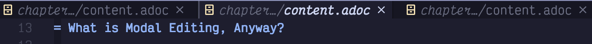
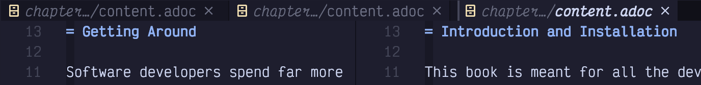
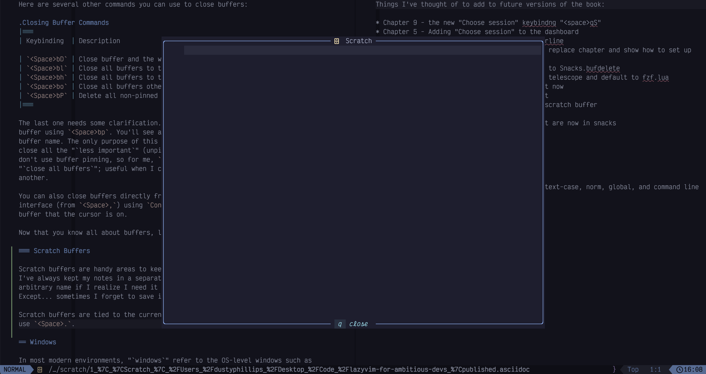
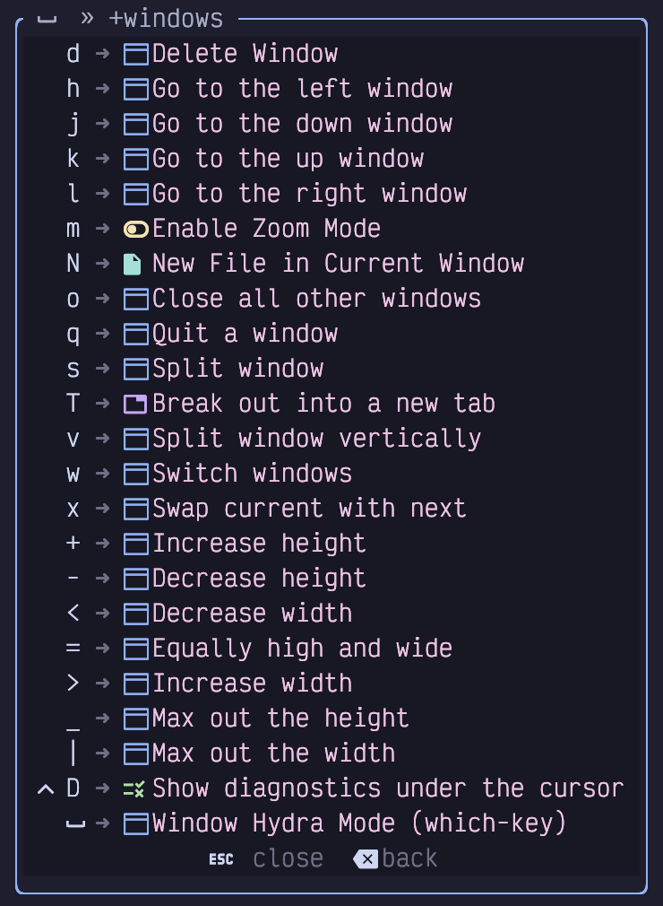
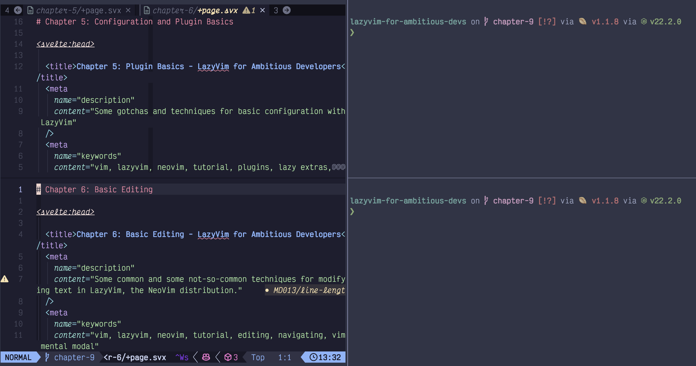
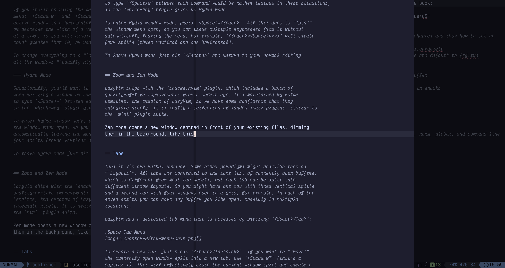
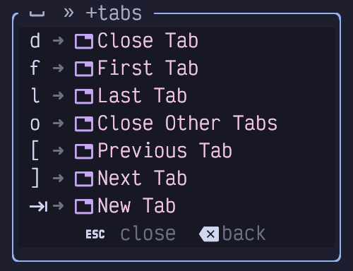
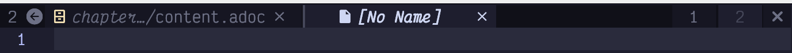
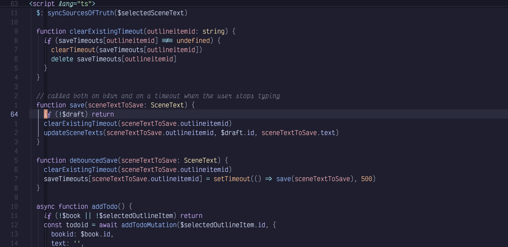
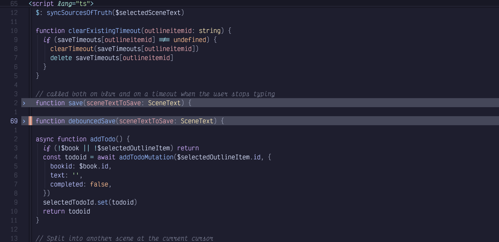

## Chapter 9. Buffers and Layouts

No matter which programming language you are working with, it is inevitable that you will be working on multiple files at a time. And in multiple areas within the same file.

Like all coding editors (other than Notepad), Neovim has a robust system for working with multiple files. LazyVim is configured with a powerful buffer, file, and window management system that may feel familiar at first, but is actually far more powerful than your average editor.

### 9.1. Some Terminology

Sometimes it seems like every window management system uses the same words for different things. If you read the documents for e.g. tmux, emacs, kitty, vim, and i3, you'll end up with multiple definitions for words like "window", "pane", "tab", and "layout".

I'll stick with the Vim definitions of these words so that you can switch between this book and most Vim and Vim plugin help files, tutorials, and documentation, without getting confused. Unfortunately, this may mean you get confused when interacting with any other software!

This list goes roughly from least to most specific, though understand that the relationship between most of these elements is a graph rather than a tree; it's not a strict hierarchy.

Server  
Neovim can run in a server mode and can have multiple clients attached. This means you can have multiple views into the same Neovim instance, and those views could be from different terminals or GUI software, web browsers or even a VS Code Extension. You will probably not need to think about the Neovim server, and I won't mention it again in this book. But if you want to do something interesting such as connect to an existing Neovim instance to open a commit message rather than opening Neovim in a new window, you now know that this is possible.

Client  
A Neovim application that you are actually running. Normally connected to its own independent server but can be configured to connect to an existing or remote one. A terminal client starts up when you type `nvim`, but other clients include GUIs such as Neovide or VimR.

Tab  
One client can have multiple tabs. Each tab is a full screen layout that is more or less independent from the other tabs. You can have different buffers visible and different configurations of window splits on each tab. Only one tab is visible at any one time. This is a much different paradigm from VS Code and many other environments where each split has its own set of tabs.

Window  
Also known as a "pane" or a "split", a window is a section of the screen that is dedicated to viewing a buffer. Every tab has one or more windows on it. Every window is normally entirely visible; there is no overlap between windows. The excepton is floating windows such as the ones that pop up when you open a picker or Lazy Extras. If a buffer's contents don't fit in a window the window can be scrolled.

Buffer  
This is Vim's word for a file that is currently open and available to be viewed/edited. One buffer can be displayed in multiple windows, which means you can have two side-by-side views into the same file at different scroll positions or you can view the same buffer in multiple tabs. If a buffer is visible in two places, they will have the exact same contents (other than scrolling position). There is only ever **one** underlying buffer open for each file, no matter how many views of the buffer are visible in different windows or tabs.

Fold  
Within any one view of a buffer, it is possible to "collapse" a section of that file (for example a function, class, or indentation level) into a single line, effectively hiding the contents. This allows you to view two disjointed sections of the same file at the same time while keeping the unrelated information between those two sections hidden.

File  
A file that exists on disk. Each buffer is linked to at most one file, though it is possible to have buffers with no file (sometimes called "scratch" buffers, a word borrowed from Emacs parlance). The contents of a buffer may not be the same as the contents of the file on disk if the buffer has not been saved.

So far in this book, all your interactions have happened in a single window in a single tab, with possibly multiple buffers open. Now, things are about to get much more interesting.

### 9.2. Buffers

If you've used a picker, the explorer, or mini.files to open multiple files, you may well think that a buffer is a tab. In this view, I have three buffers open, only one of which is currently visible:

Figure 33. Bufferline With Three Buffers

Yes, I know they look like tabs in any other software, ever, but that is because LazyVim has configured the buffer line to look like tabs. With the buffer line visible, you may actually not need to use (real) Vim tabs very often, but in Vim, tabs are a completely different concept.

No matter how many **windows** you have open, there is only one buffer line. In the following screenshot, I have three buffers open, and two of them are visible in separate windows, side by side. But there is still only one buffer line along the top of the editor.

Figure 34. Only One Buffer Line

This implies that buffers are a "global" concept. There is one collection of buffers for the entire Neovim client, and you can access any of those open buffers from any window (or tab).

You can, of course, use the mouse to select different buffers from the buffer line with a single click. But why would you do that when there are **so many** ways to access buffers with the keyboard in LazyVim?

#### 9.2.1. Navigating Between Open Buffers

The absolute easiest way to switch between buffers is using the `H` and `L` (i.e. `Shift-h` and `Shift-l`) keys. By this point you are hopefully intimately familiar with the fact that `h` means left and `l` means right for cursor movement. If you press the shift key with these, you will switch the buffer visible in the currently active window to whichever buffer is to the left or right of the current buffer in the buffer line.

Alternatively, you can use the `[b` and `]b` commands which map to the same thing.

Annoyingly, you will find that these keybindings do not accept counts. So you cannot, by default, use `2L` to jump two tabs to the right. This frustrated me because I know the underlying `:bnext` and `:bprev` commands *do* accept a count.

It turns out that LazyVim maps these to a `BufferLineCycleNext` command provided by the underlying plugin, bufferline.nvim, and that plugin doesn't, as far as I can tell, support counts.

Upon investigation I learned that the `BufferLineCycle*` commands exist because the plugin can configure some kind of sorting mechanism on the buffer list. But LazyVim isn't configured to use that mechanism. So we can use the old-fashioned commands instead. To do so, create a new file in your `plugins` configuration folder named (something like) `extend-bufferline.lua`:

Listing 24. Simplify Buffer Navigation Keybindings

    return {
      "akinsho/bufferline.nvim",
      keys = {
        {
          "L",
          function()
            vim.cmd("bnext " .. vim.v.count1)
          end,
          desc = "Next buffer",
        },
        {
          "H",
          function()
            vim.cmd("bprev " .. vim.v.count1)
          end,
          desc = "Previous buffer",
        },
        {
          "]b",
          function()
            vim.cmd("bnext " .. vim.v.count1)
          end,
          desc = "Next buffer",
        },
        {
          "[b",
          function()
            vim.cmd("bprev " .. vim.v.count1)
          end,
          desc = "Previous buffer",
        },
      },
    }

|||
| -- | -- | 
|  | If you have disabled bufferline as I have, you don't need the above. `]b` and `[b` are already mapped to `bnext` and `bprev` in the default LazyVim keybindings. |

The `vim.v.count1` variable is set whenever a keybinding is called with a count, so it can be accessed inside the callback and passed to the Vim command using string concatenation (the `..` operator). Restart Neovim and you can do things like `3L` to jump three buffers to the right on the buffer line.

Another keybinding you will want to reach for when jumping between buffers is `<Space><Backtick>`. This one simply jumps between the current file and the file that was most recently opened in the current window. In Vim parlance, this is referred to as "the alternate file."

If you have a large number of buffers open, the buffer line can get awfully crowded. At some point, it will show two arrows to the left and/or right of the buffer bar so you can tell that there are "hidden" buffers. When you navigate through buffers, it will always ensure the active buffer is visible. Here's a very full buffer line with four buffers hidden to the left and two hidden to the right:

Figure 35. Full Buffer Line

If you have this many buffers open, you may find it easier to use a picker to search through the open buffers. The keybinding to pop up a filterable, scrollable list of currently open buffers is `<Space><comma>`. It has the exact same contents as the buffer line, but it's a different interaction effect.

This is useful if you are working on large projects that have so many files that searching through them with `<Space><Space>` is difficult. Open the relatively low number of files that you actually need to access as active buffers, so they are easy to filter in the `<Space><comma>` buffer list.

Personally, I have disabled the Bufferline plugin altogether, and `<Space><comma>` is the primary interface through which I manage my buffers.

#### 9.2.2. Closing Buffers

You will often want to close the current buffer without closing the split(s) it is currently open in. The keybinding for this is `<Space>bd`, where `<Space>b` pops up a useful menu of other buffer related functions, and `d` means "delete". You aren't actually deleting the underlying *file* when you do this; you're just deleting the buffer from Vim's memory: i.e. closing it.

Here are several other commands you can use to close buffers:

<table class="tableblock frame-all grid-all stretch">
<caption>Table 1. Closing Buffer Commands</caption>
<colgroup>
<col style="width: 33%" />
<col style="width: 33%" />
<col style="width: 33%" />
</colgroup>
<thead>
<tr>
<th class="tableblock halign-left valign-top">Keybinding</th>
<th class="tableblock halign-left valign-top">Description</th>
<th class="tableblock halign-left valign-top">Mnemonic</th>
</tr>
</thead>
<tbody>
<tr>
<td class="tableblock halign-left valign-top">
<code>&lt;Space&gt;bD</code>
</td>
<td class="tableblock halign-left valign-top">
Close buffer and the window split it is in.
</td>
<td class="tableblock halign-left valign-top">
<strong>D</strong>elete buffer, but "bigger"
</td>
</tr>
<tr>
<td class="tableblock halign-left valign-top">
<code>&lt;Space&gt;bl</code>
</td>
<td class="tableblock halign-left valign-top">
Close all buffers to the left in the tab line
</td>
<td class="tableblock halign-left valign-top"></td>
</tr>
<tr>
<td class="tableblock halign-left valign-top">
<code>&lt;Space&gt;br</code>
</td>
<td class="tableblock halign-left valign-top">
Close all buffers to the right in the tab line
</td>
<td class="tableblock halign-left valign-top"></td>
</tr>
<tr>
<td class="tableblock halign-left valign-top">
<code>&lt;Space&gt;bo</code>
</td>
<td class="tableblock halign-left valign-top">
Close all buffers other than the active one
</td>
<td class="tableblock halign-left valign-top">
"<strong>o</strong>nly" this buffer
</td>
</tr>
<tr>
<td class="tableblock halign-left valign-top">
<code>&lt;Space&gt;bP</code>
</td>
<td class="tableblock halign-left valign-top">
Delete all non-pinned buffers
</td>
<td class="tableblock halign-left valign-top">
"P" is opposite of "p"
</td>
</tr>
</tbody>
</table>

The last one needs some clarification. You can toggle a "pin" on any active buffer using `<Space>bp`. You'll see a pin icon show up to the left of the buffer name. The only purpose of this pin is to keep it open if you want to close all the "less important" (unpinned) files using `<Space>bP`. I personally don't use buffer pinning, so for me, `<Space>bP` is a shortcut for "close all buffers"; useful when I complete one task and am ready to start another.

I find that some "close buffer" incantations are too common to deserve three keys, so I have added the following three shortcuts to my `keymaps.lua`:

Listing 25. Close Buffer Keymap

    vim.keymap.set("n", "<leader><delete>", function()
      Snacks.bufdelete()
    end, { desc = "Close Buffer" })
    vim.keymap.set("n", "<leader><CR>", "<cmd>%bd<cr>", { desc = "Close All Buffers" })

The first behaves like `<Space>bd` to close the current buffer. The other closes all buffers using an ex command and range syntax we will discuss as part of searching in chapter 12.

You can also close buffers directly from the buffer picker interface (from `<Space>,`) using `Control-x` to close the buffer that the cursor is on.

#### 9.2.3. Scratch Buffers

Scratch buffers are handy areas to keep notes about a project. Historically, I've always kept my notes in a separate new window, and saved it with some arbitrary name if I realize I need it to last longer than one editing session. Except…​ sometimes I forget to save it.

Scratch buffers are tied to the current working directory. To open one, just use `<Space>.`. It pops up a floating window like this:

Figure 36. Scratch Buffer

Type whatever you want in there, hit `<Escape>` to switch to normal mode, and `q` to close the buffer. Close and reopen Neovim if you want; the scratch buffer doesn't care. Your notes will be saved until you need them again. Then just hit `<Space>.` again and, so long as your cwd is the same as it was when you last opened the scratch buffer, there they are.

Occasionally, you may need to open a scratch buffer that was saved on a different cwd or git branch. You can see a picker list of scratch buffers using the `<Space>S` shortcut.

Now that you know all about buffers, let's discuss windows.

### 9.3. Windows

In most modern environments, "windows" refer to the OS-level windows such as the terminal you are running Neovim in. Since Vi predates such environments, they were able to use the word window to refer to what are nowadays more commonly described as "panes" or "splits" in other environments.

The window management commands are collected in the `<Space>w` submode menu:

Figure 37. Window Menu

We'll cover many of these in the following sections.

|||
| -- | -- | 
|  | This menu can also be accessed with `Control-w`. Historically, this is the the keybinding that is enabled by default in Vim and Neovim, though LazyVim has added some extra keybindings to it. However, `&lt;Space&gt;w` is a bit easier to type. |

#### 9.3.1. Creating Window Splits

Windows in LazyVim can be created on the fly at any time. To split the current window in half "vertically" with one window on the left and a new window on the right, use the `<Space>wv` keymap.

When you create a split, the new window will contain another view of the buffer you were already viewing, side by side. But once the split is opened, you can switch the buffer in that window using any of the buffer management commands or by opening a new file with any of the tools we've previously discussed for opening files.

To create a horizontal split between two windows (one above the other), use `<Space>ws`. The mnemonic for this is unfortunately just "split". They weren't able to reuse `<Space>wh` because that is already used for switching windows.

|||
| -- | -- | 
|  | LazyVim also allows you to create a vertical split with `&lt;Space&gt;|` where the `|` is the vertical bar when you `Shift-Backslash`, and `&lt;Space&gt;&lt;Minus&gt;` for a horizontal split. I find `&lt;Space&gt;ws` and `&lt;Space&gt;wv` easier to type. |

#### 9.3.2. Creating Splits When Opening Files

You already know you can open a file in the current window from Snacks explorer by moving your cursor to the file and pressing `<Enter>`. You can also use the `Control-v` keybinding in the explorer to open it in a *vertical* split. Use `Control-s` to create a horizontal split.

These keybindings also work in the various snacks pickers to open in vertical or horizontal splits.

Finally, if you use mini.files, you can open a file in a split sensibly using the same keybindings as in a normal window (`<Space>wv` and `<Space>ws`).

#### 9.3.3. Navigating Between Windows

You can move your cursor between window splits by holding the control key along with any of the `h`, `j`, `k`, or `l` home row "arrow-key" directions. They can also be prefixed with numerical counts if you want to skip over a window to get to the next one.

Alternatively, you can use the same keys with `<Space>w`. So `<Space>wh` will move to the window to the left of the current one.

##### Smart Splits

I suggest the [mrjones2014/smart-splits.nvim](https://github.com/mrjones2014/smart-splits.nvim) plugin, which can be configured to navigate between Vim windows and Kitty, Wezterm, or Tmux panes with the same keybindings. Consider this screenshot:

Figure 38. Kitty and Vim Splits

I have three Kitty Terminal panes open. The left one is running Neovim with two windows in it, one above the other. The right is split into two normal terminal panes. By default, if I want to navigate between the three Kitty panes, I have to use one set of keybindings, and if I want to navigate between the two Neovim windows, I have to use another set of keybindings. With the smart-splits.nvim plugin, I can navigate between all the windows with the same keybindings, no matter where my cursor is.

Setting up the terminal integration for smart splits is beyond the scope of this book (documentation on the README in the GitHub repository should be sufficient), but to configure the smart-splits plugin in Neovim, create a file in the plugins directory called e.g. `smart-splits.lua`:

Listing 26. Smart-splits configuration

    return {
      "mrjones2014/smart-splits.nvim",
      build = "./kitty/install-kittens.bash",
      keys = {
        {
          "",
          function()
            require("smart-splits").move_cursor_left()
          end,
          desc = "Move to left window",
        },
        {
          "",
          function()
            require("smart-splits").move_cursor_right()
          end,
          desc = "Move to right window",
        },
        {
          "",
          function()
            require("smart-splits").move_cursor_down()
          end,
          desc = "Move to below window",
        },
        {
          "",
          function()
            require("smart-splits").move_cursor_up()
          end,
          desc = "Move to above window",
        },
      },
    }

If you are using WezTerm or Tmux you won't need the `build =` line, but for all three environments, you'll also need to add some configuration to your Kitty, WezTerm, or Tmux configuration as described in the plugin's README.

#### 9.3.4. Closing a Window Split

You can close a window at any time using one of three keybindings:

- `<Space>wq` closes the window, and if it is the only window open, exits (**q**uits) Neovim.

- `<Space>wc` **c**loses the window unless it is the only window open, in which case it displays an error and refuses to close.

- `<Space>wd` **d**eletes the window. It is actually doing exactly the same operation as `<Space>wc`, but it is helpful for muscle memory for its symmetry with `<Space>bd` to "delete" an open buffer.

In all three cases, the **buffer** remains open in the bufferline. Only the window split is closed.

If, instead, you want to close all splits except the active one, use `<Space>wo` for "**o**nly this window" or "close **o**ther" (whichever is easier to remember).

#### 9.3.5. Resizing Windows

In my unconventional opinion, the easiest way to resize Vim splits is to use…​ *the mouse*. There is a vertical bar between vertical splits that you can click and drag on. The mouse cursor doesn't change to give you any feedback that you can click and drag on it, but it works.

For horizontal splits (when two windows are one above the other), there is no obvious bar to click. But you can actually just drag on the status bar of the "upper" window to move it up or down.

If you insist on using the keyboard, the keybindings are in the `<Space>w` menu: `<Space>w+` and `<Space>w-` to increase or decrease the height of the active window in a horizontal split, and `<Space>w>` or `<Space>w<` to increase or decrease the width of a vertical split. They only move by one row or column at a time, so you will almost certainly want to prefix these commands with a count greater than 10, or use "Hydra" mode, discussed next.

To change everything to a "default" size, use `<Space>w=` which will make all the windows "equally high and wide."

#### 9.3.6. Hydra Mode

Occasionally, you'll want to run several window commands in a row, for example when resizing a window or creating a layout containing several splits. Having to type `<Space>w` between each command would be rather tedious in these situations, so the `which-key` plugin gives us Hydra mode.

To enter Hydra window mode, press `<Space>w<Space>`. All this does is "pin" the window menu open, so you can issue multiple keypresses from it without automatically leaving the menu. For example, `<Space>w<Space>vvvs` will create four splits (three vertical and one horizontal).

To leave Hydra mode just hit `<Escape>` and return to your normal editing.

#### 9.3.7. Zoom and Zen Mode

To get into or out of zen mode, use the `<Space>uz` keybinding, which is mapped to an action in `snacks.nvim`. under the UI menu. Zen mode opens a new window centred in front of your existing files, dimming them in the background, like this:

Figure 39. Zen Mode

Syntax hyghlighting is disabled except in the immediate vicinity of your cursor. Ostensibly, this helps one focus. I actually find it rather distracting and prefer to keep my normal layout, but try it and see if it works for you.

Zoom mode is similar in that it temporarily changes the window layout. It simply replaces all the existing windows with a single maximized window containing the current file. You can access it with `<Space>uZ` where `Z` is capitalized this time.

This can be handy if you need to temporarily focus on or expand a buffer. Historically, I've always gotten this behaviour by opening the same buffer in a new tab, so lets discuss tabs next.

### 9.4. Tabs

Tabs in Vim are rather unusual. Some other paradigms might describe them as "Layouts". All tabs are connected to the same list of currently open buffers, which is different from most tab models, but each tab can be split into different window layouts. So you might have one tab with three vertical splits and a second tab with four windows open in a grid, for example. In each of the seven splits you can have any buffer you like open, possibly in multiple locations.

LazyVim has a dedicated tab menu that is accessed by pressing `<Space><Tab>`:

Figure 40. Space Tab Menu

To create a new tab, just press `<Space><Tab><Tab>`. If you want to "move" the currently open window split into a new tab, use `<Space>wT` (that's a capital T). This will effectively close the current window split and create a new tab with the same buffer in that tab.

After you create a tab, you'll likely have trouble finding it again! The tabs are grouped at the right end of the buffer line:

Figure 41. Tabs in Buffer Line

This screenshot has **two** tabs, numbered 1 and 2 at the right with an `X` beside them. The two buffers at the left *are not tabs*. Have I emphasized that too many times?

Unfortunately, other than numbers, the tabs don't do anything to make themselves look unique; it is not possible to preview which buffers are active in each tab or what layout they have.

To navigate between tabs, you can click the numbers, or you can use the default vim keybindings of `gt` and `gT` to go to the next or previous tab. Alternatively, the `<Space><Tab>[` and `<Space><Tab>]` keybindings provided by LazyVim can also switch tabs. To go to a specific tab by number, use that number as the count when calling `gt`. For example `3gt` will show the tab number 3 rather than jumping three tabs to the right.

There are several ways to close a tab:

- Just close the last window in the tab (i.e. with `<Space>wq`) and the tab will disappear.

- The `<Space><tab>d` keybinding will close all the *windows* in a tab as well as the tab itself. The *buffers* will stay open.

- Click the `X` icon to the right of the tabs in the tab bar.

### 9.5. Code Folding

Vim's code folding system is almost too robust, probably because it has had many iterations of "best practices" over the years. LazyVim is configured with the *current* best practices, so you generally only need a small subset of the complete list of folding commands.

If you are unfamiliar with the concept, code folding allows you to hide entire sections of code by collapsing them into a single line. Visually, this has a similar effect to splitting a window horizontally and then reading two sections of the same file above and below the split, but when you use folding only one view of the buffer is visible and it scrolls as a single entity.

Consider this section of code:

Figure 42. Code With No Folds

While I'm editing, imagine that I am interested in the `clearExistingTimeout` function at the top of the screenshot and the `addTodo` function at the bottom, but not currently interested in the contents of the two `save` callbacks. I can collapse those sections and my screen looks like this:

Figure 43. Collapsed Folds

Most fold operations are accessible from the `z` mode menu accessible by typing `z` in Normal mode (we discussed some of the `z` mode operations in chapter 3 when we were dealing with scrolling). To collapse a section of code into a fold, use whatever navigation operations you like to get to that section and type `zc` for "**c**ollapse fold".

To open it again, use `zo` for "**o**pen fold".

Alternatively, if you only want to remember a single keybinding, `za` will toggle a fold, collapsing if you are not on a folded line and expanding if you are.

If you have collapsed some folds and want to quickly get back to a point where there are no folds collapsed, use `zR` to open all folds. I had no idea what mnemonic is supposed to work with `R`, but an early reader helpfully pointed out that `zr` is "reduce folding", so `zR` is "Reduce folding BUT BIGGER".

You can even nest folds by folding already folded code. If you want to open folds recursively, use `zO`, which will open a fold and any folds that are nested under that fold.

The way LazyVim is configured, you don't have much control over what gets folded, but it will usually do something close to what you expect based on where your cursor is in the document. "What you expect" depends on both the LSP and the TreeSitter grammar for the language you are working on, but I find it best to just let it do its thing and not disagree with it.

If you find that you want way more control over code folding, I recommend reading `:help folding` in its entirety. More than likely, you'll decide that actually, you don't want more control over folding and just want LazyVim to handle it for you!

### 9.6. Sessions

After a long hard day of coding, you probably have several buffers open and your splits and tabs configured with all the files in just the right places. Wouldn't it be nice to put the code away for the evening and come back to all those buffers, tabs, and splits just as they were?

LazyVim has built-in session management enabled by default. Simply close LazyVim with `<Space>qq` and you're done. Tomorrow morning, use your terminal to `cd` to the folder you were working in. Open the session to the dashboard with the `nvim` command and hit `s` to be on your way.

If you forgot to open it right away and the dashboard is long gone, you can use `<Space>qs` to restore Neovim to wherever it was when you last closed it (though any files you modified and saved in the meantime will still have their new contents).

Sessions are scoped to folders. So every time you change your working directory a different session is stored and kept up to date until you exit. To open a session, either cd to a directory in your terminal before opening Neovim, or use the `:cd` command after opening it.

Alternatively, use the `<space>qS` command after you open Neovim. This will open a picker with all the folders you have recently worked in. Select one of those folders and LazyVim will automatically `:cd` to that folder and open the session.

If you use a graphical frontend to Neovim such as Neovide or VimR, the `<Space>qS` command can be super useful for you to select a recent project. In fact, it may be so useful that you want to add a command for it to your dashboard, as discussed in Chapter 5.

One last note on sessions: if you have opened Neovim temporarily and want to close it without wiping out the session that was saved the last time you closed it, hit `<Space>qd` at any time after you open Neovim and before you close it. In some contexts (notably, git commit messages), this happens automatically so you don't have to worry about making a commit after you close the editor and then losing your session.

### 9.7. Summary

In this chapter, we learned about Vim's buffers, windows and tabs, and how they are different not only from each other, but also from many other window management paradigms. Vim has the same concepts as other editors, but they are sometimes mixed or named in different ways.

We also covered code folding to make it easier to wrangle large files, and session management to return to your window configuration and come back to it later. This is particularly useful when combined with LazyVim's lightning fast startup time. There's no reason to keep your code editor open consuming memory when you aren't actually, you know, editing code.

In the next chapter, we'll dig into some of the terrific programming language support that LazyVim provides. This is arguably the one thing that made VS Code amazing, but the Vim community has learned from its competitors and eventually outmatched them.
